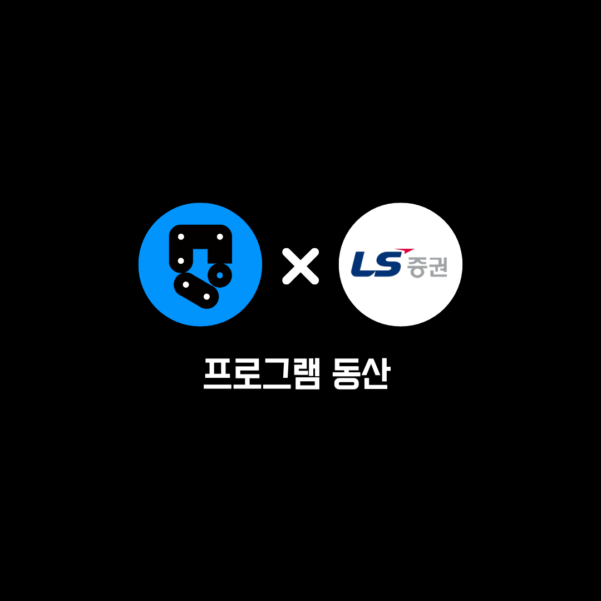

# 소개

    

> **⚠️ 경고**: ProgramGarden 자동화매매는 현재 **테스트 버전**이므로 오류를 계속 확인하고 있습니다. 따라서 정식 버전이 출시되기 전까지는 **모의투자** 또는 **소액 투자**를 권장합니다. 오픈소스 사용 시 발생하는 문제에 대한 책임은 사용자에게 있으며, 라이선스를 반드시 확인해 주세요. [라이선스 보기](https://github.com/programgarden/programgarden?tab=AGPL-3.0-1-ov-file#readme)

> **⚠️ 경고**: 모의투자도 지원됩니다. 다만 해외선물은 `홍콩거래소 (HKEX)`의 모의투자만 지원되며, `CME`, `EUREX` 등 다른 거래소의 모의투자는 지원되지 않습니다. 모의투자 시 실제 체결 가격과 차이가 발생하니 유의하시기 바랍니다. [빠른 실행 가이드 보기](https://programgarden.gitbook.io/docs/invest/non_dev_quick_guide)

## 📌 소개

**ProgramGarden**은 코딩 지식이 없는 시스템 트레이더와 투자자들이 손쉽게 사용할 수 있는 **개인 맞춤형 자동화매매 오픈소스 플랫폼**입니다. 

또한 AI가 ProgramGarden 오픈소스를 활용하여 자동화매매 전략을 쉽게 구현할 수 있도록 지원하며, 사용자는 챗봇이 생성한 코드를 빠르게 검토하고 실전 매매에 활용할 수 있습니다. 그리고 자동화매매 서비스를 원하는 기업에게도 최적의 환경을 제공합니다.

그리하여 유튜버 [**프로그램 동산**](https://programgarden.com)과 [**LS증권**](https://ls-sec.co.kr) 협업으로 **시스템 트레이더 생태계** 발전에 기여하기 위하여 오랜 연구 끝에

`DSL`(Domain Specific Language, 특정 목적에 특화된 언어)를 개발하여 코딩 경험이 없어도 손쉽게 자동매매를 실행할 수 있으며, 외부 개발자가 기여한 전략을 조합해 투자에 활용할 수 있습니다. 자세한 사용법은 [**가이드 문서**](https://programgarden.gitbook.io/docs)를 참고하세요.

해외주식 · 해외선물 업데이트 내용과 국내 주식·코인 등의 업데이트 일정을 유튜브와 커뮤니티에서 실시간으로 공유하고 있으니, 꼭 구독하고 알림을 설정해 주세요!

* 카카오톡 단톡방: https://open.kakao.com/o/gKVObqUh
* 프로그램 동산 유튜브: https://youtube.com/@programgarden
* 시스템 트레이더 커뮤니티: https://cafe.naver.com/programgarden
* LS증권 유튜브: https://www.youtube.com/@lssec
* 비즈니스 문의: coding@programgarden.com

## 👥 운영진

* **프로그램 동산** – DSL 개발 담당 [링크딘 주소](https://www.linkedin.com/in/masterjyj/)
* **라쿠너리 동산** – 시각화, WTS 개발 담당 [링크딘 주소](https://www.linkedin.com/in/rakunary)
* **클라우드 동산** – AI & 서버 개발 담당 [링크딘 주소](https://www.linkedin.com/in/philip-sung-jae-cho/)
* **디자인 동산** – 콘텐츠와 디자인 담당 [링크딘 주소](https://www.linkedin.com/in/jina-jang-4561b717a/)
