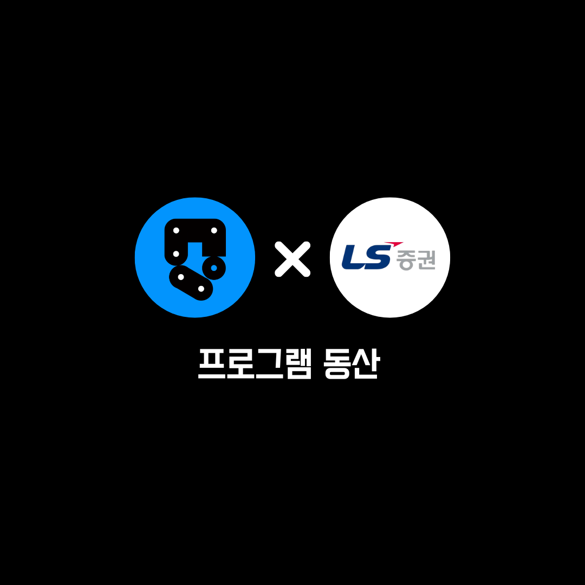

# 소개

[](https://www.python.org/) [](https://github.com/programgarden/programgarden/releases) [](LICENSE/) [](https://ls-sec.co.kr) [](https://programgarden.gitbook.io/docs)



> **⚠️ 주의**: 오픈소스 사용 시 발생하는 문제에 대한 책임은 사용자에게 있으며, 라이선스를 반드시 확인해 주세요. [라이선스 보기](https://github.com/programgarden/programgarden?tab=AGPL-3.0-1-ov-file#readme)

> **⚠️ 모의투자 안내**: 해외선물은 `홍콩거래소 (HKEX)`의 모의투자만 지원되며, `CME`, `EUREX` 등 다른 거래소와 해외주식은 모의투자가 지원되지 않습니다 (실전투자만 가능). 모의투자 시 실제 체결 가격과 차이가 발생하니 유의하시기 바랍니다. [빠른 실행 가이드 보기](https://programgarden.gitbook.io/docs/invest/non_dev_quick_guide)

> **📢 예정**: 국내주식 및 코인은 제작중입니다.

## 소개

**ProgramGarden**은 오픈소스 기반 AI 퀀트 플랫폼입니다. 코딩 없이 노드를 조합하여 자동매매 전략을 구성하고 실행할 수 있습니다.

[**프로그램 동산**](https://programgarden.com)과 [**LS증권**](https://ls-sec.co.kr) 협업으로 개발되었으며, 개인 투자자부터 자동매매 서비스를 원하는 기업까지 활용할 수 있습니다.

자세한 사용법은 [**가이드 문서**](https://programgarden.gitbook.io/docs)를 참고하세요.

## AI 퀀트 앱

오픈소스 기반으로 구축된 웹사이트와 앱에서 이용하세요.

* https://programgarden.com (오픈 예정)

## 커뮤니티

* 카카오톡 단톡방: https://open.kakao.com/o/gKVObqUh
* 프로그램 동산 유튜브: https://youtube.com/@programgarden
* 네이버 카페 커뮤니티: https://cafe.naver.com/programgarden
* 비즈니스 문의: coding@programgarden.com

## 주요 기능

* **노드 기반 워크플로우** — 58개 노드를 조합하여 코딩 없이 전략 구성
* **해외주식 · 해외선물** — LS증권 OpenAPI 기반 실시간 시세 조회 및 자동 주문
* **AI Agent** — LLM 기반 분석 및 의사결정을 워크플로우에 통합
* **전략 플러그인** — RSI, MACD 등 커뮤니티 기여 전략을 조합하여 활용
* **위험 관리** — 포트폴리오 추적, HWM/Drawdown, 위험 이벤트 감사 기록
* **동적 노드 주입** — 외부 개발자가 런타임에 커스텀 노드를 추가 가능

## 패키지 구조

```
src/
├── programgarden/          # 워크플로우 실행 엔진 (메인 패키지)
├── core/                   # 노드 타입, 베이스 클래스, 레지스트리, i18n
├── finance/                # LS증권 OpenAPI 래퍼
└── community/              # 전략 플러그인 (RSI, MACD 등)
```

## 설치

```bash
pip install programgarden
```

또는 Poetry를 사용하는 경우:

```bash
poetry add programgarden
```
