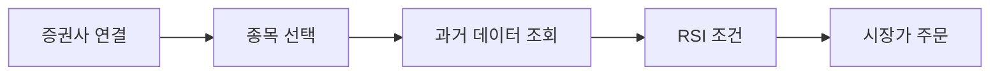

# ProgramGarden

<figure><figcaption></figcaption></figure>

**코딩 없이 만드는 나만의 자동매매 전략**

ProgramGarden은 노드 기반 워크플로우로 해외주식/해외선물 자동매매 전략을 설계하는 오픈소스 플랫폼입니다. LS증권 OpenAPI와 연동되어 실제 거래까지 자동으로 실행됩니다. Finance API를 통해 국내주식도 지원합니다.

***

## 이런 분들을 위해 만들었습니다

- 코딩은 모르지만 자동매매를 하고 싶은 투자자
- RSI, MACD 같은 기술적 지표로 전략을 만들고 싶은 분
- 백테스트로 전략을 검증한 뒤 실전에 적용하고 싶은 분
- AI에게 시장 분석을 맡기고 싶은 분

---

## 어떻게 작동하나요?

노드(블록)를 연결해서 전략을 만듭니다. 모든 설정은 JSON으로 표현됩니다.



```json
{
  "nodes": [
    { "id": "broker", "type": "OverseasStockBrokerNode", "credential_id": "my-cred", "paper_trading": false },
    { "id": "watchlist", "type": "WatchlistNode", "symbols": [{"exchange": "NASDAQ", "symbol": "AAPL"}] },
    { "id": "history", "type": "OverseasStockHistoricalDataNode", "interval": "1d" },
    { "id": "rsi", "type": "ConditionNode", "plugin": "RSI",
      "items": {
        "from": "{{ nodes.history.value.time_series }}",
        "extract": {
          "symbol": "{{ item.symbol }}",
          "exchange": "{{ item.exchange }}",
          "date": "{{ row.date }}",
          "close": "{{ row.close }}"
        }
      },
      "fields": { "period": 14, "threshold": 30, "direction": "below" }
    },
    { "id": "marketData", "type": "OverseasStockMarketDataNode", "symbol": "{{ item }}" },
    { "id": "sizing", "type": "PositionSizingNode",
      "symbol": "{{ item }}",
      "balance": "{{ nodes.account.balance }}",
      "market_data": "{{ nodes.marketData.value }}",
      "method": "fixed_percent", "max_percent": 10
    },
    { "id": "order", "type": "OverseasStockNewOrderNode",
      "side": "buy", "order_type": "market",
      "order": "{{ nodes.sizing.order }}"
    }
  ],
  "edges": [
    { "from": "broker", "to": "watchlist" },
    { "from": "watchlist", "to": "history" },
    { "from": "history", "to": "rsi" },
    { "from": "rsi", "to": "order" }
  ],
  "credentials": [
    {
      "credential_id": "my-cred",
      "type": "broker_ls_overseas_stock",
      "data": [
        { "key": "appkey", "value": "", "type": "password", "label": "App Key" },
        { "key": "appsecret", "value": "", "type": "password", "label": "App Secret" }
      ]
    }
  ]
}
```

---

## 주요 기능

| 기능 | 설명 |
|------|------|
| **73개 노드** | 시세 조회, 펀더멘털 분석, 조건 분기, 주문, 리스크 관리, 차트 시각화까지 |
| **77개 전략 플러그인** | RSI, MACD, 볼린저밴드, 이치모쿠, VWAP, 듀얼모멘텀, 상관분석, 레짐감지, Z-Score, 스퀴즈모멘텀, 모멘텀순위, 페어트레이딩, 터틀브레이크아웃, 변동성돌파, 마법공식, 지지/저항레벨, RSI다이버전스, KDJ, 아룬, 하이킨아시, 허스트지수, 샤프비율, 소르티노, 칼마비율 등 바로 쓸 수 있는 전략 |
| **실시간 모니터링** | WebSocket으로 실시간 시세/계좌/주문 이벤트 수신 |
| **백테스트** | 과거 데이터로 전략을 검증하고 벤치마크와 비교 |
| **AI 에이전트** | GPT/Claude 등 LLM이 시장을 분석하고 의사결정 지원 |
| **해외주식 + 해외선물 + 국내주식** | 세 상품군 모두 워크플로우 노드 지원 |

---

## 시작하기

1. **LS증권 계좌 개설** 및 OpenAPI 앱키 발급
2. **워크플로우 JSON 작성** (이 가이드를 참고하세요)
3. **실행** — 스케줄에 따라 자동으로 동작합니다

다음 문서로 넘어가세요:

- [빠른 시작 가이드](non_dev_quick_guide.md) — 5분 만에 첫 전략 만들기
- [워크플로우 구조 이해](structure.md) — 노드, 엣지, 인증의 개념
- [전체 노드 레퍼런스](node_reference.md) — 73개 노드 상세 설명
