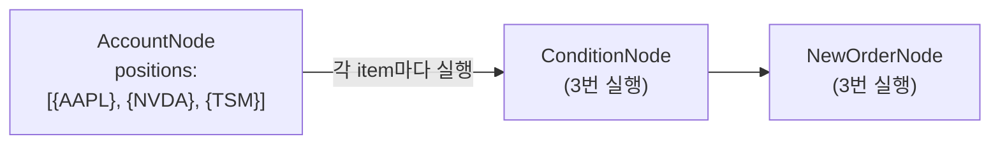

# 자동 반복 처리 (Auto-Iterate)

하나의 노드가 여러 종목의 데이터를 출력하면, 다음 노드가 **각 종목마다 자동으로 반복 실행**됩니다. 이것을 **Auto-Iterate**라고 합니다.

***

## 기본 동작



이전 노드의 출력이 **배열**이면, 다음 노드는 배열의 각 항목에 대해 자동으로 실행됩니다.

***

## 반복 키워드

반복 실행 중에 사용할 수 있는 특수 키워드입니다.

| 키워드     | 설명          | 예시                             |
| ------- | ----------- | ------------------------------ |
| `item`  | 현재 반복 항목    | `{{ item.symbol }}` → `"AAPL"` |
| `index` | 현재 순번 (0부터) | `{{ index }}` → `0`            |
| `total` | 전체 항목 수     | `{{ total }}` → `3`            |

**사용 예시:**

```json
{
  "id": "history",
  "type": "OverseasStockHistoricalDataNode",
  "symbol": "{{ item }}"
}
```

WatchlistNode이 3개 종목을 출력하면, HistoricalDataNode은 각 종목에 대해 3번 실행됩니다.

***

## SplitNode을 사용한 명시적 분리

Auto-Iterate가 자동으로 동작하지만, **SplitNode**을 사용하면 더 명확하게 제어할 수 있습니다.

```json
{
  "nodes": [
    {
      "id": "watchlist",
      "type": "WatchlistNode",
      "symbols": [
        {"exchange": "NASDAQ", "symbol": "AAPL"},
        {"exchange": "NASDAQ", "symbol": "NVDA"},
        {"exchange": "NYSE", "symbol": "TSM"}
      ]
    },
    {
      "id": "split",
      "type": "SplitNode"
    },
    {
      "id": "history",
      "type": "OverseasStockHistoricalDataNode",
      "symbol": "{{ item }}",
      "interval": "1d"
    },
    {
      "id": "rsi",
      "type": "ConditionNode",
      "plugin": "RSI",
      "fields": { "period": 14, "threshold": 30, "direction": "below" }
    },
    {
      "id": "aggregate",
      "type": "AggregateNode",
      "mode": "filter",
      "filter_field": "passed"
    }
  ],
  "edges": [
    {"from": "watchlist", "to": "split"},
    {"from": "split", "to": "history"},
    {"from": "history", "to": "rsi"},
    {"from": "rsi", "to": "aggregate"}
  ]
}
```

**흐름:**

1. WatchlistNode → 3개 종목 출력
2. SplitNode → 1개씩 분리
3. HistoricalDataNode → 각 종목의 차트 데이터 조회 (3번)
4. ConditionNode → RSI 조건 평가 (3번)
5. AggregateNode → 조건 통과한 종목만 모음

***

## 메서드 체이닝

표현식에서 노드 출력에 메서드를 체이닝할 수 있습니다.

| 메서드             | 설명       | 예시                                      |
| --------------- | -------- | --------------------------------------- |
| `.all()`        | 전체 배열    | `{{ nodes.account.all() }}`             |
| `.first()`      | 첫 번째 항목  | `{{ nodes.account.first() }}`           |
| `.filter('조건')` | 조건 필터링   | `{{ nodes.account.filter('pnl > 0') }}` |
| `.map('필드')`    | 특정 필드 추출 | `{{ nodes.account.map('symbol') }}`     |
| `.sum('필드')`    | 합계       | `{{ nodes.account.sum('quantity') }}`   |
| `.avg('필드')`    | 평균       | `{{ nodes.account.avg('pnl') }}`        |
| `.count()`      | 개수       | `{{ nodes.account.count() }}`           |

**체이닝 예시:**

```json
{
  "profit_count": "{{ nodes.account.filter('pnl > 0').count() }}",
  "loss_symbols": "{{ nodes.account.filter('pnl < 0').map('symbol') }}",
  "total_qty": "{{ nodes.account.sum('quantity') }}"
}
```

***

## 함수 네임스페이스

표현식에서 사용할 수 있는 내장 함수들입니다.

### date - 날짜

| 함수                   | 설명       | 예시                                      |
| -------------------- | -------- | --------------------------------------- |
| `date.today()`       | 오늘 날짜    | `{{ date.today(format='yyyymmdd') }}`   |
| `date.ago(n)`        | N일 전     | `{{ date.ago(30, format='yyyymmdd') }}` |
| `date.later(n)`      | N일 후     | `{{ date.later(7) }}`                   |
| `date.months_ago(n)` | N개월 전    | `{{ date.months_ago(3) }}`              |
| `date.year_start()`  | 올해 1월 1일 | `{{ date.year_start() }}`               |
| `date.month_start()` | 이번달 1일   | `{{ date.month_start() }}`              |

### finance - 금융 계산

| 함수                             | 설명      | 예시                                            |
| ------------------------------ | ------- | --------------------------------------------- |
| `finance.pct_change(a, b)`     | 변화율 (%) | `{{ finance.pct_change(100, 110) }}` → `10.0` |
| `finance.pct(value, pct)`      | 비율 계산   | `{{ finance.pct(1000, 10) }}` → `100`         |
| `finance.discount(price, pct)` | 할인가     | `{{ finance.discount(100, 5) }}` → `95`       |
| `finance.markup(price, pct)`   | 할증가     | `{{ finance.markup(100, 5) }}` → `105`        |

### stats - 통계

| 함수                  | 설명   | 예시                                    |
| ------------------- | ---- | ------------------------------------- |
| `stats.mean(arr)`   | 평균   | `{{ stats.mean([1,2,3]) }}` → `2.0`   |
| `stats.median(arr)` | 중앙값  | `{{ stats.median([1,2,3]) }}` → `2.0` |
| `stats.stdev(arr)`  | 표준편차 | `{{ stats.stdev([1,2,3]) }}`          |

### format - 포맷팅

| 함수                   | 설명    | 예시                                              |
| -------------------- | ----- | ----------------------------------------------- |
| `format.pct(n)`      | % 표시  | `{{ format.pct(12.34) }}` → `"12.34%"`          |
| `format.currency(n)` | 통화 표시 | `{{ format.currency(1234.5) }}` → `"$1,234.50"` |
| `format.number(n)`   | 숫자 포맷 | `{{ format.number(1234567) }}` → `"1,234,567"`  |

### lst - 리스트

| 함수                    | 설명    | 예시                               |
| --------------------- | ----- | -------------------------------- |
| `lst.first(arr)`      | 첫 번째  | `{{ lst.first(items) }}`         |
| `lst.last(arr)`       | 마지막   | `{{ lst.last(items) }}`          |
| `lst.count(arr)`      | 개수    | `{{ lst.count(items) }}`         |
| `lst.pluck(arr, key)` | 필드 추출 | `{{ lst.pluck(items, 'name') }}` |
| `lst.flatten(arr)`    | 평탄화   | `{{ lst.flatten(nested) }}`      |
