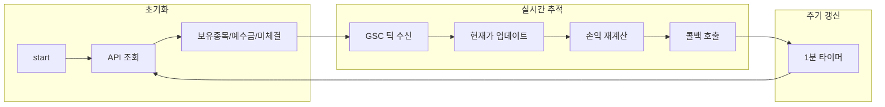

# Programgarden Finance 사용 가이드

Programgarden Finance는 LS증권 OpenAPI를 Python 친화적으로 감싸 해외 주식, 해외 선물·옵션, 국내 주식 거래를 손쉽게 자동화할 수 있게 돕는 라이브러리입니다. 이 문서는 라이브러리의 특징과 설치 방법부터 실전 활용 시나리오, TR 코드 참고, 실시간 스트리밍까지 한 번에 정리한 확장 설명서입니다. 문서를 읽다가 헷갈리는 부분은 이슈 페이지나 사용자 커뮤니티를 통해 언제든지 피드백 주세요.

- 사용자 커뮤니티: https://cafe.naver.com/programgarden
- 카카오톡 오픈채팅: https://open.kakao.com/o/gKVObqUh

---

## 주요 특징

- 간편한 LS증권 API 통합: 복잡한 LS증권 OpenAPI 스펙을 상황별 클래스로 추상화해 몇 줄의 코드로 호출 가능
- 해외 주식 & 선물옵션 & 국내 주식 지원: 시세, 주문, 잔고, 차트 등 주요 기능을 단일 인터페이스에서 처리
- 실시간 WebSocket 스트리밍: 실시간 체결, 호가, 시세를 Async WebSocket으로 구독
- 비동기·동기 동시 지원: 모든 API 요청에 대해 동기(`req`)와 비동기(`req_async`) 호출을 구분 제공
- 토큰 자동 관리: OAuth 토큰 발급 및 만료 시 자동 갱신을 라이브러리 내부에서 전담하여 사용자 관리 불필요
- 타입 안전성: Pydantic 기반 요청/응답 모델로 타입 힌트와 IDE 자동완성 강화
- 풍부한 예제: `src/finance/example/` 폴더에 TR별 실행 스크립트 포함

---

## 요구 사항 및 설치

- Python 3.10 이상
- LS증권 자동화매매 API 사용 권한 및 발급 받은 `appkey`, `appsecret`

```bash
# PyPI 배포본 사용
pip install programgarden-finance

# Poetry 기반 개발 환경
poetry add programgarden-finance
```

---

## 사전 준비

- **계좌 및 API 키 발급**: 투혼앱에서 글로벌 상품 거래 계좌를 비대면 개설 후 `전체 메뉴 → 투자정보 → 투자 파트너 → API` 메뉴에서 자동화매매용 Appkey/Appsecret을 발급받습니다. 분실 방지를 위해 키는 절대 외부에 노출하지 마세요.
- **샘플 코드**: 풍부한 예제 코드는 [GitHub 예제 디렉토리](https://github.com/programgarden/programgarden/tree/main/src/finance/example)에서 확인할 수 있습니다.
---

## 라이브러리 구조 한눈에 보기

```python
from programgarden_finance import LS

ls = LS()
ls.login(appkey="...", appsecretkey="...")

# 해외 주식 도메인
stock = ls.overseas_stock()
stock.market()    # 시장 정보
stock.chart()     # 차트 데이터
stock.accno()     # 계좌/잔고
stock.order()     # 주문
stock.real()      # 실시간 스트림

# 해외 선물·옵션 도메인
futures = ls.overseas_futureoption()
futures.market()
futures.chart()
futures.accno()
futures.order()
futures.real()

# 국내 주식 도메인
korea = ls.korea_stock()
korea.market()    # 시장 정보 (현재가, 호가, 마스터 등 13개 TR)
korea.chart()     # 차트 데이터 (일/주/월/년, 분봉 등 4개 TR)
korea.accno()     # 계좌/잔고 (잔고, 예수금, 미체결 등 10개 TR)
korea.order()     # 주문 (현물주문, 정정, 취소 3개 TR)
korea.ranking()   # 랭킹 (거래량상위, 시가총액상위 등 7개 TR)
korea.investor()  # 투자자별 매매동향 (6개 TR)
korea.sector()    # 업종/테마 (5개 TR)
korea.etf()       # ETF 시세/구성 (3개 TR)
korea.etc()       # 기타 (신규상장, 공매도 등 4개 TR)
korea.frgr_itt()  # 외인/기관 매매 (1개 TR)
korea.real()      # 실시간 WebSocket (시세 8개 + 주문 5개 = 13개 TR)
```

- **동기/비동기 세션**: `ls.login`은 동기, `await ls.async_login(...)`은 비동기 로그인입니다. 싱글톤 인스턴스가 필요하면 `LS.get_instance()`를 사용할 수 있습니다.
- **토큰 발급**: `programgarden_finance.ls.oauth.generate_token` 모듈은 OAuth 토큰 발급·갱신을 지원합니다.
- **로깅**: 표준 `logging` 모듈을 사용하면 디버깅 로그를 일관되게 출력할 수 있습니다.

---

## 빠른 시작 튜토리얼

### 1. OAuth 토큰 발급 (토큰만 필요한 경우)

```python
import asyncio
from programgarden_finance.ls.oauth.generate_token import GenerateToken
from programgarden_finance.ls.oauth.generate_token.token.blocks import TokenInBlock

async def get_token():
    response = GenerateToken().token(
        TokenInBlock(appkey="YOUR_APPKEY", appsecretkey="YOUR_APPSECRET"),
    )
    result = await response.req_async()
    print(f"Access Token: {result.block.access_token}")

asyncio.run(get_token())
```

토큰은 일정 시간이 지나면 만료되지만, 라이브러리 내부에서 요청 시 만료 여부를 확인하고 자동으로 갱신하므로 별도의 관리가 필요하지 않습니다.

### 2. 로그인 및 세션 준비 (로그인시 토큰 관리 자동으로 됨)

```python
import asyncio
from programgarden_finance import LS
import logging

async def ensure_login():
    ls = LS.get_instance()
    success = await ls.async_login(
        appkey="발급받은 App Key",
        appsecretkey="발급받은 App Secret",
    )
    if not success:
        logging.error("로그인 실패")
        return None
    return ls

ls = asyncio.run(ensure_login())
```

### 3. 해외 주식 현재가 조회 (동기/비동기 모두 지원)

```python
import asyncio
from programgarden_finance import LS, g3101
import logging

async def get_stock_price():
    ls = LS()
    if not ls.login(appkey="발급받은 App Key", appsecretkey="발급받은 App Secret"):
        logging.error("로그인 실패")
        return

    response = ls.overseas_stock().market().현재가조회(
        g3101.G3101InBlock(
            delaygb="R",
            keysymbol="82TSLA",
            exchcd="82",
            symbol="TSLA",
        )
    )
    result = await response.req_async()
    logging.debug(f"TSLA 현재가: {result}")

asyncio.run(get_stock_price())
```

### 4. 실시간 시세(WebSocket) 구독

```python
import asyncio
from programgarden_finance import LS
import logging

async def subscribe_realtime():
    ls = LS()
    if not ls.login(appkey="발급받은 App Key", appsecretkey="발급받은 App Secret"):
        logging.error("로그인 실패")
        return

    def on_message(resp):
        print(f"실시간 데이터: {resp}")

    client = ls.overseas_stock().real()
    await client.connect()

    gsc = client.GSC()
    gsc.add_gsc_symbols(symbols=["81SOXL", "82TSLA"])
    gsc.on_gsc_message(on_message)

asyncio.run(subscribe_realtime())
```

구독 해지 시에는 `gsc.on_remove_gsc_message()` 또는 연결 종료 로직을 호출합니다. 대량 구독 시에는 연결 유지용 `asyncio.create_task`와 종료 신호를 조합해 관리하세요.

### 5. 국내 주식 현재가 조회

```python
import asyncio
from programgarden_finance import LS, t1102
import logging

async def get_korea_stock_price():
    ls = LS()
    if not ls.login(appkey="발급받은 App Key", appsecretkey="발급받은 App Secret"):
        logging.error("로그인 실패")
        return

    response = ls.korea_stock().market().주식현재가시세(
        t1102.T1102InBlock(shcode="005930")  # 삼성전자
    )
    result = await response.req_async()
    logging.debug(f"삼성전자 현재가: {result}")

asyncio.run(get_korea_stock_price())
```

### 6. 해외 선물·옵션 마스터 조회

```python
import asyncio
from programgarden_finance import LS, o3101
import logging

async def get_futures_master():
    ls = LS()
    if not ls.login(
        appkey="발급받은 App Key",
        appsecretkey="발급받은 App Secret",
    ):
        logging.error("로그인 실패")
        return

    result = ls.overseas_futureoption().market().해외선물마스터조회(
        body=o3101.O3101InBlock(gubun="1"),
    )
    response = await result.req_async()
    print(response)

asyncio.run(get_futures_master())
```

---

## 활용 예시

### 차트 데이터 수집

```python
import asyncio
import logging
from programgarden_finance import LS, g3204

async def fetch_tsla_chart():
    logging.basicConfig(level=logging.DEBUG)
    ls = LS.get_instance()
    if not await ls.async_login("발급받은 App Key", "발급받은 App Secret"):
        logging.error("로그인 실패")
        return

    chart = ls.overseas_stock().차트().차트일주월년별조회(
        g3204.G3204InBlock(
            sujung="Y",
            delaygb="R",
            keysymbol="82TSLA",
            exchcd="82",
            symbol="TSLA",
            gubun="2",
            qrycnt=500,
            comp_yn="N",
            sdate="20230203",
            edate="20250505",
        )
    )

    asyncio.create_task(chart.req_async())
    await chart.occurs_req_async(
        callback=lambda resp, status: logging.debug(
            f"응답 상태: {status}, 건수: {len(resp.block1) if resp and hasattr(resp, 'block1') else 0}",
        ),
    )

asyncio.run(fetch_tsla_chart())
```

### 실시간 데이터 유지

```python
import asyncio
from programgarden_finance import LS, AS0
import logging

async def stream_real_time():
    ls = LS.get_instance()
    if not ls.login("발급받은 App Key", "발급받은 App Secret"):
        logging.error("로그인 실패")
        return

    def on_message(resp: AS0.AS0RealResponse):
        print(f"받은 데이터: {resp}")

    client = ls.overseas_stock().real()
    await client.connect()

    as0 = client.AS0()
    as0.on_as0_message(on_message)
    try:
        await asyncio.sleep(3600)
    finally:
        as0.on_remove_as0_message()
        await client.close()

asyncio.run(stream_real_time())
```

---

### Extension: 계좌 추적기

보유종목, 예수금, 미체결 주문을 실시간으로 추적하고 손익을 자동 계산합니다. SEC Fee, TAF, 국가별 거래세가 자동 반영되며, 거래소·증권사별로 수수료율이 다를 수 있어 직접 설정도 가능합니다.



```python
import asyncio
from programgarden_finance import LS
from decimal import Decimal

async def track_account():
    ls = LS()
    ls.login(appkey="발급받은 App Key", appsecretkey="발급받은 App Secret")

    accno = ls.overseas_stock().accno()
    real = ls.overseas_stock().real()
    await real.connect()

    # 수수료/세금 직접 설정 (선택사항)
    tracker = accno.account_tracker(
        real_client=real,
        commission_rates={"USD": Decimal("0.0025"), "DEFAULT": Decimal("0.0025")},
        tax_rates={"HK": Decimal("0.001"), "CN": Decimal("0.001"), "DEFAULT": Decimal("0")},
    )
    tracker.on_position_change(lambda positions: print(f"보유종목: {positions}"))
    tracker.on_balance_change(lambda balances: print(f"예수금: {balances}"))
    tracker.on_open_orders_change(lambda orders: print(f"미체결: {orders}"))

    await tracker.start()
    try:
        await asyncio.sleep(3600)
    finally:
        await tracker.stop()

asyncio.run(track_account())
```

해외 선물·옵션도 `ls.overseas_futureoption().accno().account_tracker()`로 동일하게 사용합니다.

#### 국내 주식 계좌 추적기

국내 주식도 동일한 패턴으로 계좌를 실시간 추적합니다. SC0~SC4 주문 이벤트를 통해 체결 시 자동 갱신됩니다.

```python
import asyncio
from programgarden_finance import LS

async def track_korea_account():
    ls = LS()
    ls.login(appkey="발급받은 App Key", appsecretkey="발급받은 App Secret")

    accno = ls.korea_stock().accno()
    real = ls.korea_stock().real()
    await real.connect()

    tracker = accno.account_tracker(real_client=real)
    tracker.on_position_change(lambda positions: print(f"보유종목: {positions}"))
    tracker.on_balance_change(lambda balances: print(f"예수금: {balances}"))
    tracker.on_account_pnl_change(lambda pnl: print(f"수익률: {pnl}"))

    await tracker.start()
    try:
        await asyncio.sleep(3600)
    finally:
        await tracker.stop()

asyncio.run(track_korea_account())
```

---

### 요청 속도 직접 조절(Rate Limiting)

각 데이터 요청에는 `SetupOptions`가 정의돼 있어 초당 전송 횟수 제한을 자동으로 준수합니다. 필요 시 인스턴스를 직접 생성해 옵션을 요청시 Header의 options에 추가하여 변경할 수 있습니다.

```python
from programgarden_finance.ls.tr_base import SetupOptions

options = SetupOptions(
    rate_limit_count=3,
    rate_limit_seconds=1,
    on_rate_limit="wait",
    rate_limit_key="g3102",
)
```

- `on_rate_limit="stop"`으로 설정하면 제한 초과 시 즉시 예외가 발생합니다.
- 여러 프로세스에서 같은 TR을 호출할 때 `rate_limit_key`를 공유하면 Redis 등 외부 저장소로 속도 제한 상태를 공유할 수 있습니다.

---

## TR 코드 참조

### 국내 주식
- 시장 정보: `t9945`(마스터), `t8450`(호가), `t1101`(호가), `t1102`(현재가/시세), `t1301`(체결), `t1471`(시간별체결), `t1475`(체결), `t8407`(복수종목시세), `t8454`(멀티현재가), `t1404`/`t1405`(프로그램매매), `t1422`/`t1442`(관리/이상종목)
- 계좌: `CSPAQ22200`(예수금), `CSPAQ12200`(잔고), `CSPAQ12300`(잔고), `CSPAQ13700`(미체결), `CDPCQ04700`(투자가능금액), `FOCCQ33600`(증거금), `CSPAQ00600`(체결내역), `CSPBQ00200`(평가손익), `t0424`(잔고2), `t0425`(종목별잔고)
- 주문: `CSPAT00601`(현물주문), `CSPAT00701`(정정), `CSPAT00801`(취소)
- 랭킹: `t1441`(등락률), `t1444`(시가총액상위), `t1452`(거래량상위), `t1463`(거래대금상위), `t1466`(전일동시간비), `t1481`(가격급등락), `t1482`(신고/신저)
- 차트: `t8451`(일주월년), `t8452`(분봉), `t8453`(틱봉), `t1665`(종합차트)
- 업종/테마: `t1511`(업종현재가), `t1516`(업종종목조회), `t1531`(테마종목), `t1532`(테마그룹), `t1537`(테마별종목)
- 투자자: `t1601`(투자자매매동향1), `t1602`(투자자매매동향2), `t1603`(시간별투자자), `t1617`(일자별투자자), `t1621`(투자자매매종합), `t1664`(투자자매매추이)
- ETF: `t1901`(ETF시세), `t1903`(ETF구성종목), `t1904`(ETF일별)
- 기타: `t1403`(신규상장), `t1638`(신용거래동향), `t1927`(공매도), `t1941`(종목별프로그램)
- 외인/기관: `t1702`(외인기관별종목)
- 실시간: `S3_`(체결), `K3_`(KOSDAQ체결), `H1_`(호가), `HA_`(KOSDAQ호가), `NH1`(순간체결량), `IJ_`(업종지수), `DVI`(VI발동해제), `NVI`(시간외VI), `SC0`~`SC4`(주문접수/체결/정정/취소/거부)

### 해외 주식
- 시장 정보: `g3101`(현재가), `g3102`(시간대별), `g3104`(종목정보), `g3106`(현재가호가), `g3190`(마스터상장종목)
- 차트: `g3103`(일주월), `g3202`(N틱), `g3203`(N분), `g3204`(일주월년별)
- 계좌: `COSAQ00102`(주문체결내역), `COSAQ01400`(예약주문처리결과), `COSOQ00201`(종합잔고평가), `COSOQ02701`(외화예수금/주문가능금액)
- 주문: `COSAT00301`(정정), `COSAT00311`(신규), `COSMT00300`(취소), `COSAT00400`(예약)
- 실시간: `GSC`(체결), `GSH`(호가), `AS0`~`AS4`(각종 실시간 시세)
  - ⚠️ `GSH` 호가 제약: 개별 호가단계 잔량(offerrem2~10)은 항상 0, 총잔량만 1단계에 합산됨. 건수(offerno/bidno)도 항상 0. 개별 잔량은 REST `g3106`으로 조회 가능
  - ⚠️ `g3106` 호가 제약: 잔량(offerrem/bidrem)은 정상 제공, 건수(offercnt/bidcnt)는 항상 0

### 해외 선물·옵션
- 시장 정보: `o3101`(선물마스터), `o3104`(일별체결), `o3105`(현재가), `o3106`(현재가호가), `o3107`(관심종목), `o3116`(시간대별Tick체결), `o3121`(옵션마스터), `o3123`~`o3128`, `o3136`, `o3137`
- 차트: `o3103`(분봉), `o3108`(일주월), `o3117`(NTick), `o3139`(옵션NTick)
- 계좌: `CIDBQ01400`(체결내역/주문가능수량), `CIDBQ01500`(미결제잔고), `CIDBQ01800`(주문내역), `CIDBQ02400`(주문체결상세), `CIDBQ03000`(예수금/잔고현황), `CIDBQ05300`(예탁자산), `CIDEQ00800`(일자별미결제잔고)
- 주문: `CIDBT00100`(신규), `CIDBT00900`(정정), `CIDBT01000`(취소)
- 실시간: `OVC`(체결), `OVH`(호가), `TC1`~`TC3`, `WOC`, `WOH`

### 공용 (Broker-agnostic)

브로커 상품 구분 없이 공용으로 사용하는 실시간 TR. `Common.real()` 세션을 통해 구독하며 3종 broker(overseas_stock / overseas_futureoption / korea_stock) 중 아무거나 로그인된 상태에서 접근 가능합니다.

- 실시간: `JIF`(장운영정보 — 12개 시장 개장/종가/CB/사이드카 상태)

#### JIF (장운영정보) 지원 시장 12종

LS 스펙의 `jangubun` 코드를 내부 상수 `MarketKey` 로 매핑:

| jangubun | MarketKey | 범위 |
|----------|-----------|------|
| `1` | `KOSPI` | 코스피 (KRX 유가증권시장) |
| `2` | `KOSDAQ` | 코스닥 |
| `5` | `KRX_FUTURES` | 코스피 관련 파생상품 (선물/옵션) |
| `6` | `NXT` | KRX NXT 전용 |
| `8` | `KRX_NIGHT` | KRX 야간파생 |
| `9` | `US` | 미국 주식 전체 (NASDAQ, NYSE, AMEX 등 — 거래소별 세분 없음) |
| `A` | `CN_AM` | 중국 주식 오전 |
| `B` | `CN_PM` | 중국 주식 오후 |
| `C` | `HK_AM` | 홍콩 주식 오전 |
| `D` | `HK_PM` | 홍콩 주식 오후 |
| `E` | `JP_AM` | 일본 주식 오전 |
| `F` | `JP_PM` | 일본 주식 오후 |

**⚠️ 해외선물 시장 미지원**: CME, HKEX Futures, SGX 등은 JIF 범위 밖입니다. 해외선물 시장 시간 판단은 심볼별 `trading_hours` 메타데이터 또는 외부 데이터 소스를 사용해야 합니다.

#### jstatus (장상태) 50여 코드

공통: `11` 장전동시호가개시, `21` 장시작, `41` 장마감, `51` 시간외종가매매개시, `54` 시간외단일가매매종료, `55` 프리마켓 개시, `56` 에프터마켓 개시, `57` 프리마켓 마감, `58` 에프터마켓 마감 등

KOSPI/KOSDAQ 한정 (jangubun=1,2): `61` 서킷브레이크1단계발동, `64`/`66` 사이드카 매도/매수 발동, `68` 서킷브레이크2단계발동, `69` 서킷브레이크3단계발동·당일 장종료 등

선물/옵션 한정 (jangubun=5): `61` 코스피관련파생상품 당일 장종료, `62` 서킷브레이크 해제, `70`~`77` 상/하한가 확대 단계

전체 코드 매핑은 `programgarden_finance.ls.common.real.JIF.constants.JSTATUS_LABELS` 참조 (`resolve_jstatus()` 헬퍼 제공).

#### 사용 예제

```python
import asyncio
from programgarden_finance import LS, oauth

async def main():
    tm = oauth.generate_token(appkey="xxx", appsecret="yyy", paper_trading=False)
    ls = LS.overseas_stock(tm)
    await ls.login()

    # 공용 Common 세션 — broker 세션과 독립 WebSocket
    common = ls.token_manager.common()
    real = common.real()
    jif = real.JIF()

    async def on_event(event):
        # event: JIFRealResponse — header(tr_cd='JIF'), body(jangubun, jstatus)
        jang = event.body.jangubun
        jst = event.body.jstatus
        print(f"[JIF] jangubun={jang} jstatus={jst}")

    await jif.on_jif_message(on_event)
    await asyncio.sleep(60)  # 60초 구독
    await jif.on_remove_jif_message()

asyncio.run(main())
```

평일 KST 09~15시 실행 시 KOSPI/KOSDAQ 개장 이벤트 자동 수신. 주말/휴장 시간에는 이벤트 없음.

패키지 루트에서는 주요 심볼을 재노출해 손쉽게 가져올 수 있습니다.

```python
from programgarden_finance import (
    LS,
    oauth,
    TokenManager,
    overseas_stock,
    overseas_futureoption,
    korea_stock,
    # 해외주식
    g3101, g3102, g3103, g3104, g3106, g3190,
    g3202, g3203, g3204,
    COSAQ00102, COSAQ01400, COSOQ00201, COSOQ02701,
    COSAT00301, COSAT00311, COSMT00300, COSAT00400,
    GSC, GSH, AS0, AS1, AS2, AS3, AS4,
    # 해외선물
    o3101, o3104, o3105, o3106, o3107,
    o3116, o3121, o3123, o3125, o3126,
    o3127, o3128, o3136, o3137,
    o3103, o3108, o3117, o3139,
    CIDBQ01400, CIDBQ01500, CIDBQ01800, CIDBQ02400,
    CIDBQ03000, CIDBQ05300, CIDEQ00800,
    CIDBT00100, CIDBT00900, CIDBT01000,
    OVC, OVH, TC1, TC2, TC3, WOC, WOH,
    # 국내주식
    t9945, t8450, t1101, t1102, t1301, t1471, t1475,
    t1403, t1404, t1405, t8407, t8454,
    t1441, t1444, t1452, t1463, t1466, t1481, t1482,
    t8451, t8452, t8453, t1665,
    CSPAQ22200, CSPAQ12200, CSPAQ12300, CSPAQ13700,
    CDPCQ04700, FOCCQ33600, CSPAQ00600, CSPBQ00200,
    t0424, t0425,
    CSPAT00601, CSPAT00701, CSPAT00801,
    t1638, t1927, t1941,
    t1901, t1903, t1904, t1702,
    t1601, t1602, t1603, t1617, t1621, t1664,
    t1511, t1516, t1531, t1532, t1537,
    S3_, K3_, H1_, HA_, NH1, IJ_, DVI, NVI,
    SC0, SC1, SC2, SC3, SC4,
    exceptions,
)
```

