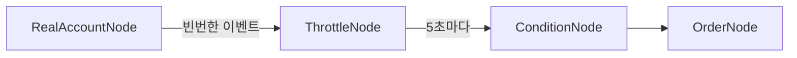
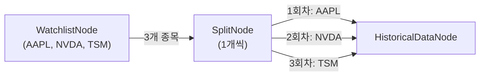
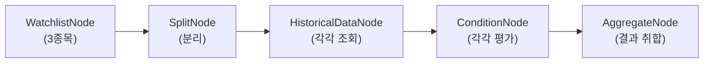
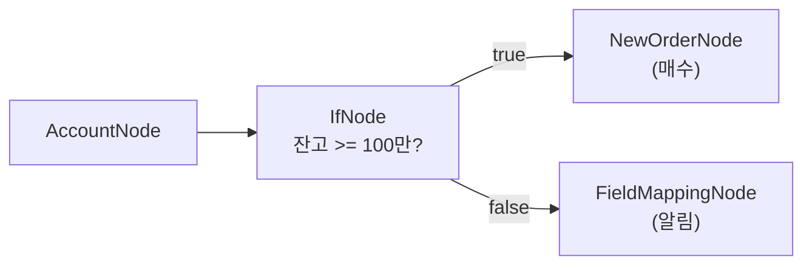
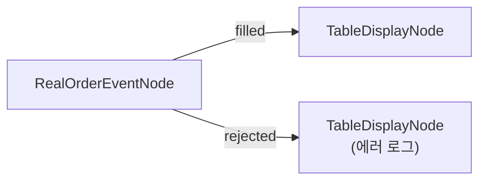
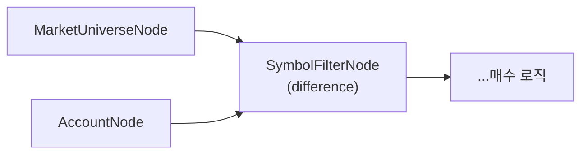
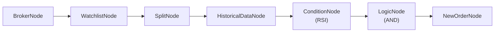
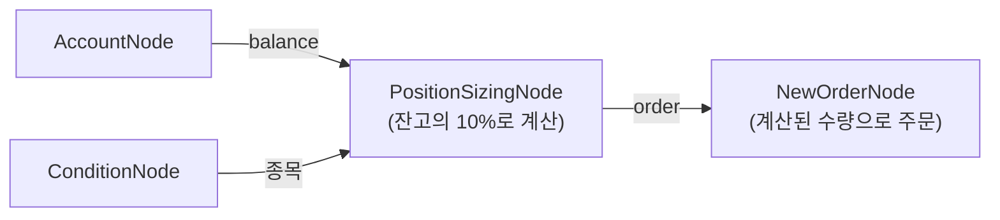
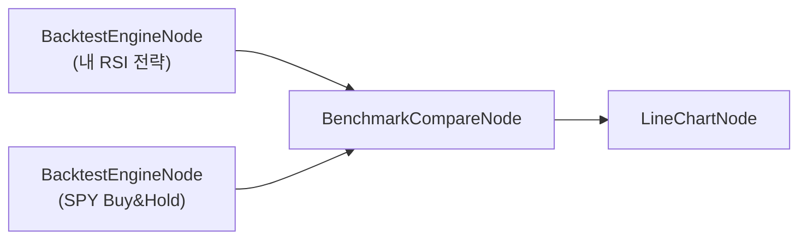

# 노드 레퍼런스 가이드

ProgramGarden에서 사용할 수 있는 모든 노드의 상세 설명입니다. 각 노드는 워크플로우에서 하나의 **블록** 역할을 하며, 블록을 연결(엣지)하여 자동매매 전략을 만듭니다.

> **노드 수**: 12개 카테고리, 72개 노드
>
> **해외주식 / 해외선물 / 국내주식**: 대부분의 노드가 상품별로 분리되어 있습니다. 예를 들어 `OverseasStockBrokerNode`(해외주식), `OverseasFuturesBrokerNode`(해외선물), `KoreaStockBrokerNode`(국내주식)는 같은 기능이지만 상품이 다릅니다.

---

## 1. infra - 인프라/연결

워크플로우의 시작점, 증권사 연결, 데이터 흐름 제어를 담당하는 기반 노드들입니다.

### StartNode

워크플로우의 **진입점**입니다. 모든 워크플로우에 반드시 1개 있어야 합니다. StartNode 없이는 워크플로우가 실행되지 않습니다.

```json
{
  "id": "start",
  "type": "StartNode"
}
```

**출력**: `start` - 워크플로우 시작 신호

> **주의**: StartNode는 ScheduleNode와 함께 사용하면 스케줄에 따라 반복 실행됩니다. StartNode만 있으면 1회 실행 후 종료됩니다.

---

### BrokerNode (증권사 연결)

LS증권 API에 연결하는 노드입니다. **증권사 연결이 필요한 모든 노드**(계좌 조회, 시세 조회, 주문 등)는 이 노드가 먼저 있어야 합니다.

상품 유형에 따라 노드 타입이 다릅니다:

| 상품 | 노드 타입 | credential 타입 | 모의투자 |
|------|----------|----------------|---------|
| 해외주식 | `OverseasStockBrokerNode` | `broker_ls_overseas_stock` | 미지원 (실전만 가능) |
| 해외선물 | `OverseasFuturesBrokerNode` | `broker_ls_overseas_futures` | 지원 |
| 국내주식 | `KoreaStockBrokerNode` | `broker_ls_korea_stock` | 미지원 (실전만 가능) |

**해외주식 연결:**

```json
{
  "id": "broker",
  "type": "OverseasStockBrokerNode",
  "credential_id": "my-stock-cred"
}
```

**해외선물 연결 (모의투자):**

```json
{
  "id": "broker",
  "type": "OverseasFuturesBrokerNode",
  "credential_id": "my-futures-cred",
  "paper_trading": true
}
```

**국내주식 연결:**

```json
{
  "id": "broker",
  "type": "KoreaStockBrokerNode",
  "credential_id": "my-kr-cred"
}
```

| 필드 | 타입 | 필수 | 설명 |
|------|------|:----:|------|
| `credential_id` | string | ✅ | credentials 섹션에서 정의한 인증 ID |
| `paper_trading` | boolean | ❌ | 모의투자 여부 (**해외선물만** 지원, 기본: false) |

**출력**: `connection` - 증권사 연결 객체

> **자동 전달**: BrokerNode의 `connection`은 하위 노드(계좌, 시세, 주문 등)에 자동으로 전달됩니다. 엣지로 연결만 해주면 되고, `{{ nodes.broker.connection }}`처럼 직접 바인딩할 필요가 없습니다.

> **주의 - 모의투자**: LS증권은 해외주식/국내주식 모의투자를 지원하지 않습니다. 모의투자를 먼저 해보고 싶다면 해외선물(`OverseasFuturesBrokerNode`)로 시작하세요.

> **주의 - credential 설정**: `credential_id`가 credentials 섹션의 ID와 정확히 일치해야 합니다. 불일치하면 연결에 실패합니다.

---

### ThrottleNode

실시간 데이터의 흐름을 제어하는 **속도 조절기**입니다. 실시간 노드(RealMarketDataNode, RealAccountNode 등)는 초당 수십 번 데이터를 보내는데, 이를 받아서 하위 노드가 너무 자주 실행되지 않도록 막아줍니다.

```json
{
  "id": "throttle",
  "type": "ThrottleNode",
  "mode": "latest",
  "interval_sec": 5,
  "pass_first": true
}
```

| 필드 | 타입 | 기본값 | 설명 |
|------|------|--------|------|
| `mode` | `"skip"` \| `"latest"` | `"latest"` | 쿨다운 중 데이터 처리 방식 |
| `interval_sec` | number | `5` | 최소 실행 간격 (초), 0.1~300 |
| `pass_first` | boolean | `true` | 첫 번째 데이터를 즉시 통과시킬지 여부 |

**모드 설명:**

| 모드 | 동작 | 언제 쓰나요? |
|------|------|------------|
| `skip` | 쿨다운 중 들어오는 데이터를 전부 버림 | 단순히 실행 빈도만 줄이고 싶을 때 |
| `latest` | 쿨다운 중 최신 데이터만 기억해두고, 쿨다운 끝나면 그 데이터로 실행 | 항상 최신 상태를 반영해야 할 때 **(권장)** |

**latest 모드 동작 예시:**

```
시간 →  0초    1초    2초    3초    4초    5초    6초
데이터    A     B     C     D      -     E     F
결과     통과   대기   대기   대기         D실행   통과
                                   (쿨다운 끝나면 가장 최신인 D 실행)
```

**필수 사용 패턴:**



> **중요**: 실시간 노드 → 주문 노드, 실시간 노드 → AI 에이전트를 **직접 연결하면 차단**됩니다. 반드시 ThrottleNode를 사이에 넣어야 합니다. 이는 초당 수십 번의 주문이 나가는 사고를 방지하기 위한 안전장치입니다.

> **팁**: `interval_sec`을 너무 짧게 설정하면 API 호출이 과도해져 증권사에서 제한당할 수 있습니다. 주문 관련 흐름에서는 최소 5초 이상을 권장합니다.

---

### SplitNode

리스트(배열) 데이터를 개별 항목으로 **분리**하여 하나씩 처리합니다. 예를 들어 관심종목 3개를 하나씩 분리해서 각각 차트 데이터를 조회할 때 사용합니다.

```json
{
  "id": "split",
  "type": "SplitNode",
  "parallel": false,
  "continue_on_error": true
}
```

| 필드 | 타입 | 기본값 | 설명 |
|------|------|--------|------|
| `parallel` | boolean | `false` | 병렬 실행 여부 (true면 동시에 실행) |
| `delay_ms` | number | `0` | 항목 간 대기 시간 (밀리초, 0~60000) |
| `continue_on_error` | boolean | `true` | 하나가 에러 나도 나머지 계속 처리 |

**출력:**
- `item` - 현재 처리 중인 항목
- `index` - 현재 순번 (0부터 시작)
- `total` - 전체 항목 수

**사용 예시:**



하위 노드에서 현재 항목을 참조할 때는 `{{ item }}`을 사용합니다:

```json
{
  "id": "history",
  "type": "OverseasStockHistoricalDataNode",
  "symbol": "{{ item }}"
}
```

> **주의 - API 호출 제한**: 종목이 많을 때 `parallel: true`로 설정하면 증권사 API를 동시에 많이 호출하게 되어 제한당할 수 있습니다. 10개 이상의 종목을 처리할 때는 `parallel: false`로 하고 `delay_ms: 500` 정도를 권장합니다.

> **팁**: SplitNode 없이도 이전 노드가 배열을 출력하면 다음 노드가 자동으로 반복 실행됩니다 (Auto-Iterate). SplitNode은 `parallel`, `delay_ms` 등 세밀한 제어가 필요할 때 사용하세요. 자세한 내용은 [자동 반복 처리 가이드](auto_iterate_guide.md)를 참고하세요.

---

### AggregateNode

SplitNode으로 분리된 결과를 다시 **하나로 모으는** 노드입니다. 예를 들어 3개 종목의 RSI 결과를 모아서 조건을 통과한 종목만 필터링할 때 사용합니다.

```json
{
  "id": "aggregate",
  "type": "AggregateNode",
  "mode": "collect"
}
```

| 필드 | 타입 | 기본값 | 설명 |
|------|------|--------|------|
| `mode` | string | `"collect"` | 집계 방식 |
| `filter_field` | string | `"passed"` | `filter` 모드에서 필터링할 필드명 |
| `value_field` | string | `"value"` | `sum`/`avg`/`min`/`max`에서 대상 필드명 |

**mode 옵션:**

| 모드 | 설명 | 사용 예시 |
|------|------|----------|
| `collect` | 모든 결과를 배열로 모음 | 3개 종목의 차트 데이터를 하나의 배열로 |
| `filter` | 특정 필드가 true인 것만 모음 | RSI 조건 통과한 종목만 |
| `sum` | 숫자 합계 | 전체 포지션 금액 합계 |
| `avg` | 숫자 평균 | 평균 수익률 |
| `min` / `max` | 최솟값 / 최댓값 | 가장 낮은 RSI 값 |
| `count` | 개수 | 조건 통과한 종목 수 |
| `first` / `last` | 첫 번째 / 마지막 항목 | - |

**출력:**
- `array` - 집계된 배열
- `value` - 집계된 단일 값 (sum, avg 등)
- `count` - 항목 수

**전형적인 패턴 (Split → 처리 → Aggregate):**



---

### IfNode (조건 분기)

조건을 평가하여 **true/false 두 갈래로 실행 흐름을 분기**하는 노드입니다. 프로그래밍의 `if-else`와 같은 역할입니다.

```json
{
  "nodes": [
    {"id": "account", "type": "OverseasStockAccountNode"},
    {"id": "if1", "type": "IfNode",
     "left": "{{ nodes.account.balance }}",
     "operator": ">=",
     "right": 1000000},
    {"id": "order", "type": "OverseasStockNewOrderNode"},
    {"id": "notify", "type": "FieldMappingNode"}
  ],
  "edges": [
    {"from": "account", "to": "if1"},
    {"from": "if1", "to": "order", "from_port": "true"},
    {"from": "if1", "to": "notify", "from_port": "false"}
  ]
}
```

위 예시는 계좌 잔고가 100만원 이상이면 주문 실행, 미만이면 알림 노드로 분기합니다.

**입력 필드:**

| 필드 | 타입 | 설명 | 표현식 |
|------|------|------|--------|
| `left` | any | 왼쪽 피연산자 | `{{ nodes.account.balance }}` |
| `operator` | string | 비교 연산자 (기본값: `==`) | - |
| `right` | any | 오른쪽 피연산자 | `{{ 1000000 }}` |

**지원 연산자 (12종):**

| 연산자 | 설명 | 예시 |
|--------|------|------|
| `==` | 같음 | `"AAPL" == "AAPL"` → true |
| `!=` | 다름 | `5 != 3` → true |
| `>` | 초과 | `100 > 50` → true |
| `>=` | 이상 | `100 >= 100` → true |
| `<` | 미만 | `50 < 100` → true |
| `<=` | 이하 | `100 <= 100` → true |
| `in` | 포함됨 | `"AAPL" in ["AAPL","TSLA"]` → true |
| `not_in` | 미포함 | `"MSFT" not_in ["AAPL","TSLA"]` → true |
| `contains` | 문자열 포함 | `"Hello World" contains "World"` → true |
| `not_contains` | 문자열 미포함 | `"Hello" not_contains "World"` → true |
| `is_empty` | 빈값 (right 불필요) | `[] is_empty` → true |
| `is_not_empty` | 비어있지 않음 (right 불필요) | `[1,2] is_not_empty` → true |

> **타입 자동 변환**: 숫자 비교(`>`, `>=`, `<`, `<=`)에서 문자열 `"100"`과 숫자 `50`을 비교하면 자동으로 숫자로 변환합니다. 변환 불가능한 경우 `false`를 반환합니다.

**출력:**

| 포트 | 타입 | 설명 |
|------|------|------|
| `true` | any | 조건 참 → upstream 데이터 pass-through |
| `false` | any | 조건 거짓 → upstream 데이터 pass-through |
| `result` | boolean | 조건 평가 결과 (`true` / `false`) |

**분기 연결 (from_port):**

엣지에 `from_port`를 지정하여 어떤 브랜치의 후속 노드인지 명시합니다:

```json
{"from": "if1", "to": "buy_order", "from_port": "true"}
{"from": "if1", "to": "sell_order", "from_port": "false"}
```

`from_port`가 없는 엣지는 **항상 실행**됩니다 (합류 노드에 유용).

**활용 패턴:**

1. **잔고 확인 후 주문**: 잔고 >= 최소금액 → 매수 / 아니면 → 대기
2. **종목 필터링**: 종목코드 `in` 관심종목 리스트 → 분석 진행
3. **다단계 분기**: IfNode를 연속 배치하여 `if-elif-else` 구현



> **캐스케이딩 스킵**: false 브랜치의 하위 노드들은 자동으로 실행이 스킵됩니다. 여러 노드가 연결되어 있어도 스킵이 전파됩니다.

---

## 2. account - 계좌 조회

계좌 잔고, 보유종목, 미체결 주문을 조회하는 노드들입니다.

### AccountNode (1회성 계좌 조회)

REST API로 현재 시점의 계좌 정보를 **한 번** 조회합니다. 스냅샷을 찍는 것과 같습니다.

| 상품 | 노드 타입 |
|------|----------|
| 해외주식 | `OverseasStockAccountNode` |
| 해외선물 | `OverseasFuturesAccountNode` |
| 국내주식 | `KoreaStockAccountNode` |

```json
{
  "id": "account",
  "type": "OverseasStockAccountNode"
}
```

**출력:**
- `held_symbols` - 보유종목 코드 리스트 `["AAPL", "NVDA"]`
- `balance` - 예수금/매수가능금액
- `positions` - 보유종목 상세 정보

**positions 출력 예시:**

```json
[
  {
    "symbol": "AAPL",
    "exchange": "NASDAQ",
    "quantity": 10,
    "buy_price": 185.50,
    "current_price": 192.30,
    "pnl_rate": 3.67
  },
  {
    "symbol": "NVDA",
    "exchange": "NASDAQ",
    "quantity": 5,
    "buy_price": 880.00,
    "current_price": 920.50,
    "pnl_rate": 4.60
  }
]
```

> **주의**: AccountNode는 실행 시점의 데이터를 1회 조회합니다. 실시간으로 계속 업데이트되는 데이터가 필요하면 RealAccountNode을 사용하세요.

> **주의**: 보유종목이 없으면 `positions`는 빈 배열 `[]`을 반환합니다. 잔고가 0이면 `balance`는 0을 반환합니다. 에러가 아닙니다.

---

### OpenOrdersNode (미체결 주문 조회)

아직 체결되지 않은 주문 목록을 조회합니다. 지정가 주문을 넣었는데 아직 체결되지 않은 경우 등을 확인할 수 있습니다.

| 상품 | 노드 타입 |
|------|----------|
| 해외주식 | `OverseasStockOpenOrdersNode` |
| 해외선물 | `OverseasFuturesOpenOrdersNode` |
| 국내주식 | `KoreaStockOpenOrdersNode` |

```json
{
  "id": "openOrders",
  "type": "OverseasStockOpenOrdersNode"
}
```

**출력:**
- `open_orders` - 미체결 주문 목록
- `count` - 미체결 주문 수

**open_orders 출력 예시:**

```json
[
  {
    "order_no": "12345",
    "symbol": "AAPL",
    "side": "buy",
    "order_type": "limit",
    "price": 180.00,
    "quantity": 10,
    "filled_quantity": 0
  }
]
```

> **팁**: CancelOrderNode + TimeStop 플러그인과 조합하면 "30분 이내 미체결 시 자동 취소" 같은 로직을 만들 수 있습니다.

---

### RealAccountNode (실시간 계좌)

WebSocket으로 계좌 정보를 **실시간** 수신합니다. 주문이 체결되거나 시세가 변할 때마다 자동으로 업데이트됩니다.

| 상품 | 노드 타입 |
|------|----------|
| 해외주식 | `OverseasStockRealAccountNode` |
| 해외선물 | `OverseasFuturesRealAccountNode` |
| 국내주식 | `KoreaStockRealAccountNode` |

```json
{
  "id": "realAccount",
  "type": "OverseasStockRealAccountNode",
  "stay_connected": true,
  "sync_interval_sec": 60,
  "commission_rate": 0.25
}
```

| 필드 | 타입 | 기본값 | 설명 |
|------|------|--------|------|
| `stay_connected` | boolean | `true` | 워크플로우 종료 후에도 WebSocket 연결 유지 |
| `sync_interval_sec` | number | `60` | REST API로 정확한 데이터 동기화하는 주기 (초, 10~3600) |
| `commission_rate` | number | `0.25` | 수수료율 (%), 수익률 계산에 반영 |
| `tax_rate` | number | `0.0` | 세율 (%), 수익률 계산에 반영 |

**출력:**
- `held_symbols` - 보유종목 코드
- `balance` - 예수금
- `open_orders` - 미체결 주문
- `positions` - 보유종목 (실시간 수익률 포함)

**AccountNode vs RealAccountNode 비교:**

| 항목 | AccountNode | RealAccountNode |
|------|-------------|-----------------|
| 연결 방식 | REST API (1회 조회) | WebSocket (실시간 스트리밍) |
| 데이터 갱신 | 호출 시점 1번 | 이벤트 발생 시 자동 갱신 |
| 사용 시점 | 매매 전 잔고 확인 | 실시간 모니터링, 리스크 관리 |
| 리소스 | 가벼움 | 연결 유지 필요 |

> **주의**: RealAccountNode의 데이터는 매우 빈번하게 업데이트됩니다. 하위에 주문 노드를 연결할 때는 반드시 **ThrottleNode**를 사이에 넣어주세요.

> **팁 - commission_rate**: 해외주식 수수료는 증권사마다 다릅니다. LS증권의 경우 약 0.25%입니다. 정확한 수익률 계산을 위해 실제 수수료율을 입력하세요.

---

### RealOrderEventNode (실시간 주문 이벤트)

주문이 접수/체결/정정/취소/거부될 때마다 실시간으로 이벤트를 수신합니다. 주문 상태를 모니터링할 때 사용합니다.

| 상품 | 노드 타입 |
|------|----------|
| 해외주식 | `OverseasStockRealOrderEventNode` |
| 해외선물 | `OverseasFuturesRealOrderEventNode` |
| 국내주식 | `KoreaStockRealOrderEventNode` |

```json
{
  "id": "orderEvents",
  "type": "OverseasStockRealOrderEventNode",
  "stay_connected": true
}
```

| 필드 | 타입 | 기본값 | 설명 |
|------|------|--------|------|
| `stay_connected` | boolean | `true` | WebSocket 연결 유지 여부 |

**출력 (5개 포트):**

이벤트 종류별로 다른 출력 포트로 나갑니다:

| 포트 | 설명 | 언제 발생하나요? |
|------|------|-----------------|
| `accepted` | 주문 접수됨 | 주문이 거래소에 접수되었을 때 |
| `filled` | 체결됨 | 주문이 실제로 체결되었을 때 |
| `modified` | 정정 완료 | 주문 가격/수량이 정정되었을 때 |
| `cancelled` | 취소 완료 | 주문이 취소되었을 때 |
| `rejected` | 거부됨 | 주문이 거래소에서 거부되었을 때 |

**사용 예시 - 체결 알림:**



> **팁**: `filled` 포트에 조건 로직을 연결하면 "체결되면 → 익절/손절 주문 자동 발생" 같은 흐름을 만들 수 있습니다.

---

## 3. market - 시세/종목

시세 조회, 종목 검색, 관심종목 관리를 담당하는 노드들입니다.

### MarketDataNode (현재가 조회)

REST API로 **당일 현재가**를 조회합니다. 단일 종목 기반으로 동작하며, 여러 종목을 조회하려면 SplitNode과 조합합니다.

| 상품 | 노드 타입 |
|------|----------|
| 해외주식 | `OverseasStockMarketDataNode` |
| 해외선물 | `OverseasFuturesMarketDataNode` |
| 국내주식 | `KoreaStockMarketDataNode` |

```json
{
  "id": "market",
  "type": "OverseasStockMarketDataNode",
  "symbol": "{{ item }}"
}
```

| 필드 | 타입 | 필수 | 설명 |
|------|------|:----:|------|
| `symbol` | object | ✅ | 종목 정보 |

`symbol` 지정 방법:
- SplitNode과 함께: `"{{ item }}"` (자동으로 현재 종목 사용)
- 직접 지정: `{"exchange": "NASDAQ", "symbol": "AAPL"}`

**출력**: `value` - 시세 데이터

```json
{
  "symbol": "AAPL",
  "exchange": "NASDAQ",
  "price": 192.30,
  "change": 1.50,
  "change_pct": 0.79,
  "volume": 45123456,
  "open": 190.50,
  "high": 193.20,
  "low": 189.80,
  "close": 192.30
}
```

> **MarketDataNode vs HistoricalDataNode**: MarketDataNode은 **오늘 현재가 1건**만 조회합니다. RSI나 MACD 같은 기술적 지표를 계산하려면 과거 N일 데이터가 필요하므로 **HistoricalDataNode**을 사용하세요.

---

### FundamentalNode (종목 펀더멘털 조회)

LS증권 g3104 API로 **PER, EPS, 시가총액, 52주 고/저가** 등 펀더멘털 데이터를 조회합니다. **해외주식 전용**입니다 (해외선물은 파생상품이므로 펀더멘털 개념 없음).

| 상품 | 노드 타입 |
|------|----------|
| 해외주식 | `OverseasStockFundamentalNode` |
| 해외선물 | - (지원하지 않음) |

```json
{
  "id": "fundamental",
  "type": "OverseasStockFundamentalNode",
  "symbols": [
    {"exchange": "NASDAQ", "symbol": "AAPL"},
    {"exchange": "NASDAQ", "symbol": "MSFT"}
  ]
}
```

| 필드 | 타입 | 필수 | 설명 |
|------|------|:----:|------|
| `symbol` | object | - | 단일 종목 (`{exchange, symbol}`) |
| `symbols` | array | - | 복수 종목 배열 |

`symbol` 또는 `symbols` 중 하나를 지정합니다. SplitNode과 함께 사용 시 `"symbol": "{{ item }}"`.

**출력**: `value` / `values` — 펀더멘털 데이터

```json
{
  "exchange": "NASDAQ", "symbol": "AAPL", "name": "APPLE INC",
  "industry": "Technology", "nation": "USA", "exchange_name": "NASDAQ",
  "current_price": 264.35, "volume": 45123456, "change_percent": 1.25,
  "per": 33.39, "eps": 7.9,
  "market_cap": 3869057094000, "shares_outstanding": 14681100000,
  "high_52w": 288.62, "low_52w": 169.21, "exchange_rate": 1443.1
}
```

| 출력 필드 | 설명 |
|-----------|------|
| `per` | PER (주가수익비율) |
| `eps` | EPS (주당순이익) |
| `market_cap` | 시가총액 |
| `shares_outstanding` | 발행주식수 |
| `high_52w` / `low_52w` | 52주 최고가 / 최저가 |
| `exchange_rate` | 환율 |

> **MarketDataNode vs FundamentalNode**: MarketDataNode은 시세(가격/변동) 위주이고 PER/EPS도 포함합니다. FundamentalNode은 **시가총액, 업종, 52주 고/저가, 발행주식수** 등 종목 기본정보를 추가로 제공합니다.

> **AI 에이전트 도구**: `is_tool_enabled = true`이므로 AIAgentNode에서 도구(tool)로 직접 호출할 수 있습니다.

---

### HistoricalDataNode (과거 차트 조회)

과거 N일치 **OHLCV**(시가/고가/저가/종가/거래량) 차트 데이터를 조회합니다. RSI, MACD 같은 기술적 지표 계산에 필수입니다.

| 상품 | 노드 타입 |
|------|----------|
| 해외주식 | `OverseasStockHistoricalDataNode` |
| 해외선물 | `OverseasFuturesHistoricalDataNode` |

```json
{
  "id": "history",
  "type": "OverseasStockHistoricalDataNode",
  "symbol": "{{ item }}",
  "interval": "1d",
  "start_date": "{{ date.ago(90, format='yyyymmdd') }}",
  "end_date": "{{ date.today(format='yyyymmdd') }}"
}
```

| 필드 | 타입 | 기본값 | 설명 |
|------|------|--------|------|
| `symbol` | object | - | 종목 정보 |
| `interval` | string | `"1d"` | 데이터 주기 |
| `start_date` | string | 3개월 전 | 조회 시작일 (YYYYMMDD) |
| `end_date` | string | 오늘 | 조회 종료일 (YYYYMMDD) |
| `adjust` | boolean | `false` | 수정주가 적용 여부 |

**interval 옵션:**

| 값 | 주기 | 용도 |
|----|------|------|
| `1m` | 1분봉 | 단타/스캘핑 |
| `5m` | 5분봉 | 단기 매매 |
| `15m` | 15분봉 | 단기 매매 |
| `1h` | 1시간봉 | 스윙 트레이딩 |
| `1d` | 일봉 | **가장 많이 사용** |
| `1w` | 주봉 | 중장기 분석 |
| `1M` | 월봉 | 장기 분석 |

**출력**: `value` - OHLCV 배열

```json
[
  {"date": "2025-01-10", "open": 190.0, "high": 193.5, "low": 189.2, "close": 192.3, "volume": 45000000},
  {"date": "2025-01-09", "open": 188.5, "high": 191.0, "low": 187.8, "close": 190.0, "volume": 38000000}
]
```

> **주의 - RSI 기간 설정**: RSI 14일을 계산하려면 최소 14일 이상의 데이터가 필요합니다. `start_date`를 넉넉하게 잡아주세요. 보통 RSI 14일 기준으로 최소 30일, 권장 90일 이상입니다.

> **주의 - 분봉 데이터**: 1분봉/5분봉은 조회 가능한 기간이 제한적입니다 (최근 수일). 일봉은 수년치 조회 가능합니다.

> **팁**: `adjust: true`로 설정하면 액면분할 등이 반영된 수정주가를 조회합니다. 장기 백테스트에 유용합니다.

---

### RealMarketDataNode (실시간 시세)

WebSocket으로 **실시간 시세**를 수신합니다. 체결이 발생할 때마다 데이터가 업데이트됩니다.

| 상품 | 노드 타입 |
|------|----------|
| 해외주식 | `OverseasStockRealMarketDataNode` |
| 해외선물 | `OverseasFuturesRealMarketDataNode` |

```json
{
  "id": "realMarket",
  "type": "OverseasStockRealMarketDataNode",
  "symbol": "{{ item }}",
  "stay_connected": true
}
```

| 필드 | 타입 | 기본값 | 설명 |
|------|------|--------|------|
| `symbol` | object | - | 종목 (SplitNode의 `{{ item }}` 사용) |
| `stay_connected` | boolean | `true` | 워크플로우 종료 후에도 연결 유지 |

**출력:**
- `ohlcv_data` - OHLCV 실시간 데이터
- `data` - 전체 시세 (현재가, 호가, 거래량 등)

> **LS증권 미국 주식 거래 시간 (한국시간 기준)**:
>
> | 구간 | 겨울 (서머타임 미적용) | 여름 (서머타임 적용, 3~11월) | 비고 |
> |------|----------------------|---------------------------|------|
> | 주간거래 | 10:00 ~ 17:30 | 09:00 ~ 16:30 | 지정가만 가능 |
> | 프리마켓 | 18:00 ~ 23:30 | 17:00 ~ 22:30 | 장전 시간외 |
> | 정규장 | 23:30 ~ 06:00 (익일) | 22:30 ~ 05:00 (익일) | 메인 거래 시간 |
> | 애프터마켓 | 06:00 ~ 09:30 | 05:00 ~ 08:30 | 장후 시간외 |
>
> 실시간 시세는 위 거래 시간 중에 수신됩니다.

> **주의**: 실시간 노드 하위에 주문이나 AI 노드를 연결할 때는 반드시 ThrottleNode를 거쳐야 합니다.

---

### SymbolQueryNode (종목 검색)

종목 코드나 이름으로 종목을 검색합니다. "애플의 종목코드가 뭐지?" 할 때 사용합니다.

| 상품 | 노드 타입 |
|------|----------|
| 해외주식 | `OverseasStockSymbolQueryNode` |
| 해외선물 | `OverseasFuturesSymbolQueryNode` |

```json
{
  "id": "query",
  "type": "OverseasStockSymbolQueryNode",
  "keyword": "AAPL"
}
```

**출력**: `symbols` - 검색 결과 종목 리스트

---

### WatchlistNode (관심종목)

사용자가 직접 지정하는 **관심종목 목록**입니다. 워크플로우에서 처리할 종목을 정의하는 가장 기본적인 방법입니다.

```json
{
  "id": "watchlist",
  "type": "WatchlistNode",
  "symbols": [
    {"exchange": "NASDAQ", "symbol": "AAPL"},
    {"exchange": "NASDAQ", "symbol": "NVDA"},
    {"exchange": "NYSE", "symbol": "TSM"}
  ]
}
```

| 필드 | 타입 | 필수 | 설명 |
|------|------|:----:|------|
| `symbols` | array | ✅ | 종목 목록 (`{exchange, symbol}` 배열) |

**출력**: `symbols` - 종목 리스트

> **주의 - exchange 필수**: 종목 코드만 넣으면 안 됩니다. `exchange`(거래소)와 `symbol`(종목코드)을 함께 지정해야 합니다.

| 거래소 | 코드 | 예시 종목 |
|--------|------|----------|
| 나스닥 | `NASDAQ` | AAPL, NVDA, TSLA, MSFT |
| 뉴욕증권거래소 | `NYSE` | TSM, JPM, V, WMT |
| 아멕스 | `AMEX` | SPY, QQQ, GLD |

---

### MarketUniverseNode (지수 구성종목)

나스닥100, S&P500 같은 **대표 지수의 구성종목**을 자동으로 가져옵니다.

> 해외주식 전용입니다. Broker 연결이 필요하지 않습니다 (독립 실행).

```json
{
  "id": "universe",
  "type": "MarketUniverseNode",
  "universe": "NASDAQ100"
}
```

| 필드 | 타입 | 기본값 | 설명 |
|------|------|--------|------|
| `universe` | string | `"NASDAQ100"` | 지수 이름 |

**지원 인덱스:**

| 인덱스 | 종목 수 | 설명 |
|--------|--------|------|
| `NASDAQ100` | ~101개 | 나스닥 대형주 100선 |
| `SP500` | ~503개 | S&P 500 |
| `SP100` | ~100개 | S&P 100 (대형주) |
| `DOW30` | 30개 | 다우존스 산업평균 |

**출력**: `symbols` (종목 리스트), `count` (종목 수)

> **팁**: MarketUniverseNode + ScreenerNode을 조합하면 "나스닥100 중 시총 1000억 이상 + 거래량 100만주 이상" 같은 스크리닝이 가능합니다.

---

### ScreenerNode (종목 스크리닝)

시가총액, 거래량, 섹터 등의 **조건으로 종목을 필터링**합니다.

> 해외주식 전용입니다. Broker 연결이 필요하지 않습니다.

```json
{
  "id": "screener",
  "type": "ScreenerNode",
  "market_cap_min": 100000000000,
  "volume_min": 1000000,
  "sector": "Technology",
  "exchange": "NASDAQ",
  "max_results": 10
}
```

| 필드 | 타입 | 기본값 | 설명 |
|------|------|--------|------|
| `symbols` | array | - | 입력 종목 리스트 (미지정 시 전체 대상) |
| `market_cap_min` | number | - | 최소 시가총액 (USD) |
| `market_cap_max` | number | - | 최대 시가총액 (USD) |
| `volume_min` | number | - | 최소 일 거래량 |
| `sector` | string | - | 섹터 (Technology, Healthcare, Financial 등) |
| `exchange` | string | - | 거래소 (NASDAQ, NYSE, AMEX) |
| `max_results` | number | `100` | 최대 결과 수 (1~500) |

**출력**: `symbols` (조건 충족 종목), `count` (결과 수)

> **팁 - 시가총액 단위**: 미국 달러 기준입니다. 1000억 달러 = `100000000000`, 10억 달러 = `1000000000`.

---

### SymbolFilterNode (종목 집합 연산)

두 종목 리스트를 **비교/필터링**합니다. 집합 연산(차집합, 교집합, 합집합)을 수행합니다.

```json
{
  "id": "filter",
  "type": "SymbolFilterNode",
  "operation": "difference",
  "input_a": "{{ nodes.universe.symbols }}",
  "input_b": "{{ nodes.account.held_symbols }}"
}
```

| 필드 | 타입 | 기본값 | 설명 |
|------|------|--------|------|
| `operation` | string | `"difference"` | 연산 방식 |
| `input_a` | expression | - | 첫 번째 종목 리스트 |
| `input_b` | expression | - | 두 번째 종목 리스트 |

**operation 옵션:**

| 연산 | 의미 | 실전 예시 |
|------|------|----------|
| `difference` | A에만 있는 것 (A - B) | 나스닥100 중 **아직 보유하지 않은** 종목 |
| `intersection` | A, B 모두에 있는 것 | 관심종목 중 **현재 보유 중인** 종목 |
| `union` | A + B 합치기 | 두 리스트 합치기 (중복 제거) |

**출력**: `symbols` (결과 리스트), `count` (개수)

**사용 예시 - 미보유 종목만 매수:**



### ExclusionListNode (거래 제외 종목)

거래에서 **제외할 종목**을 관리합니다. 수동 입력과 동적 바인딩을 결합할 수 있고, 입력 종목 리스트에서 자동 필터링도 가능합니다.

```json
{
  "id": "exclusion",
  "type": "ExclusionListNode",
  "symbols": [
    {"exchange": "NASDAQ", "symbol": "NVDA", "reason": "변동성 과다"},
    {"exchange": "NYSE", "symbol": "BA", "reason": "사고 리스크"}
  ],
  "default_reason": "리스크 관리",
  "input_symbols": "{{ nodes.watchlist.symbols }}"
}
```

| 필드 | 타입 | 기본값 | 설명 |
|------|------|--------|------|
| `symbols` | array | `[]` | 수동 제외 종목 `[{exchange, symbol, reason}]` |
| `dynamic_symbols` | expression | - | 동적 제외 종목 바인딩 |
| `input_symbols` | expression | - | 필터링할 원본 종목 리스트 |
| `default_reason` | string | `""` | 사유 미지정 시 기본 사유 |

**출력**: `excluded` (제외 종목), `filtered` (필터링 결과), `count` (제외 수), `reasons` (종목별 사유)

**3가지 활용 패턴:**

| 패턴 | 설명 | 설정 |
|------|------|------|
| 선언만 | 제외 목록 정의, 다른 노드에서 참조 | `symbols`만 설정 |
| 직접 필터링 | 입력 리스트에서 제외 종목 제거 | `symbols` + `input_symbols` |
| SymbolFilter 연동 | 차집합 연산으로 제외 적용 | SymbolFilterNode의 `input_b`에 `excluded` 연결 |

**주문 안전장치**: ExclusionListNode가 워크플로우에 있으면, NewOrderNode에서 제외 종목 주문을 **자동 차단**합니다 (`ignore_exclusion: true`로 비활성화 가능).

### CurrencyRateNode (환율 조회)

**credential 없이** 실시간 환율을 조회합니다. ECB 데이터 기반의 frankfurter.app API를 사용합니다.

```json
{
  "id": "currency",
  "type": "CurrencyRateNode",
  "base_currency": "USD",
  "target_currencies": ["KRW", "JPY", "EUR"]
}
```

| 출력 | 타입 | 설명 |
|------|------|------|
| `rates` | array | `[{base, target, rate, timestamp}]` 배열 |
| `krw_rate` | number | USD/KRW 환율 (KRW가 target에 포함된 경우) |

### FearGreedIndexNode (공포/탐욕 지수)

CNN의 Fear & Greed Index를 조회합니다. **credential 불필요**.

```json
{
  "id": "fg",
  "type": "FearGreedIndexNode"
}
```

| 출력 | 타입 | 설명 |
|------|------|------|
| `value` | number | 0~100 (0=극도 공포, 100=극도 탐욕) |
| `label` | string | Extreme Fear / Fear / Neutral / Greed / Extreme Greed |
| `previous_close` | number | 전일 종가 지수 |

> **팁**: IfNode와 연결하여 `value <= 25`이면 매수, `value >= 75`이면 매도하는 역발상 전략을 구성할 수 있습니다.

> **공통**: 외부 시장 데이터 노드는 retry 기본 활성화, rate limit, 실시간 노드 직접 연결 차단 (ThrottleNode 경유 필수) 설정을 가집니다.

---

## 4. condition - 조건 평가

매수/매도 조건을 판단하는 핵심 노드들입니다.

### ConditionNode

**플러그인 기반**으로 매수/매도 조건을 판단합니다. RSI, MACD, 볼린저밴드 등 다양한 기술적 지표를 플러그인으로 선택하여 사용합니다.

```json
{
  "id": "rsi",
  "type": "ConditionNode",
  "plugin": "RSI",
  "fields": {
    "period": 14,
    "threshold": 30,
    "direction": "below"
  }
}
```

| 필드 | 타입 | 필수 | 설명 |
|------|------|:----:|------|
| `plugin` | string | ✅ | 사용할 플러그인 ID (RSI, MACD 등) |
| `fields` | object | ❌ | 플러그인별 파라미터 |
| `positions` | expression | 조건부 | 포지션 데이터 (익절/손절 플러그인에서 필수) |

**플러그인별로 필요한 데이터가 다릅니다:**

| 플러그인 유형 | 필요 데이터 | 연결할 노드 | 예시 플러그인 |
|-------------|-----------|------------|-------------|
| 시계열 기반 | 과거 OHLCV 데이터 | HistoricalDataNode | RSI, MACD, BollingerBands, VolumeSpike |
| 포지션 기반 | 보유종목 정보 | AccountNode의 positions | ProfitTarget, StopLoss |

**출력:**
- `result` - 조건 평가 결과

```json
{
  "passed": true,
  "passed_symbols": [
    {"symbol": "AAPL", "exchange": "NASDAQ", "rsi": 28.5}
  ],
  "analysis": [
    {"symbol": "AAPL", "rsi": 28.5, "signal": "oversold"},
    {"symbol": "NVDA", "rsi": 55.2, "signal": "neutral"}
  ]
}
```

- `passed`: 조건을 통과한 종목이 **하나라도** 있으면 `true`
- `passed_symbols`: 조건을 통과한 종목만
- `analysis`: 모든 종목의 분석 결과

**전형적인 사용 패턴:**



> **팁**: 하나의 워크플로우에 ConditionNode을 여러 개 넣고, LogicNode으로 조합할 수 있습니다. 예: "RSI 과매도 **AND** MACD 골든크로스일 때만 매수".

> 전체 플러그인 목록과 파라미터: [종목조건 플러그인](strategies/stock_condition.md)

---

### LogicNode

여러 조건을 **논리적으로 조합**합니다. "RSI **그리고** MACD", "RSI **또는** 볼린저밴드" 같은 복합 조건을 만듭니다.

```json
{
  "id": "logic",
  "type": "LogicNode",
  "operator": "all",
  "conditions": [
    {
      "is_condition_met": "{{ nodes.rsi.result }}",
      "passed_symbols": "{{ nodes.rsi.passed_symbols }}"
    },
    {
      "is_condition_met": "{{ nodes.macd.result }}",
      "passed_symbols": "{{ nodes.macd.passed_symbols }}"
    }
  ]
}
```

| 필드 | 타입 | 필수 | 설명 |
|------|------|:----:|------|
| `operator` | string | ✅ | 논리 연산자 |
| `threshold` | number | 조건부 | 임계값 (`at_least`, `weighted` 등에서 사용) |
| `conditions` | array | ✅ | 조건 목록 |

**conditions 배열 항목:**

| 필드 | 설명 |
|------|------|
| `is_condition_met` | ConditionNode의 result 바인딩 |
| `passed_symbols` | ConditionNode의 passed_symbols 바인딩 |
| `weight` | 가중치 (`weighted` 연산자에서만 사용, 0~1) |

**연산자 설명:**

| 연산자 | 의미 | 실전 예시 |
|--------|------|----------|
| `all` | 모든 조건 만족 (AND) | RSI 과매도 **그리고** MACD 골든크로스 |
| `any` | 하나 이상 만족 (OR) | RSI 과매도 **또는** 볼린저밴드 하단 이탈 |
| `not` | 모든 조건 불만족 | RSI 과매수 **아닌** 종목 |
| `xor` | 정확히 하나만 만족 | 두 신호 중 하나만 |
| `at_least` | N개 이상 만족 | 3개 조건 중 **2개 이상** (threshold: 2) |
| `at_most` | N개 이하 만족 | 최대 1개만 충족 |
| `exactly` | 정확히 N개 만족 | 정확히 2개 충족 |
| `weighted` | 가중치 합이 threshold 이상 | RSI 40% + MACD 35% + BB 25% = 가중 점수 |

**weighted 예시 (스코어링):**

```json
{
  "id": "logic",
  "type": "LogicNode",
  "operator": "weighted",
  "threshold": 0.6,
  "conditions": [
    {
      "is_condition_met": "{{ nodes.rsi.result }}",
      "passed_symbols": "{{ nodes.rsi.passed_symbols }}",
      "weight": 0.4
    },
    {
      "is_condition_met": "{{ nodes.macd.result }}",
      "passed_symbols": "{{ nodes.macd.passed_symbols }}",
      "weight": 0.35
    },
    {
      "is_condition_met": "{{ nodes.bb.result }}",
      "passed_symbols": "{{ nodes.bb.result.passed_symbols }}",
      "weight": 0.25
    }
  ]
}
```

이 예시에서 RSI(40%) + MACD(35%) = 75% ≥ 60%(threshold)이면 매수 신호가 됩니다.

> 상세 가이드: [조건 조합 (LogicNode)](logic_guide.md)

---

## 5. order - 주문 실행

실제 매수/매도 주문을 실행하는 노드들입니다.

### NewOrderNode (신규 주문)

신규 매수/매도 주문을 실행합니다. 플러그인으로 주문 방식(시장가/지정가)을 선택합니다.

| 상품 | 노드 타입 |
|------|----------|
| 해외주식 | `OverseasStockNewOrderNode` |
| 해외선물 | `OverseasFuturesNewOrderNode` |
| 국내주식 | `KoreaStockNewOrderNode` |

```json
{
  "id": "order",
  "type": "OverseasStockNewOrderNode",
  "plugin": "MarketOrder",
  "fields": {
    "side": "buy",
    "amount_type": "percent_balance",
    "amount": 90
  }
}
```

| 필드 | 타입 | 필수 | 설명 |
|------|------|:----:|------|
| `plugin` | string | ✅ | 주문 플러그인 (`MarketOrder` 또는 `LimitOrder`) |
| `fields` | object | ❌ | 플러그인 파라미터 |
| `order` | object | 조건부 | PositionSizingNode의 출력을 직접 바인딩할 때 |

**출력**: `result` - 주문 결과

```json
{
  "success": true,
  "order_no": "12345",
  "symbol": "AAPL",
  "side": "buy",
  "quantity": 10,
  "price": 192.30
}
```

> **중요 - 실시간 연결 차단**: 실시간 노드(RealMarketDataNode 등)에서 NewOrderNode으로 **직접 연결할 수 없습니다**. 초당 수십 번 주문이 나가는 사고를 방지하기 위해, 반드시 ThrottleNode를 사이에 넣어야 합니다.

> **주의 - 실전 주문**: 해외주식 BrokerNode은 모의투자를 지원하지 않으므로, 주문 노드를 연결하면 **실제 돈으로 거래**됩니다. 처음에는 소량으로 테스트하세요.

> **주의 - 재시도 비활성화**: 주문 노드는 네트워크 에러를 제외하고 자동 재시도가 **비활성화**되어 있습니다. 중복 주문을 방지하기 위한 안전장치입니다.

> 전체 주문 플러그인: [주문 플러그인](strategies/order_condition.md)

---

### ModifyOrderNode (주문 정정)

미체결 주문의 가격을 정정합니다. TrailingStop 플러그인과 조합하면 현재가를 추적하며 자동 정정할 수 있습니다.

| 상품 | 노드 타입 |
|------|----------|
| 해외주식 | `OverseasStockModifyOrderNode` |
| 해외선물 | `OverseasFuturesModifyOrderNode` |

```json
{
  "id": "modify",
  "type": "OverseasStockModifyOrderNode",
  "plugin": "TrailingStop",
  "fields": {
    "price_gap_percent": 0.5,
    "max_modifications": 5
  }
}
```

| 필드 | 타입 | 기본값 | 설명 |
|------|------|--------|------|
| `price_gap_percent` | number | `0.5` | 현재가 대비 주문가 차이 (%) |
| `max_modifications` | number | `5` | 최대 정정 횟수 |

> **팁**: 지정가 매수 주문을 넣었는데 가격이 오르면, TrailingStop이 자동으로 주문가를 올려서 체결 확률을 높입니다.

---

### CancelOrderNode (주문 취소)

미체결 주문을 취소합니다. TimeStop 플러그인으로 "N분 내 미체결 시 자동 취소"를 구현할 수 있습니다.

| 상품 | 노드 타입 |
|------|----------|
| 해외주식 | `OverseasStockCancelOrderNode` |
| 해외선물 | `OverseasFuturesCancelOrderNode` |

```json
{
  "id": "cancel",
  "type": "OverseasStockCancelOrderNode",
  "plugin": "TimeStop",
  "fields": {
    "timeout_minutes": 30
  }
}
```

| 필드 | 타입 | 기본값 | 설명 |
|------|------|--------|------|
| `timeout_minutes` | number | `30` | 미체결 시 취소까지 대기 시간 (분) |

> **팁**: 지정가 주문 후 30분 동안 체결되지 않으면 자동 취소하고 싶다면 TimeStop을 사용하세요.

---

### PositionSizingNode (포지션 크기 계산)

**주문 수량을 자동으로 계산**합니다. "잔고의 10%만 투자" 같은 자금 관리 규칙을 적용합니다.

```json
{
  "id": "sizing",
  "type": "PositionSizingNode",
  "symbol": "{{ item }}",
  "balance": "{{ nodes.account.balance }}",
  "method": "fixed_percent",
  "max_percent": 10
}
```

| 필드 | 타입 | 기본값 | 설명 |
|------|------|--------|------|
| `symbol` | expression | - | 대상 종목 |
| `balance` | expression | - | 가용 잔고 |
| `market_data` | expression | - | 현재가 정보 (선택) |
| `method` | string | `"fixed_percent"` | 포지션 사이징 방법 |
| `max_percent` | number | `10` | 잔고 대비 비율 (%) |
| `fixed_amount` | number | - | 고정 금액 (fixed_amount 방법 시) |
| `fixed_quantity` | number | `1` | 고정 수량 (fixed_quantity 방법 시) |

**method 옵션:**

| 방법 | 설명 | 사용 예시 |
|------|------|----------|
| `fixed_percent` | 잔고의 N% | "잔고의 10%씩 투자" (가장 일반적) |
| `fixed_amount` | 고정 금액 | "종목당 $1000씩 투자" |
| `fixed_quantity` | 고정 수량 | "종목당 10주씩 매수" |
| `kelly` | 켈리 공식 | 승률 기반 최적 비율 (고급) |
| `atr_based` | ATR 기반 | 변동성 기반 사이징 (고급) |

**출력**: `order` - 주문 정보

```json
{
  "symbol": "AAPL",
  "exchange": "NASDAQ",
  "quantity": 5,
  "price": 192.30
}
```

**전형적인 사용 패턴:**



> **팁**: PositionSizingNode의 출력(`order`)을 NewOrderNode의 `order` 필드에 바인딩하면 자동으로 계산된 수량으로 주문됩니다. 과도한 집중 투자를 방지하는 핵심 노드입니다.

---

## 6. risk - 리스크 관리

### PortfolioNode

멀티 전략 포트폴리오의 **자본 배분과 리밸런싱**을 관리합니다. 여러 전략에 자금을 어떻게 나눌지 결정합니다.

```json
{
  "id": "portfolio",
  "type": "PortfolioNode",
  "total_capital": 100000,
  "allocation_method": "equal",
  "rebalance_rule": "drift",
  "drift_threshold": 5.0,
  "reserve_percent": 10
}
```

| 필드 | 타입 | 기본값 | 설명 |
|------|------|--------|------|
| `total_capital` | number | `100000` | 총 투자 자본 (USD) |
| `allocation_method` | string | `"equal"` | 자금 배분 방법 |
| `rebalance_rule` | string | `"none"` | 리밸런싱 규칙 |
| `drift_threshold` | number | `5.0` | 배분 비율 이탈 허용치 (%) |
| `reserve_percent` | number | `0` | 현금 보유 비율 (%, 비상금) |

**배분 방법:**

| 방법 | 설명 | 예시 (3개 전략, $100,000) |
|------|------|--------------------------|
| `equal` | 균등 배분 | 각각 $33,333 |
| `custom` | 사용자 지정 | RSI 50%, MACD 30%, BB 20% |
| `risk_parity` | 변동성 역비례 (변동성 낮은 전략에 더 많이) | 안정형 $45,000, 공격형 $25,000 등 |
| `momentum` | 최근 수익률 비례 (잘 되는 전략에 더 많이) | 수익률 높은 전략에 자금 집중 |

**리밸런싱 규칙:**

| 규칙 | 설명 |
|------|------|
| `none` | 리밸런싱 안 함 (초기 배분 유지) |
| `periodic` | 주기적으로 리밸런싱 (daily/weekly/monthly/quarterly) |
| `drift` | 배분 비율이 `drift_threshold`% 이상 벗어나면 리밸런싱 |
| `both` | 주기 + 드리프트 둘 다 적용 |

**출력**: `combined_equity` (통합 자산곡선), `allocation_weights` (배분 비율), `rebalance_signal` (리밸런싱 신호), `allocated_capital` (전략별 배분 금액)

> **팁 - reserve_percent**: 항상 일정 비율은 현금으로 보유하는 것이 안전합니다. `reserve_percent: 10`이면 총 자본의 10%를 현금으로 유지합니다.

---

## 7. schedule - 스케줄/시간

### ScheduleNode

크론(cron) 스케줄에 따라 워크플로우를 **반복 실행**합니다. "평일 9시에 자동 실행", "15분마다 체크" 같은 스케줄을 설정합니다.

```json
{
  "id": "schedule",
  "type": "ScheduleNode",
  "cron": "0 */15 9-16 * * mon-fri",
  "timezone": "America/New_York"
}
```

| 필드 | 타입 | 기본값 | 설명 |
|------|------|--------|------|
| `cron` | string | `"*/5 * * * *"` | 크론 표현식 |
| `timezone` | string | `"America/New_York"` | 타임존 |
| `enabled` | boolean | `true` | 활성화 여부 |

**자주 쓰는 크론 예시:**

| 표현식 | 설명 |
|--------|------|
| `0 30 9 * * *` | 매일 오전 9:30 (뉴욕 시간) |
| `0 */15 9-16 * * mon-fri` | 평일 9~16시, 15분마다 |
| `0 0 9 * * mon` | 매주 월요일 오전 9:00 |
| `0 0 23 * * *` | 한국시간 기준 매일 08:00 (뉴욕 23시) |

**출력**: `trigger` - 스케줄 트리거 신호

> **주의 - timezone**: 미국 주식은 뉴욕 시간(`America/New_York`)으로 설정하세요. 한국 시간으로 설정하면 거래시간이 맞지 않습니다.

> **팁 - LS증권 미국 주식 거래 시간 (한국시간 기준)**:
>
> | 구간 | 겨울 (서머타임 미적용) | 여름 (서머타임 적용, 3~11월) | 비고 |
> |------|----------------------|---------------------------|------|
> | 주간거래 | 10:00 ~ 17:30 | 09:00 ~ 16:30 | 지정가만 가능 |
> | 프리마켓 | 18:00 ~ 23:30 | 17:00 ~ 22:30 | 장전 시간외 |
> | 정규장 | 23:30 ~ 06:00 (익일) | 22:30 ~ 05:00 (익일) | 메인 거래 시간 |
> | 애프터마켓 | 06:00 ~ 09:30 | 05:00 ~ 08:30 | 장후 시간외 |
>
> 한국시간 오전에도 주간거래로 미국 주식 매매가 가능합니다. 정규장 외 시간에는 지정가 주문만 가능하므로 `LimitOrder` 플러그인을 사용하세요.

> 상세 가이드: [스케줄 설정](schedule_guide.md)

---

### TradingHoursFilterNode

**거래시간 필터**입니다. 거래시간이 아니면 대기하다가, 거래시간이 시작되면 통과시킵니다.

```json
{
  "id": "tradingHours",
  "type": "TradingHoursFilterNode",
  "start": "09:30",
  "end": "16:00",
  "timezone": "America/New_York",
  "days": ["mon", "tue", "wed", "thu", "fri"]
}
```

| 필드 | 타입 | 필수 | 설명 |
|------|------|:----:|------|
| `start` | string | ✅ | 시작 시간 (HH:MM) |
| `end` | string | ✅ | 종료 시간 (HH:MM) |
| `timezone` | string | ✅ | 타임존 |
| `days` | array | ✅ | 활성 요일 (mon, tue, wed, thu, fri, sat, sun) |

**동작 방식:**

| 상황 | 동작 |
|------|------|
| 거래시간 내 | 즉시 통과 |
| 거래시간 외 | 거래시간 시작까지 **대기** (blocking) |
| shutdown 요청 | 종료 |

**출력**: `passed` (통과 여부), `blocked` (차단 여부)

> **주의**: 거래시간 외에 워크플로우를 시작하면 이 노드에서 **멈춰서 대기**합니다. ScheduleNode과 조합하여 거래시간 내에만 실행되도록 설정하는 것을 권장합니다.

---

## 8. data - 데이터 조회/저장

### SQLiteNode

로컬 SQLite 데이터베이스에 데이터를 **저장하고 조회**합니다. 매매 이력 저장, 최고가 추적 등에 활용합니다.

두 가지 모드를 지원합니다:

#### 모드 1: execute_query (SQL 직접 작성)

SQL을 알고 있다면 직접 쿼리를 작성할 수 있습니다.

```json
{
  "id": "sqlite",
  "type": "SQLiteNode",
  "db_name": "trading.db",
  "operation": "execute_query",
  "query": "SELECT * FROM trade_history WHERE symbol = :symbol",
  "parameters": {"symbol": "AAPL"}
}
```

#### 모드 2: simple (SQL 없이 CRUD)

SQL 없이 테이블/액션/컬럼을 선택하여 사용합니다.

```json
{
  "id": "sqlite",
  "type": "SQLiteNode",
  "db_name": "trading.db",
  "operation": "simple",
  "table": "peak_tracker",
  "action": "upsert",
  "columns": ["symbol", "peak_price"],
  "values": {"symbol": "AAPL", "peak_price": 195.50},
  "on_conflict": "symbol"
}
```

| 필드 | 타입 | 필수 | 설명 |
|------|------|:----:|------|
| `db_name` | string | ✅ | DB 파일명 (자동 생성됨) |
| `operation` | string | ✅ | `execute_query` 또는 `simple` |
| `query` | string | 조건부 | SQL 쿼리 (execute_query 모드) |
| `parameters` | object | ❌ | 쿼리 파라미터 (`:name` 형식) |
| `table` | string | 조건부 | 테이블명 (simple 모드) |
| `action` | string | 조건부 | `select` / `insert` / `update` / `delete` / `upsert` |
| `values` | object | 조건부 | 저장할 값 |
| `on_conflict` | string | 조건부 | upsert 시 충돌 키 (예: `"symbol"`) |

**출력**: `rows` (조회 결과), `affected_count` (영향 행 수)

> **팁 - upsert**: "있으면 업데이트, 없으면 삽입"입니다. 최고가 추적처럼 한 종목당 하나의 레코드를 유지할 때 유용합니다.

---

### HTTPRequestNode

외부 HTTP API를 호출합니다. 뉴스 API, 경제 지표 API 등 외부 데이터를 가져올 때 사용합니다.

```json
{
  "id": "http",
  "type": "HTTPRequestNode",
  "method": "GET",
  "url": "https://api.example.com/news",
  "query_params": {"symbol": "AAPL", "limit": "5"},
  "timeout_seconds": 30
}
```

| 필드 | 타입 | 기본값 | 설명 |
|------|------|--------|------|
| `method` | string | `"GET"` | HTTP 메서드 (GET, POST, PUT, PATCH, DELETE) |
| `url` | string | - | 요청 URL |
| `query_params` | object | - | URL 쿼리 파라미터 |
| `body` | object | - | 요청 본문 (POST/PUT/PATCH) |
| `headers` | object | - | 추가 헤더 |
| `credential_id` | string | - | API 인증 정보 |
| `timeout_seconds` | number | `30` | 타임아웃 (초, 1~300) |

**출력**: `response` (응답 데이터), `status_code` (HTTP 상태 코드), `success` (성공 여부), `error` (에러 메시지)

> **주의**: 실시간 노드에서 HTTPRequestNode으로 직접 연결하면 **경고**가 표시됩니다. ThrottleNode를 사용하세요.

> **팁**: 인증이 필요한 API는 `credential_id`로 credentials 섹션의 HTTP 인증 정보를 참조합니다. Bearer 토큰, 헤더 키, Basic 인증 등을 지원합니다.

---

### FieldMappingNode

데이터의 **필드명을 변환**합니다. 외부 API 응답의 필드명이 ProgramGarden 형식과 다를 때 매핑해줍니다.

```json
{
  "id": "mapping",
  "type": "FieldMappingNode",
  "data": "{{ nodes.http.response }}",
  "mappings": [
    {"from": "ticker", "to": "symbol"},
    {"from": "last_price", "to": "price"},
    {"from": "vol", "to": "volume"}
  ],
  "preserve_unmapped": true
}
```

| 필드 | 타입 | 기본값 | 설명 |
|------|------|--------|------|
| `data` | expression | - | 변환할 데이터 |
| `mappings` | array | - | 매핑 규칙 `[{from: "원래이름", to: "새이름"}]` |
| `preserve_unmapped` | boolean | `true` | 매핑 규칙에 없는 필드도 유지할지 여부 |

**출력**: `mapped_data` (변환된 데이터)

**변환 전**: `{"ticker": "AAPL", "last_price": 192.30, "vol": 45000000}`
**변환 후**: `{"symbol": "AAPL", "price": 192.30, "volume": 45000000}`

> **팁**: ConditionNode의 플러그인은 `symbol`, `open`, `high`, `low`, `close`, `volume` 같은 표준 필드명을 기대합니다. 외부 API 데이터를 ConditionNode에 넣기 전에 FieldMappingNode으로 필드명을 맞춰주세요.

---

### FileReaderNode (파일 리더)

파일을 읽어 텍스트/데이터로 변환합니다. PDF, TXT, CSV, JSON, MD, DOCX, XLSX 포맷을 지원합니다. AIAgentNode의 도구로도 사용 가능합니다.

```json
{
  "id": "reader",
  "type": "FileReaderNode",
  "file_paths": ["/app/data/report.pdf", "/app/data/prices.csv"],
  "format": "auto"
}
```

| 필드 | 설명 | 기본값 |
|------|------|--------|
| `file_paths` | 파일 경로 배열 | - |
| `file_data_list` | Base64 인코딩 파일 데이터 배열 | - |
| `format` | 포맷 (`auto`, `pdf`, `txt`, `csv`, `json`, `md`, `docx`, `xlsx`) | `auto` |
| `pages` | PDF 페이지 범위 (예: `"1-5"`, `"1,3,5"`) | 전체 |
| `encoding` | 텍스트 인코딩 | `utf-8` |
| `extract_tables` | PDF 테이블 추출 (pdfplumber) | `false` |
| `sheet_name` | XLSX 시트명 | 첫 번째 시트 |
| `max_file_size_mb` | 파일당 최대 크기(MB) | `10` |

**출력 포트**: `texts` (텍스트 배열), `data_list` (파싱된 데이터 배열), `metadata` (파일 메타데이터 배열)

> **보안**: 파일 경로는 `/app/data/` 하위로 제한됩니다. 경로 탈출 공격이 자동 차단됩니다.

> **팁**: 복수 파일을 한 번에 처리하면 출력이 배열이 되어 auto-iterate로 파일별 AI 분석이 가능합니다.

---

## 9. display - 시각화

차트와 테이블을 생성합니다. 실시간 노드와 연결하면 데이터가 **자동으로 갱신**됩니다.

### TableDisplayNode (테이블)

데이터를 테이블(표) 형태로 표시합니다.

```json
{
  "id": "table",
  "type": "TableDisplayNode",
  "title": "보유 종목 현황",
  "data": "{{ nodes.account.positions }}",
  "columns": ["symbol", "quantity", "buy_price", "current_price", "pnl_rate"],
  "limit": 20,
  "sort_by": "pnl_rate",
  "sort_order": "desc"
}
```

| 필드 | 타입 | 기본값 | 설명 |
|------|------|--------|------|
| `title` | string | - | 테이블 제목 |
| `data` | expression | - | 표시할 데이터 (배열) |
| `columns` | array | 전체 | 표시할 컬럼 목록 (미지정 시 모든 컬럼) |
| `limit` | number | `10` | 최대 행 수 (1~100) |
| `sort_by` | string | - | 정렬 기준 컬럼 |
| `sort_order` | string | `"desc"` | `"asc"` (오름차순) 또는 `"desc"` (내림차순) |

---

### LineChartNode (라인 차트)

시계열 데이터를 라인 차트로 표시합니다. RSI 추이, 가격 변동 등을 시각화할 때 사용합니다.

```json
{
  "id": "chart",
  "type": "LineChartNode",
  "title": "RSI 추이",
  "data": "{{ nodes.rsi.result.analysis }}",
  "x_field": "date",
  "y_field": "rsi"
}
```

| 필드 | 타입 | 필수 | 설명 |
|------|------|:----:|------|
| `title` | string | ❌ | 차트 제목 |
| `data` | expression | ✅ | 차트 데이터 (배열) |
| `x_field` | string | ✅ | X축 필드명 (보통 `"date"`) |
| `y_field` | string | ✅ | Y축 필드명 (보통 값 필드) |

> **주의**: `x_field`와 `y_field`를 반드시 명시해야 합니다. 자동 추론은 지원하지 않습니다.

---

### MultiLineChartNode (다중 라인 차트)

여러 시리즈(종목)를 **한 차트에** 표시합니다. 종목별 가격 비교에 유용합니다.

```json
{
  "id": "multiChart",
  "type": "MultiLineChartNode",
  "title": "종목별 가격 추이",
  "data": "{{ nodes.history.values }}",
  "x_field": "date",
  "y_field": "close",
  "series_key": "symbol"
}
```

| 필드 | 타입 | 필수 | 설명 |
|------|------|:----:|------|
| `series_key` | string | ✅ | 시리즈 구분 키 (예: `"symbol"`이면 종목별로 라인 분리) |

---

### CandlestickChartNode (캔들스틱 차트)

OHLCV 데이터를 **캔들스틱(봉) 차트**로 표시합니다. 주식 차트의 기본 형태입니다.

```json
{
  "id": "candle",
  "type": "CandlestickChartNode",
  "title": "AAPL 일봉",
  "data": "{{ nodes.history.value }}",
  "date_field": "date",
  "open_field": "open",
  "high_field": "high",
  "low_field": "low",
  "close_field": "close",
  "volume_field": "volume"
}
```

| 필드 | 타입 | 필수 | 설명 |
|------|------|:----:|------|
| `date_field` | string | ✅ | 날짜 필드 |
| `open_field` | string | ✅ | 시가 필드 |
| `high_field` | string | ✅ | 고가 필드 |
| `low_field` | string | ✅ | 저가 필드 |
| `close_field` | string | ✅ | 종가 필드 |
| `volume_field` | string | ❌ | 거래량 필드 |

---

### BarChartNode (바 차트)

범주형 데이터를 바(막대) 차트로 표시합니다.

```json
{
  "id": "bar",
  "type": "BarChartNode",
  "title": "종목별 수익률",
  "data": "{{ nodes.account.positions }}",
  "x_field": "symbol",
  "y_field": "pnl_rate"
}
```

---

### SummaryDisplayNode (요약 카드)

핵심 지표를 **요약 카드** 형태로 표시합니다. 대시보드의 KPI 카드처럼 한눈에 보이는 요약 정보입니다.

```json
{
  "id": "summary",
  "type": "SummaryDisplayNode",
  "title": "계좌 요약",
  "data": "{{ nodes.account }}"
}
```

---

## 10. analysis - 백테스트/분석

### BacktestEngineNode

과거 데이터로 전략을 **검증**합니다. 실제 돈을 투자하기 전에 "이 전략이 과거에 얼마나 수익이 났을까?"를 시뮬레이션합니다.

```json
{
  "id": "backtest",
  "type": "BacktestEngineNode",
  "initial_capital": 10000,
  "commission_rate": 0.001,
  "position_sizing": "kelly",
  "exit_rules": {
    "stop_loss_percent": 5,
    "take_profit_percent": 15
  }
}
```

| 필드 | 타입 | 설명 |
|------|------|------|
| `initial_capital` | number | 초기 투자 자본 (USD) |
| `commission_rate` | number | 수수료율 (0.001 = 0.1%) |
| `position_sizing` | string | 포지션 사이징: `fixed`, `percent`, `kelly`, `atr` |
| `exit_rules` | object | 자동 청산 규칙 |

**exit_rules 옵션:**

| 필드 | 설명 |
|------|------|
| `stop_loss_percent` | 손절 비율 (%) - 이 이상 손실나면 자동 매도 |
| `take_profit_percent` | 익절 비율 (%) - 이 이상 이익나면 자동 매도 |

**출력:**
- `equity_curve` - 자산 변동 곡선 (날짜별 자산 추이)
- `summary` - 성과 요약

```json
{
  "total_return": 25.3,
  "mdd": -8.2,
  "win_rate": 62.5,
  "sharpe_ratio": 1.85,
  "total_trades": 48
}
```

> **팁**: `summary`의 `sharpe_ratio`가 1.0 이상이면 괜찮은 전략, 2.0 이상이면 우수한 전략으로 평가됩니다. `mdd`(최대 낙폭)가 -20% 이하면 위험할 수 있습니다.

---

### BenchmarkCompareNode

여러 백테스트 결과를 **나란히 비교**합니다. "RSI 전략 vs Buy & Hold, 어떤 게 더 나았을까?"를 분석합니다.

```json
{
  "id": "compare",
  "type": "BenchmarkCompareNode",
  "strategies": [
    "{{ nodes.backtestRSI }}",
    "{{ nodes.backtestSPY }}"
  ],
  "ranking_metric": "sharpe"
}
```

| 필드 | 타입 | 필수 | 설명 |
|------|------|:----:|------|
| `strategies` | array | ✅ | BacktestEngineNode 출력들 |
| `ranking_metric` | string | ❌ | 순위 기준 (기본: `sharpe`) |

**ranking_metric 옵션:**

| 지표 | 설명 | 좋은 값 |
|------|------|--------|
| `sharpe` | 위험 대비 수익 (샤프 비율) | 높을수록 좋음 (>1.0) |
| `return` | 총 수익률 | 높을수록 좋음 |
| `mdd` | 최대 낙폭 | 낮을수록(0에 가까울수록) 좋음 |
| `calmar` | 수익률 / MDD | 높을수록 좋음 |

**출력:**
- `combined_curve` - 통합 자산 곡선 (비교 차트용)
- `comparison_metrics` - 전략별 비교 지표
- `ranking` - 순위

**사용 패턴:**



> **팁 - Buy & Hold 벤치마크**: BacktestEngineNode에 조건 신호 없이 데이터만 넣으면 **Buy & Hold** (사서 보유) 전략으로 자동 적용됩니다. 내 전략이 단순 보유보다 나은지 비교하세요.

---

## 11. ai - AI 에이전트

### LLMModelNode

LLM(대규모 언어 모델) API에 연결합니다. BrokerNode이 증권사에 연결하듯, LLMModelNode은 **AI 서비스에 연결**합니다.

```json
{
  "id": "llm",
  "type": "LLMModelNode",
  "credential_id": "my-openai-cred",
  "model": "gpt-4o",
  "temperature": 0.3,
  "max_tokens": 2000
}
```

| 필드 | 타입 | 기본값 | 설명 |
|------|------|--------|------|
| `credential_id` | string | - | LLM API 인증 ID |
| `model` | string | `"gpt-4o"` | 사용할 모델명 |
| `temperature` | number | `0.7` | 응답의 창의성 (0.0=정확, 2.0=창의적) |
| `max_tokens` | number | `1000` | 최대 응답 길이 (토큰 수, 100~128000) |
| `streaming` | boolean | `false` | 응답을 실시간으로 받을지 여부 |

**지원 LLM 제공자:**

| 제공자 | credential 타입 | 대표 모델 |
|--------|----------------|----------|
| OpenAI | `llm_openai` | gpt-4o, gpt-4o-mini |
| Anthropic | `llm_anthropic` | claude-sonnet-4-5-20250929 |
| Google | `llm_google` | gemini-2.0-flash |
| Azure OpenAI | `llm_azure_openai` | (배포 이름 사용) |
| Ollama | `llm_ollama` | llama3, mistral (로컬 실행, 무료) |

**출력**: `connection` - LLM 연결 (`ai_model` 엣지로 AIAgentNode에 전달)

> **팁 - temperature**: 투자 분석처럼 정확성이 중요한 작업은 `temperature: 0.1~0.3`을 권장합니다. 창의적인 전략 아이디어가 필요하면 `0.7~1.0`으로 올리세요.

> **팁 - Ollama**: 무료로 AI를 사용하고 싶다면 Ollama를 로컬에 설치하여 사용할 수 있습니다. 단, 성능은 OpenAI/Anthropic보다 낮을 수 있습니다.

---

### AIAgentNode

AI 에이전트가 워크플로우의 다른 노드를 **도구(Tool)**로 활용하여 시장을 분석하고 의사결정합니다.

```json
{
  "id": "agent",
  "type": "AIAgentNode",
  "preset": "technical_analyst",
  "user_prompt": "AAPL, NVDA의 최근 차트를 분석하고 매수 적절성을 판단해주세요.",
  "output_format": "json",
  "max_tool_calls": 10,
  "cooldown_sec": 60
}
```

| 필드 | 타입 | 기본값 | 설명 |
|------|------|--------|------|
| `preset` | string | `"custom"` | 에이전트 역할 프리셋 |
| `system_prompt` | string | - | AI에게 주는 역할 지시 (custom 모드에서 필수) |
| `user_prompt` | string | - | AI에게 질문/지시 (표현식 사용 가능) |
| `output_format` | string | `"text"` | 응답 형식: `text`, `json`, `structured` |
| `output_schema` | object | - | `structured` 모드에서 응답 구조 정의 |
| `max_tool_calls` | number | `10` | AI가 도구를 최대 몇 번 호출할 수 있는지 (1~50) |
| `timeout_seconds` | number | `60` | 최대 실행 시간 (초) |
| `cooldown_sec` | number | `60` | 연속 실행 간 최소 대기 시간 (초, 1~3600) |

**프리셋 역할:**

| 프리셋 | 역할 | 적합한 상황 |
|--------|------|-----------|
| `technical_analyst` | 기술적 분석가 | RSI, MACD 등 차트 분석 |
| `risk_manager` | 리스크 관리자 | 포지션 위험도 평가 |
| `news_analyst` | 뉴스 분석가 | 뉴스/이벤트의 주가 영향 분석 |
| `strategist` | 종합 전략가 | 전체 포트폴리오 전략 수립 |
| `custom` | 사용자 정의 | `system_prompt`로 직접 역할 지정 |

**연결 방법 (3가지 엣지 타입):**

```json
{
  "edges": [
    {"from": "llm", "to": "agent", "type": "ai_model"},
    {"from": "history", "to": "agent", "type": "tool"},
    {"from": "market", "to": "agent", "type": "tool"},
    {"from": "broker", "to": "agent"}
  ]
}
```

| 엣지 타입 | 용도 | 필수 |
|----------|------|:----:|
| `ai_model` | LLMModelNode → AIAgentNode (AI 연결) | ✅ (1개) |
| `tool` | 기존 노드 → AIAgentNode (도구로 등록) | ❌ (여러 개 가능) |
| `main` (기본) | 실행 순서 | - |

**출력**: `response` - AI 응답

> **중요**: `tool` 엣지로 연결된 노드는 AI가 **필요할 때만 호출**합니다. 항상 실행되는 것이 아니라, AI가 "이 데이터가 필요하다"고 판단했을 때만 호출됩니다.

> **중요 - 실시간 연결 차단**: 실시간 노드에서 AIAgentNode으로 직접 연결할 수 없습니다. ThrottleNode를 사이에 넣어야 합니다.

> **주의 - Stateless**: AI 에이전트는 매 실행마다 **이전 대화를 기억하지 않습니다**. 필요한 정보는 `user_prompt`에 표현식으로 전달하세요.

> **주의 - API 비용**: LLM API는 사용량에 따라 비용이 발생합니다. `cooldown_sec`을 적절히 설정하여 과도한 호출을 방지하세요.

> 상세 가이드: [AI 에이전트 가이드](ai_agent_guide.md)

---

## 부록: 노드 카테고리 요약

| 카테고리 | 노드 수 | 용도 | 주요 노드 |
|----------|--------|------|----------|
| `infra` | 8 | 시작/연결/흐름/분기 | StartNode, BrokerNode, ThrottleNode, SplitNode, AggregateNode, IfNode |
| `account` | 12 | 계좌 조회 | AccountNode, OpenOrdersNode, RealAccountNode, RealOrderEventNode (해외주식/선물 + 국내주식) |
| `market` | 22 | 시세/종목/펀더멘털/환율/심리/제외종목 | MarketDataNode, FundamentalNode, HistoricalDataNode, RealMarketDataNode, WatchlistNode, ScreenerNode, SymbolFilterNode, ExclusionListNode, CurrencyRateNode, FearGreedIndexNode, FundamentalDataNode, KoreaStock* |
| `condition` | 2 | 조건 평가 | ConditionNode, LogicNode |
| `order` | 10 | 주문 실행 | NewOrderNode, ModifyOrderNode, CancelOrderNode, PositionSizingNode (해외주식/선물 + 국내주식) |
| `risk` | 1 | 리스크 관리 | PortfolioNode |
| `schedule` | 2 | 스케줄/시간 | ScheduleNode, TradingHoursFilterNode |
| `data` | 4 | 데이터 조회/저장 | SQLiteNode, HTTPRequestNode, FieldMappingNode, FileReaderNode |
| `display` | 6 | 시각화 | TableDisplayNode, LineChartNode, CandlestickChartNode 등 |
| `analysis` | 2 | 백테스트 | BacktestEngineNode, BenchmarkCompareNode |
| `ai` | 2 | AI 에이전트 | LLMModelNode, AIAgentNode |
| `messaging` | 1 | 알림/메시징 | TelegramNode |

---

## 다음 단계

- [워크플로우 구조 이해](structure.md) - 노드, 엣지, 인증의 개념부터
- [자동 반복 처리](auto_iterate_guide.md) - 여러 종목을 자동으로 처리하는 방법
- [표현식 문법](expression_guide.md) - `{{ }}` 표현식 작성법
- [조건 조합](logic_guide.md) - 여러 조건을 논리 연산으로 조합
- [종목조건 플러그인](strategies/stock_condition.md) - RSI, MACD 등 67개 전략 플러그인
- [AI 에이전트](ai_agent_guide.md) - LLM으로 시장 분석
