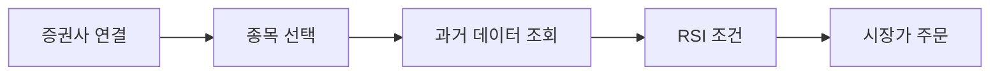

# 빠른 시작 가이드

코딩 경험이 없는 투자자도 따라할 수 있는 ProgramGarden 시작 가이드입니다. 5분이면 첫 자동매매 전략을 만들 수 있습니다.

***

## 1. 준비하기

### 1.1 LS증권 계좌 개설

거래에 필요한 계좌를 개설해 주세요.

> 현재 **LS증권**을 메인 증권사로 지원하고 있습니다.

투혼앱에서 글로벌 상품 거래가 가능한 계좌를 비대면으로 개설해 주세요. 방법을 모르시면 LS증권 고객센터(1588-2428)에 문의해 주세요.

### 1.2 API 키 발급

투혼앱에서 API를 신청하고 매매에 필요한 **App Key**와 **App Secret**를 발급 받으세요.

**투혼앱 열기 → 전체 메뉴 → 투자정보 → 투자 파트너 → API 메뉴**

> **주의**: App Key와 App Secret은 비밀번호와 같습니다. 다른 사람에게 절대 공유하지 마세요.

---

## 2. 워크플로우란?

워크플로우는 **레고 블록처럼 기능 조각(노드)을 연결**한 자동매매 전략입니다.

| 개념 | 비유 | 설명 |
|------|------|------|
| **노드(Node)** | 레고 블록 | 하나의 기능 (시세 조회, 조건 판단, 주문 등) |
| **엣지(Edge)** | 블록 연결 핀 | 실행 순서 (A 다음에 B 실행) |
| **워크플로우** | 완성된 레고 작품 | 전체 자동매매 전략 |



모든 설정은 **JSON**(텍스트)으로 작성됩니다.

---

## 3. 첫 번째 워크플로우 만들기

### 3.1 가장 간단한 예시: RSI 매수 전략

"AAPL의 RSI가 30 이하면 매수" 하는 전략입니다.

```json
{
  "nodes": [
    {
      "id": "broker",
      "type": "OverseasStockBrokerNode",
      "credential_id": "my-broker"
    },
    {
      "id": "watchlist",
      "type": "WatchlistNode",
      "symbols": [
        {"exchange": "NASDAQ", "symbol": "AAPL"}
      ]
    },
    {
      "id": "history",
      "type": "OverseasStockHistoricalDataNode",
      "interval": "1d"
    },
    {
      "id": "rsi",
      "type": "ConditionNode",
      "plugin": "RSI",
      "data": "{{ nodes.history.values }}",
      "fields": {
        "period": 14,
        "threshold": 30,
        "direction": "below"
      }
    },
    {
      "id": "order",
      "type": "OverseasStockNewOrderNode",
      "plugin": "MarketOrder",
      "fields": {
        "side": "buy",
        "amount_type": "percent_balance",
        "amount": 10
      }
    }
  ],
  "edges": [
    {"from": "broker", "to": "watchlist"},
    {"from": "watchlist", "to": "history"},
    {"from": "history", "to": "rsi"},
    {"from": "rsi", "to": "order"}
  ],
  "credentials": [
    {
      "credential_id": "my-broker",
      "type": "broker_ls_overseas_stock",
      "data": [
        {"key": "appkey", "value": "", "type": "password", "label": "App Key"},
        {"key": "appsecret", "value": "", "type": "password", "label": "App Secret"}
      ]
    }
  ]
}
```

**무슨 일이 일어나나요?**

1. **OverseasStockBrokerNode**: LS증권에 로그인합니다
2. **WatchlistNode**: AAPL을 매매 대상으로 지정합니다
3. **OverseasStockHistoricalDataNode**: AAPL의 최근 주가 데이터를 가져옵니다
4. **ConditionNode (RSI)**: RSI가 30 이하인지 확인합니다
5. **OverseasStockNewOrderNode (MarketOrder)**: 조건이 맞으면 예수금의 10%로 시장가 매수합니다

> **주의**: 실제 돈이 사용됩니다! 처음에는 반드시 소액(1~2만원)으로 테스트하세요.

---

## 4. 노드 카테고리 한눈에 보기

| 카테고리 | 뭘 하는 건가요? | 예시 노드 |
|----------|----------------|----------|
| **infra** | 증권사에 연결합니다 | OverseasStockBrokerNode |
| **market** | 종목을 정하고 시세를 조회합니다 | WatchlistNode, HistoricalDataNode |
| **account** | 내 계좌 정보를 확인합니다 | AccountNode, RealAccountNode |
| **condition** | 매매 조건을 확인합니다 | ConditionNode, LogicNode |
| **order** | 실제 주문을 냅니다 | NewOrderNode |
| **schedule** | 언제 실행할지 정합니다 | ScheduleNode |
| **display** | 차트나 표로 보여줍니다 | LineChartNode, TableDisplayNode |
| **ai** | AI에게 분석을 맡깁니다 | AIAgentNode |

> 전체 56개 노드의 상세 설명은 [노드 레퍼런스](node_reference.md)를 참고하세요.

---

## 5. 자주 쓰는 노드 설명

### OverseasStockBrokerNode (증권사 연결)

증권사에 로그인하고 연결합니다. **모든 워크플로우의 시작점**입니다.

```json
{
  "id": "broker",
  "type": "OverseasStockBrokerNode",
  "credential_id": "my-broker"
}
```

> **주의**: 해외선물을 거래하려면 `OverseasFuturesBrokerNode`를 사용하세요.

### WatchlistNode (관심 종목)

매매할 종목 목록을 지정합니다.

```json
{
  "id": "watchlist",
  "type": "WatchlistNode",
  "symbols": [
    {"exchange": "NASDAQ", "symbol": "AAPL"},
    {"exchange": "NASDAQ", "symbol": "NVDA"},
    {"exchange": "NYSE", "symbol": "TSM"}
  ]
}
```

> **주의 - 종목 형식**: 반드시 `exchange`(거래소)와 `symbol`(종목코드)을 함께 적어야 합니다.

### ScheduleNode (실행 스케줄)

언제 전략을 실행할지 정합니다.

```json
{
  "id": "schedule",
  "type": "ScheduleNode",
  "cron": "0 30 9 * * mon-fri",
  "timezone": "America/New_York"
}
```

| cron 예시 | 의미 |
|-----------|------|
| `0 30 9 * * mon-fri` | 평일 뉴욕시간 9:30 (정규장 시작) |
| `0 */15 9-16 * * mon-fri` | 평일 9~16시, 15분마다 |
| `0 0 10 * * mon-fri` | 평일 뉴욕시간 10:00 |

> **주의 - timezone**: 미국 주식은 뉴욕 시간(`America/New_York`)으로 설정하세요. 한국시간(`Asia/Seoul`)을 쓰면 거래시간이 안 맞습니다.

> **팁 - LS증권 미국 주식 거래 시간 (한국시간 기준)**:
>
> | 구간 | 겨울 (서머타임 미적용) | 여름 (서머타임 적용, 3~11월) |
> |------|----------------------|---------------------------|
> | 주간거래 | 10:00 ~ 17:30 | 09:00 ~ 16:30 |
> | 프리마켓 | 18:00 ~ 23:30 | 17:00 ~ 22:30 |
> | 정규장 | 23:30 ~ 06:00 (익일) | 22:30 ~ 05:00 (익일) |
> | 애프터마켓 | 06:00 ~ 09:30 | 05:00 ~ 08:30 |

자세한 스케줄 설정은 [스케줄 가이드](schedule_guide.md)를 참고하세요.

### TradingHoursFilterNode (거래 시간 필터)

거래시간이 아니면 대기하다가, 거래시간이 시작되면 통과시킵니다.

```json
{
  "id": "tradingHours",
  "type": "TradingHoursFilterNode",
  "start": "09:30",
  "end": "16:00",
  "timezone": "America/New_York",
  "days": ["mon", "tue", "wed", "thu", "fri"]
}
```

### ConditionNode (조건 분석)

기술적 지표로 매수/매도 신호를 확인합니다.

```json
{
  "id": "rsi",
  "type": "ConditionNode",
  "plugin": "RSI",
  "data": "{{ nodes.history.values }}",
  "fields": {
    "period": 14,
    "threshold": 30,
    "direction": "below"
  }
}
```

- `plugin`: 사용할 분석 전략 ([종목조건 플러그인 목록](strategies/stock_condition.md))
- `fields`: 전략에 필요한 설정값
- `data`: 분석할 시세 데이터

### LogicNode (조건 조합)

여러 조건을 어떻게 조합할지 정합니다.

```json
{
  "id": "logic",
  "type": "LogicNode",
  "operator": "all"
}
```

| operator | 의미 |
|----------|------|
| `all` | 모든 조건 만족 (그리고) |
| `any` | 하나라도 만족 (또는) |
| `at_least` | N개 이상 만족 |
| `weighted` | 가중치 합산 |

자세한 내용은 [조건 조합 가이드](logic_guide.md)를 참고하세요.

### NewOrderNode (신규 주문)

조건이 맞으면 주문을 냅니다.

```json
{
  "id": "order",
  "type": "OverseasStockNewOrderNode",
  "plugin": "MarketOrder",
  "fields": {
    "side": "buy",
    "amount_type": "percent_balance",
    "amount": 10
  }
}
```

- `plugin`: 주문 방식 ([주문 플러그인 목록](strategies/order_condition.md))
- `side`: `buy`(매수) 또는 `sell`(매도)
- `amount_type`: `percent_balance`(예수금 비율), `fixed`(고정 수량), `all`(전량)

---

## 6. 엣지(Edge) 연결하기

노드끼리 연결하려면 **엣지**를 사용합니다. `from` 노드가 먼저 실행되고, 완료되면 `to` 노드가 실행됩니다.

```json
{
  "edges": [
    {"from": "broker", "to": "watchlist"},
    {"from": "watchlist", "to": "history"},
    {"from": "history", "to": "rsi"},
    {"from": "rsi", "to": "order"}
  ]
}
```

> **팁**: 증권사(broker) 노드를 시세/계좌/주문 노드에 연결하면 자동으로 로그인 정보가 전달됩니다.

---

## 7. 완성된 예시

### 7.1 RSI + MACD 복합 조건 매수

두 가지 조건을 **모두 만족**할 때만 매수합니다.

```json
{
  "nodes": [
    {"id": "broker", "type": "OverseasStockBrokerNode", "credential_id": "my-broker"},
    {"id": "watchlist", "type": "WatchlistNode", "symbols": [{"exchange": "NASDAQ", "symbol": "AAPL"}, {"exchange": "NASDAQ", "symbol": "NVDA"}]},
    {"id": "history", "type": "OverseasStockHistoricalDataNode", "interval": "1d"},
    {
      "id": "rsi",
      "type": "ConditionNode",
      "plugin": "RSI",
      "data": "{{ nodes.history.values }}",
      "fields": {"period": 14, "threshold": 30, "direction": "below"}
    },
    {
      "id": "macd",
      "type": "ConditionNode",
      "plugin": "MACD",
      "data": "{{ nodes.history.values }}",
      "fields": {"signal_type": "bullish_cross"}
    },
    {"id": "logic", "type": "LogicNode", "operator": "all"},
    {
      "id": "order",
      "type": "OverseasStockNewOrderNode",
      "plugin": "MarketOrder",
      "fields": {"side": "buy", "amount_type": "percent_balance", "amount": 10}
    }
  ],
  "edges": [
    {"from": "broker", "to": "watchlist"},
    {"from": "watchlist", "to": "history"},
    {"from": "history", "to": "rsi"},
    {"from": "history", "to": "macd"},
    {"from": "rsi", "to": "logic"},
    {"from": "macd", "to": "logic"},
    {"from": "logic", "to": "order"}
  ],
  "credentials": [
    {
      "credential_id": "my-broker",
      "type": "broker_ls_overseas_stock",
      "data": [
        {"key": "appkey", "value": "", "type": "password", "label": "App Key"},
        {"key": "appsecret", "value": "", "type": "password", "label": "App Secret"}
      ]
    }
  ]
}
```

### 7.2 스케줄 기반 정기 실행

평일 뉴욕시간 10시에 자동 실행되는 전략입니다.

```json
{
  "nodes": [
    {"id": "broker", "type": "OverseasStockBrokerNode", "credential_id": "my-broker"},
    {"id": "schedule", "type": "ScheduleNode", "cron": "0 0 10 * * mon-fri", "timezone": "America/New_York"},
    {"id": "tradingHours", "type": "TradingHoursFilterNode", "start": "09:30", "end": "16:00", "timezone": "America/New_York", "days": ["mon", "tue", "wed", "thu", "fri"]},
    {"id": "watchlist", "type": "WatchlistNode", "symbols": [{"exchange": "NASDAQ", "symbol": "AAPL"}]},
    {"id": "history", "type": "OverseasStockHistoricalDataNode", "interval": "1d"},
    {"id": "rsi", "type": "ConditionNode", "plugin": "RSI", "data": "{{ nodes.history.values }}", "fields": {"period": 14, "threshold": 30, "direction": "below"}},
    {"id": "order", "type": "OverseasStockNewOrderNode", "plugin": "MarketOrder", "fields": {"side": "buy", "amount_type": "percent_balance", "amount": 10}}
  ],
  "edges": [
    {"from": "schedule", "to": "tradingHours"},
    {"from": "tradingHours", "to": "watchlist"},
    {"from": "broker", "to": "watchlist"},
    {"from": "watchlist", "to": "history"},
    {"from": "history", "to": "rsi"},
    {"from": "rsi", "to": "order"}
  ],
  "credentials": [
    {
      "credential_id": "my-broker",
      "type": "broker_ls_overseas_stock",
      "data": [
        {"key": "appkey", "value": "", "type": "password", "label": "App Key"},
        {"key": "appsecret", "value": "", "type": "password", "label": "App Secret"}
      ]
    }
  ]
}
```

---

## 8. 유용한 팁

### 8.1 모의투자로 먼저 테스트

> **해외선물은 모의투자를 지원**합니다. 해외주식은 현재 모의투자를 지원하지 않으므로, 소액으로 테스트하세요.

### 8.2 여러 종목을 한번에

WatchlistNode에 여러 종목을 넣으면 각 종목에 대해 **자동으로 반복 실행**됩니다.

```json
{
  "id": "watchlist",
  "type": "WatchlistNode",
  "symbols": [
    {"exchange": "NASDAQ", "symbol": "AAPL"},
    {"exchange": "NASDAQ", "symbol": "NVDA"},
    {"exchange": "NYSE", "symbol": "TSM"}
  ]
}
```

이후 노드에서 `{{ item }}`으로 현재 종목을 참조할 수 있습니다. 자세한 내용은 [자동 반복 처리](auto_iterate_guide.md)를 참고하세요.

### 8.3 익절/손절 자동화

보유 종목의 수익률에 따라 자동으로 매도하려면 `ProfitTarget`(익절)과 `StopLoss`(손절) 플러그인을 사용하세요.

```json
{"id": "profit", "type": "ConditionNode", "plugin": "ProfitTarget", "fields": {"target_percent": 5.0}},
{"id": "stop", "type": "ConditionNode", "plugin": "StopLoss", "fields": {"stop_percent": -3.0}}
```

---

## 9. 다음 단계

- [워크플로우 구조 이해](structure.md) - 노드, 엣지, 인증의 개념을 더 자세히
- [전체 노드 레퍼런스](node_reference.md) - 56개 노드 상세 설명
- [조건 조합 가이드](logic_guide.md) - 여러 조건을 조합하는 방법
- [스케줄 가이드](schedule_guide.md) - cron 표현식 작성법
- [종목조건 플러그인](strategies/stock_condition.md) - RSI, MACD 등 55개 분석 전략
- [주문 플러그인](strategies/order_condition.md) - 시장가, 지정가 등 주문 전략
- [AI 에이전트](ai_agent_guide.md) - GPT/Claude로 시장 분석 자동화
