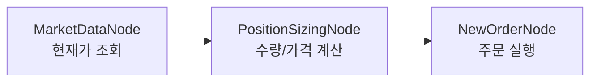

# 주문 노드 사용법

> ⚠️ **v1.20.1 변경**: 주문 노드는 **플러그인을 사용하지 않습니다**. `OverseasStockNewOrderNode`, `OverseasStockModifyOrderNode`, `OverseasStockCancelOrderNode`, `OverseasFuturesNewOrderNode`, `KoreaStockNewOrderNode` 등은 모두 고정 필드(`side`, `order_type`, `order` 바인딩 등)를 직접 사용합니다.
>
> 이전 가이드에 존재하던 `MarketOrder` / `LimitOrder` / `TimeStop` 플러그인은 **실제로 구현되어 있지 않습니다**. 해당 예제를 사용하면 조용히 no-op 처리됩니다 (`[log/error] 주문할 종목이 없습니다` 경고). 아래의 올바른 패턴으로 교체하세요.

---

## 1. 주문 파이프라인 기본 흐름

주문 실행은 **3단계 파이프라인**으로 구성됩니다.



1. **시세 조회** — `OverseasStockMarketDataNode` 등으로 현재가/호가 정보 획득
2. **수량 계산** — `PositionSizingNode`로 잔고·가격 대비 주문 수량/가격 계산
3. **주문 실행** — `OverseasStockNewOrderNode`에 `order: {{ nodes.sizing.order }}` 바인딩

---

## 2. PositionSizingNode (수량 계산)

주문 수량과 가격을 계산하여 `order: {symbol, exchange, quantity, price}` 형태로 출력합니다. `NewOrderNode`의 `order` 필드는 `bindable_sources: ["PositionSizingNode.order"]` 기반이므로 이 노드를 거치는 것이 표준 패턴입니다.

| 필드 | 타입 | 기본값 | 설명 |
|------|------|--------|------|
| `symbol` | `{exchange, symbol}` | - | 주문할 종목 (보통 `{{ item }}`) |
| `balance` | number | - | 사용 가능 잔고 (`{{ nodes.account.balance }}`) |
| `market_data` | `{price, ...}` | - | 현재가 정보 (`{{ nodes.marketData.value }}`) |
| `method` | enum | `"fixed_percent"` | 수량 산정 방식 (아래 표) |
| `max_percent` | number | `10` | `fixed_percent` 사용 시 예수금 비율 (%) |
| `fixed_amount` | number | - | `fixed_amount` 사용 시 금액 (USD 등) |
| `fixed_quantity` | integer | - | `fixed_quantity` 사용 시 고정 수량 |
| `kelly_fraction` | number | `0.5` | `kelly` 사용 시 켈리 분수 |
| `atr_risk_percent` | number | `2.0` | `atr_based` 사용 시 리스크 비율 (%) |

**`method` 값:**

| 값 | 설명 |
|----|------|
| `fixed_percent` | 잔고의 `max_percent` % 사용 |
| `fixed_amount` | 지정 금액 사용 |
| `fixed_quantity` | 지정 수량 주문 |
| `kelly` | 켈리 기준 배분 |
| `atr_based` | ATR 기반 변동성 조정 배분 |

---

## 3. OverseasStockNewOrderNode (해외주식 신규주문)

| 필드 | 타입 | 필수 | 설명 |
|------|------|:----:|------|
| `side` | `"buy"` \| `"sell"` | ✅ | 매수/매도 |
| `order_type` | `"market"` \| `"limit"` | ✅ | 시장가 / 지정가 |
| `price_type` | enum | | LS증권 호가 유형 (`limit`, `market`, `LOO`, `LOC`, `MOO`, `MOC`) |
| `order` | `{symbol, exchange, quantity, price?}` | ✅ | `PositionSizingNode.order` 바인딩 권장 |

> **주의**: `order` 필드는 표현식 바인딩 전용(`expression_only`)입니다. 직접 객체 리터럴을 넣지 말고 `"{{ nodes.sizing.order }}"` 형태로 바인딩하세요.

### 3.1 시장가 매수 (MarketOrder 플러그인 대체)

```json
[
  {"id": "marketData", "type": "OverseasStockMarketDataNode", "symbol": "{{ item }}"},
  {
    "id": "sizing",
    "type": "PositionSizingNode",
    "symbol": "{{ item }}",
    "balance": "{{ nodes.account.balance }}",
    "market_data": "{{ nodes.marketData.value }}",
    "method": "fixed_percent",
    "max_percent": 10
  },
  {
    "id": "order",
    "type": "OverseasStockNewOrderNode",
    "side": "buy",
    "order_type": "market",
    "order": "{{ nodes.sizing.order }}"
  }
]
```

### 3.2 지정가 매수 (LimitOrder 플러그인 대체)

지정가 주문은 `order_type: "limit"` + `order.price`를 명시합니다. 현재가 기준 백분율 할인은 `PositionSizingNode`에서 `market_data.price * 0.99` 같은 표현식으로 직접 계산하거나, 사전 노드에서 계산한 가격을 전달하세요.

```json
[
  {"id": "marketData", "type": "OverseasStockMarketDataNode", "symbol": "{{ item }}"},
  {
    "id": "sizing",
    "type": "PositionSizingNode",
    "symbol": "{{ item }}",
    "balance": "{{ nodes.account.balance }}",
    "market_data": "{{ nodes.marketData.value }}",
    "method": "fixed_quantity",
    "fixed_quantity": 5
  },
  {
    "id": "order",
    "type": "OverseasStockNewOrderNode",
    "side": "buy",
    "order_type": "limit",
    "price_type": "limit",
    "order": "{{ nodes.sizing.order }}"
  }
]
```

### 3.3 전량 매도

전량 매도는 계좌 포지션에서 각 종목의 `quantity`를 읽어 주문 크기로 사용합니다.

```json
[
  {"id": "account", "type": "OverseasStockAccountNode"},
  {
    "id": "sellOrder",
    "type": "OverseasStockNewOrderNode",
    "side": "sell",
    "order_type": "market",
    "order": {
      "symbol": "{{ item.symbol }}",
      "exchange": "{{ item.exchange }}",
      "quantity": "{{ item.quantity }}"
    }
  }
]
```

> **참고**: `account.positions`는 배열이므로 이후 노드가 auto-iterate로 종목별 실행됩니다 (`{{ item }}`).

---

## 4. OverseasStockModifyOrderNode (정정주문)

미체결 주문의 가격이나 수량을 수정합니다.

| 필드 | 타입 | 필수 | 설명 |
|------|------|:----:|------|
| `order_id` | string | ✅ | 정정 대상 주문 ID |
| `new_price` | number | | 변경할 가격 |
| `new_quantity` | integer | | 변경할 수량 |

```json
{
  "id": "modify",
  "type": "OverseasStockModifyOrderNode",
  "order_id": "{{ item.order_id }}",
  "new_price": "{{ finance.markup(item.price, 1.0) }}"
}
```

> **이전 `TrailingStop` 플러그인 예제 대체**: 가격 추적 정정은 실시간 시세(`OverseasStockRealMarketDataNode` + `ThrottleNode`)와 `OverseasStockOpenOrdersNode`를 조합한 워크플로우에서 `new_price`를 표현식으로 계산하여 직접 구현합니다.

---

## 5. OverseasStockCancelOrderNode (주문 취소)

| 필드 | 타입 | 필수 | 설명 |
|------|------|:----:|------|
| `order_id` | string | ✅ | 취소할 주문 ID |

```json
{
  "id": "cancel",
  "type": "OverseasStockCancelOrderNode",
  "order_id": "{{ item.order_id }}"
}
```

> **이전 `TimeStop` 플러그인 예제 대체**: "N분 내 미체결 시 자동 취소"는 `ScheduleNode` 또는 `ThrottleNode`로 주기적으로 `OverseasStockOpenOrdersNode`를 조회하고, 미체결 시간을 `IfNode`로 판정한 뒤 `OverseasStockCancelOrderNode`를 호출하여 직접 구현합니다.

---

## 6. 전체 파이프라인 예시 (RSI 과매도 매수 + 전량 익절/손절)

```json
{
  "nodes": [
    {"id": "broker", "type": "OverseasStockBrokerNode", "credential_id": "my-broker", "paper_trading": false},
    {"id": "account", "type": "OverseasStockAccountNode"},
    {"id": "watchlist", "type": "WatchlistNode", "symbols": [{"exchange": "NASDAQ", "symbol": "AAPL"}]},
    {"id": "history", "type": "OverseasStockHistoricalDataNode", "symbol": "{{ item }}", "interval": "1d"},
    {
      "id": "rsi",
      "type": "ConditionNode",
      "plugin": "RSI",
      "items": {
        "from": "{{ nodes.history.value.time_series }}",
        "extract": {
          "symbol": "{{ item.symbol }}",
          "exchange": "{{ item.exchange }}",
          "date": "{{ row.date }}",
          "close": "{{ row.close }}"
        }
      },
      "fields": {"period": 14, "threshold": 30, "direction": "below"}
    },
    {"id": "marketData", "type": "OverseasStockMarketDataNode", "symbol": "{{ item }}"},
    {
      "id": "sizing",
      "type": "PositionSizingNode",
      "symbol": "{{ item }}",
      "balance": "{{ nodes.account.balance }}",
      "market_data": "{{ nodes.marketData.value }}",
      "method": "fixed_percent",
      "max_percent": 10
    },
    {
      "id": "buyOrder",
      "type": "OverseasStockNewOrderNode",
      "side": "buy",
      "order_type": "market",
      "order": "{{ nodes.sizing.order }}"
    },
    {
      "id": "profit",
      "type": "ConditionNode",
      "plugin": "ProfitTarget",
      "positions": "{{ nodes.account.positions }}",
      "fields": {"target_percent": 5.0}
    },
    {
      "id": "stop",
      "type": "ConditionNode",
      "plugin": "StopLoss",
      "positions": "{{ nodes.account.positions }}",
      "fields": {"stop_percent": -3.0}
    },
    {
      "id": "exitLogic",
      "type": "LogicNode",
      "operator": "any",
      "conditions": [
        {"is_condition_met": "{{ nodes.profit.result }}", "passed_symbols": "{{ nodes.profit.passed_symbols }}"},
        {"is_condition_met": "{{ nodes.stop.result }}", "passed_symbols": "{{ nodes.stop.passed_symbols }}"}
      ]
    },
    {
      "id": "sellOrder",
      "type": "OverseasStockNewOrderNode",
      "side": "sell",
      "order_type": "market",
      "order": {
        "symbol": "{{ item.symbol }}",
        "exchange": "{{ item.exchange }}",
        "quantity": "{{ item.quantity }}"
      }
    }
  ],
  "edges": [
    {"from": "broker", "to": "watchlist"},
    {"from": "watchlist", "to": "history"},
    {"from": "history", "to": "rsi"},
    {"from": "rsi", "to": "marketData"},
    {"from": "marketData", "to": "sizing"},
    {"from": "sizing", "to": "buyOrder"},
    {"from": "account", "to": "profit"},
    {"from": "account", "to": "stop"},
    {"from": "profit", "to": "exitLogic"},
    {"from": "stop", "to": "exitLogic"},
    {"from": "exitLogic", "to": "sellOrder"}
  ]
}
```

> **주의**: 실제 주문이 실행됩니다. 해외주식은 모의투자가 지원되지 않으므로 **소액으로 먼저 검증**하세요. 해외선물은 `OverseasFuturesBrokerNode`의 `paper_trading: true`로 모의투자가 가능합니다.
