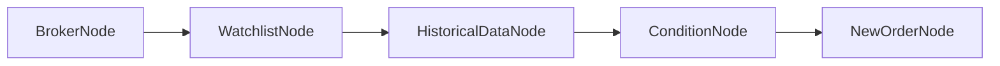
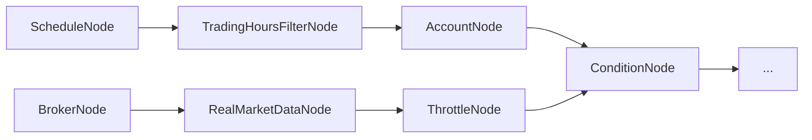
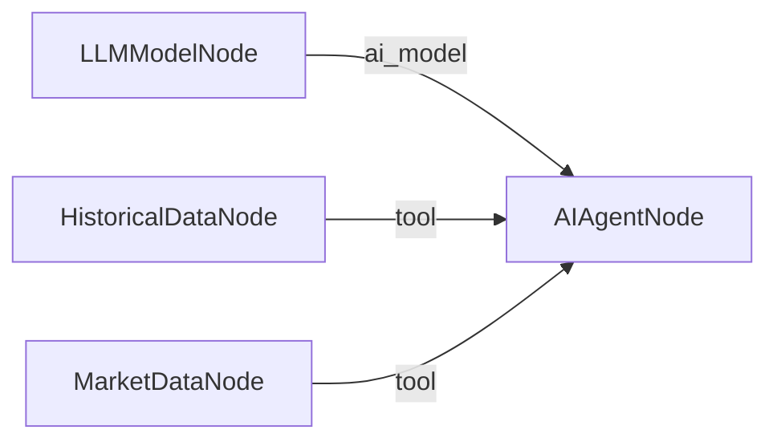

# 워크플로우 구조 이해

워크플로우는 **노드(블록)**를 **엣지(연결선)**으로 이어 붙여서 만드는 자동매매 전략입니다. 모든 설정은 JSON 형식으로 작성됩니다.

***

## 1. 워크플로우 JSON의 4가지 구성 요소

```json
{
  "nodes": [ ... ],
  "edges": [ ... ],
  "credentials": [ ... ],
  "notes": [ ... ]
}
```

| 구성 요소 | 필수 | 설명 |
|-----------|:----:|------|
| `nodes` | O | 기능을 담당하는 블록들의 배열 |
| `edges` | O | 블록 간 연결 (실행 순서) |
| `credentials` | O | 증권사/API 인증 정보 |
| `notes` | - | 캔버스 메모 (실행되지 않음, 문서화 용도) |

---

## 2. 노드 (Node)

노드는 하나의 기능을 담당하는 블록입니다.

```json
{
  "id": "broker",
  "type": "OverseasStockBrokerNode",
  "credential_id": "my-broker",
  "paper_trading": false
}
```

> **주의**: `OverseasStockBrokerNode`는 `paper_trading: false`를 반드시 명시해야 합니다. LS증권이 해외주식 모의투자를 지원하지 않기 때문에 생략 시 기본값(`true`)으로 인식되어 연결이 실패합니다.

| 필드 | 필수 | 설명 |
|------|:----:|------|
| `id` | O | 고유 식별자 (영문, 숫자, 밑줄). 다른 노드에서 참조할 때 사용 |
| `type` | O | 노드 종류 ([전체 노드 레퍼런스](node_reference.md) 참고) |
| 기타 | - | 노드별 설정값 (예: `symbol`, `plugin`, `cron` 등) |

> **주의 - 예약어**: `nodes`, `input`, `context`는 노드 ID로 사용할 수 없습니다. 이 이름들은 표현식에서 특별한 용도로 사용됩니다.

### 상품별 노드 이름

ProgramGarden은 **해외주식**과 **해외선물** 두 가지 상품을 지원합니다. 대부분의 노드는 상품별로 이름이 다릅니다.

| 기능 | 해외주식 | 해외선물 |
|------|---------|---------|
| 증권사 연결 | `OverseasStockBrokerNode` | `OverseasFuturesBrokerNode` |
| 계좌 조회 | `OverseasStockAccountNode` | `OverseasFuturesAccountNode` |
| 시세 조회 | `OverseasStockMarketDataNode` | `OverseasFuturesMarketDataNode` |
| 과거 데이터 | `OverseasStockHistoricalDataNode` | `OverseasFuturesHistoricalDataNode` |
| 실시간 시세 | `OverseasStockRealMarketDataNode` | `OverseasFuturesRealMarketDataNode` |
| 실시간 계좌 | `OverseasStockRealAccountNode` | `OverseasFuturesRealAccountNode` |
| 신규 주문 | `OverseasStockNewOrderNode` | `OverseasFuturesNewOrderNode` |
| 정정 주문 | `OverseasStockModifyOrderNode` | `OverseasFuturesModifyOrderNode` |
| 취소 주문 | `OverseasStockCancelOrderNode` | `OverseasFuturesCancelOrderNode` |

> **팁**: `WatchlistNode`, `ConditionNode`, `LogicNode`, `ScheduleNode` 등 상품에 무관한 노드는 이름이 하나입니다.

---

## 3. 엣지 (Edge)

엣지는 노드 간의 연결입니다. **from** 노드가 먼저 실행되고, 완료되면 **to** 노드가 실행됩니다.

### 3가지 엣지 타입

```json
{
  "edges": [
    {"from": "broker", "to": "account"},
    {"from": "llm", "to": "agent", "type": "ai_model"},
    {"from": "history", "to": "agent", "type": "tool"}
  ]
}
```

| 타입 | 설명 | 사용 예시 |
|------|------|----------|
| `main` (기본) | 실행 순서 연결. `type` 생략 시 이 타입 | `broker → account` |
| `ai_model` | LLM 모델 연결. LLMModelNode → AIAgentNode 전용 | `llm → agent` |
| `tool` | AI 도구 등록. 기존 노드를 AI의 도구로 등록 | `history → agent` |

> **주의**: `type`을 생략하면 자동으로 `main` 타입이 됩니다. `ai_model`과 `tool`은 AI 에이전트를 사용할 때만 필요합니다. 자세한 내용은 [AI 에이전트 가이드](ai_agent_guide.md)를 참고하세요.

### 브로커 연결 (자동 전파)

BrokerNode는 엣지로 연결된 하위 노드들에게 **자동으로 증권사 연결 정보를 전달**합니다. 별도의 설정 없이 엣지만 연결하면 됩니다.

```json
{
  "edges": [
    {"from": "broker", "to": "account"},
    {"from": "broker", "to": "market"},
    {"from": "broker", "to": "order"}
  ]
}
```

> **팁**: `connection` 필드를 직접 작성할 필요가 없습니다. BrokerNode에서 엣지를 따라 자동으로 전파됩니다.

---

## 4. 인증 정보 (Credentials)

증권사 API 키, LLM API 키 등 민감한 정보를 관리합니다.

```json
{
  "credentials": [
    {
      "credential_id": "my-broker",
      "type": "broker_ls_overseas_stock",
      "data": [
        {"key": "appkey", "value": "", "type": "password", "label": "App Key"},
        {"key": "appsecret", "value": "", "type": "password", "label": "App Secret"}
      ]
    }
  ]
}
```

| 필드 | 설명 |
|------|------|
| `credential_id` | 고유 ID (노드에서 참조) |
| `type` | 인증 종류 |
| `data` | 인증 데이터 배열 |

### 인증 타입 목록

| 타입 | 설명 | data 키 |
|------|------|---------|
| `broker_ls_overseas_stock` | LS증권 해외주식 | `appkey`, `appsecret` |
| `broker_ls_overseas_futures` | LS증권 해외선물 | `appkey`, `appsecret` |
| `broker_ls_korea_stock` | LS증권 국내주식 | `appkey`, `appsecret` |
| `llm_openai` | OpenAI (GPT) | `api_key` |
| `llm_anthropic` | Anthropic (Claude) | `api_key` |
| `llm_google` | Google (Gemini) | `api_key` |
| `llm_azure_openai` | Azure OpenAI | `api_key`, `endpoint`, `deployment` |
| `llm_ollama` | Ollama (로컬 LLM) | `base_url` |
| `http_custom` | 커스텀 HTTP | 배열: `[{type, key, value, label}]` |
| `http_bearer` | Bearer Token | `token` |
| `http_basic` | Basic Auth | `username`, `password` |

> **주의 - 공유 시 보안**: 워크플로우를 다른 사람에게 공유할 때는 `value`를 빈 문자열(`""`)로 비워두세요. 실행 시 서버에서 암호화된 값을 주입합니다.

---

## 5. 메모 (Notes)

캔버스에 메모를 남길 수 있습니다. 실행에는 영향을 주지 않으며, 전략 설명이나 주의사항을 기록하는 용도입니다.

```json
{
  "notes": [
    {
      "id": "note-1",
      "content": "## RSI 전략 메모\n\nRSI 30 이하에서 매수",
      "color": 1,
      "width": 300,
      "height": 200,
      "position": {"x": 100, "y": 50}
    }
  ]
}
```

| 필드 | 설명 |
|------|------|
| `content` | 마크다운 형식의 메모 내용 |
| `color` | 색상 번호 (0~7) |
| `width`, `height` | 메모 크기 (픽셀) |
| `position` | 캔버스 위치 (x, y) |

---

## 6. 표현식 (Expression)

노드 설정값에 `{{ }}` 문법을 사용하면 다른 노드의 출력값을 참조하거나 동적 계산을 할 수 있습니다.

```json
{
  "nodes": [
    {
      "id": "watchlist",
      "type": "WatchlistNode",
      "symbols": [
        {"exchange": "NASDAQ", "symbol": "AAPL"},
        {"exchange": "NASDAQ", "symbol": "NVDA"}
      ]
    },
    {
      "id": "history",
      "type": "OverseasStockHistoricalDataNode",
      "symbol": "{{ item }}",
      "start_date": "{{ date.ago(30, format='yyyymmdd') }}",
      "end_date": "{{ date.today(format='yyyymmdd') }}"
    }
  ]
}
```

### 자주 사용하는 표현식

| 표현식 | 설명 | 결과 예시 |
|--------|------|----------|
| `{{ nodes.account.positions }}` | 계좌 노드의 보유종목 | `[{...}, {...}]` |
| `{{ item.symbol }}` | 반복 실행 중 현재 종목 | `"AAPL"` |
| `{{ date.today(format='yyyymmdd') }}` | 오늘 날짜 | `"20260214"` |
| `{{ date.ago(30) }}` | 30일 전 | `"2026-01-15"` |
| `{{ finance.pct_change(100, 110) }}` | 변화율 | `10.0` |

> 상세 가이드: [표현식 문법](expression_guide.md) | [자동 반복 처리](auto_iterate_guide.md)

---

## 7. 노드 카테고리 (12개)

72개 노드가 12개 카테고리로 분류되어 있습니다.

| 카테고리 | 용도 | 주요 노드 |
|----------|------|----------|
| `infra` | 워크플로우 시작, 증권사 연결, 흐름 제어, 조건 분기 | StartNode, BrokerNode, ThrottleNode, SplitNode, AggregateNode, IfNode |
| `account` | 잔고, 포지션, 미체결 주문 | AccountNode, OpenOrdersNode, RealAccountNode, RealOrderEventNode |
| `market` | 시세, 종목, 과거 데이터, 펀더멘털, 환율, 심리, 제외종목 | WatchlistNode, MarketDataNode, FundamentalNode, HistoricalDataNode, RealMarketDataNode, ScreenerNode, ExclusionListNode, CurrencyRateNode, FearGreedIndexNode, FundamentalDataNode |
| `condition` | 매매 조건 판단, 논리 조합 | ConditionNode, LogicNode |
| `order` | 신규/정정/취소 주문 | NewOrderNode, ModifyOrderNode, CancelOrderNode, PositionSizingNode |
| `risk` | 포트폴리오 배분, 리밸런싱 | PortfolioNode |
| `schedule` | 스케줄 트리거, 거래시간 필터 | ScheduleNode, TradingHoursFilterNode |
| `data` | DB 저장/조회, 외부 API, 필드 매핑, 파일 파싱 | SQLiteNode, HTTPRequestNode, FieldMappingNode, FileReaderNode |
| `display` | 차트, 테이블, 요약 시각화 | TableDisplayNode, LineChartNode, CandlestickChartNode, BarChartNode, SummaryDisplayNode |
| `analysis` | 백테스트, 벤치마크 비교 | BacktestEngineNode, BenchmarkCompareNode |
| `ai` | AI 에이전트 (GPT, Claude 등) | LLMModelNode, AIAgentNode |
| `messaging` | 알림/메시징 | TelegramNode |

> 각 노드의 상세 설명은 [전체 노드 레퍼런스](node_reference.md)를 참고하세요.

---

## 8. 워크플로우 패턴 예시

### 패턴 1: 기본 매매 전략



```json
{
  "nodes": [
    {"id": "broker", "type": "OverseasStockBrokerNode", "credential_id": "my-broker", "paper_trading": false},
    {"id": "account", "type": "OverseasStockAccountNode"},
    {"id": "watchlist", "type": "WatchlistNode", "symbols": [{"exchange": "NASDAQ", "symbol": "AAPL"}]},
    {"id": "history", "type": "OverseasStockHistoricalDataNode", "symbol": "{{ item }}", "interval": "1d"},
    {
      "id": "rsi", "type": "ConditionNode", "plugin": "RSI",
      "items": {
        "from": "{{ nodes.history.value.time_series }}",
        "extract": {"symbol": "{{ item.symbol }}", "exchange": "{{ item.exchange }}", "date": "{{ row.date }}", "close": "{{ row.close }}"}
      },
      "fields": {"period": 14, "threshold": 30, "direction": "below"}
    },
    {"id": "marketData", "type": "OverseasStockMarketDataNode", "symbol": "{{ item }}"},
    {
      "id": "sizing", "type": "PositionSizingNode",
      "symbol": "{{ item }}", "balance": "{{ nodes.account.balance }}",
      "market_data": "{{ nodes.marketData.value }}",
      "method": "fixed_percent", "max_percent": 10
    },
    {"id": "order", "type": "OverseasStockNewOrderNode", "side": "buy", "order_type": "market", "order": "{{ nodes.sizing.order }}"}
  ],
  "edges": [
    {"from": "broker", "to": "watchlist"},
    {"from": "watchlist", "to": "history"},
    {"from": "history", "to": "rsi"},
    {"from": "rsi", "to": "marketData"},
    {"from": "marketData", "to": "sizing"},
    {"from": "account", "to": "sizing"},
    {"from": "sizing", "to": "order"}
  ],
  "credentials": [
    {
      "credential_id": "my-broker",
      "type": "broker_ls_overseas_stock",
      "data": [
        {"key": "appkey", "value": "", "type": "password", "label": "App Key"},
        {"key": "appsecret", "value": "", "type": "password", "label": "App Secret"}
      ]
    }
  ]
}
```

### 패턴 2: 스케줄 + 실시간 모니터링



### 패턴 3: AI 에이전트 분석



> 자세한 패턴은 [빠른 시작 가이드](non_dev_quick_guide.md)를 참고하세요.

---

## 9. 리소스 관리

워크플로우 JSON에 `resource_limits`를 추가하면 CPU/메모리 사용량을 제한할 수 있습니다. 생략하면 시스템이 자동으로 적절한 값을 설정합니다.

```json
{
  "resource_limits": {
    "max_cpu_percent": 70,
    "max_memory_percent": 75,
    "max_workers": 2,
    "throttle_strategy": "conservative"
  },
  "nodes": [...],
  "edges": [...]
}
```

| 필드 | 기본값 | 설명 |
|------|--------|------|
| `max_cpu_percent` | 80 | 최대 CPU 사용률 (%) |
| `max_memory_percent` | 80 | 최대 메모리 사용률 (%) |
| `max_workers` | 4 | 동시 작업 수 |
| `throttle_strategy` | "gradual" | 스로틀 전략 (gradual, aggressive, conservative) |

리소스 사용량이 높아지면 자동으로 실행 속도를 조절합니다:

| 레벨 | 트리거 | 동작 |
|------|--------|------|
| NONE | < 60% | 정상 실행 |
| LIGHT | 60~75% | 배치 크기 20% 감소 |
| MODERATE | 75~85% | 배치 크기 50% 감소 |
| HEAVY | 85~95% | 동시 작업 50% 제한 |
| CRITICAL | > 95% | 신규 작업 일시 중지 (주문만 허용) |

> **주의**: CRITICAL 상태에서도 **주문 노드는 항상 우선 실행**됩니다. 매매 기회를 놓치지 않습니다.

---

## 10. 다음 단계

- [전체 노드 레퍼런스](node_reference.md) - 72개 노드 상세 설명
- [표현식 문법](expression_guide.md) - `{{ }}` 표현식 작성법
- [자동 반복 처리](auto_iterate_guide.md) - 여러 종목 자동 순회
- [종목조건 플러그인](strategies/stock_condition.md) - RSI, MACD 등 77개 분석 전략
- [주문 플러그인](strategies/order_condition.md) - 시장가, 지정가 등 주문 전략
- [AI 에이전트](ai_agent_guide.md) - GPT/Claude로 시장 분석
