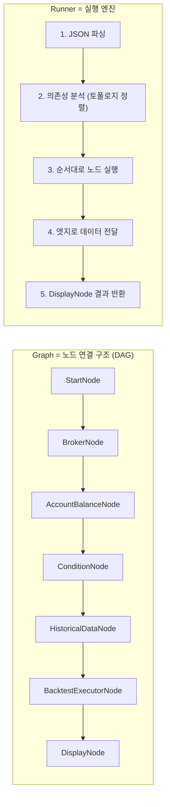

# 예제 32: 보유종목 이평선 추세 백테스트

해외주식 보유종목의 이동평균선 추세를 백테스트하여 현재 추세 유효성을 점검합니다.

## 워크플로우

```mermaid
flowchart LR
    subgraph INFRA["🏗️ INFRA"]
        start[("▶️ StartNode")]
        broker["🔌 BrokerNode<br/>company: ls<br/>product: overseas_stock"]
    end

    subgraph ACCOUNT["💰 ACCOUNT"]
        fetchBalance["📊 AccountBalanceNode<br/>해외주식 잔고 조회"]
    end

    subgraph CONDITION["⚡ CONDITION"]
        hasHoldings{"🔍 ConditionNode<br/>plugin: HasPositions<br/>min_count: 1"}
    end

    subgraph DATA["📈 DATA"]
        historicalData["📅 HistoricalDataNode<br/>{{ input.analysis_days }}일 일봉"]
    end

    subgraph BACKTEST["🧪 BACKTEST"]
        maTrendBacktest["⚙️ BacktestExecutorNode<br/>MA Trend 분석<br/>short: {{ input.short_ma_period }}<br/>long: {{ input.long_ma_period }}"]
        backtestResult["📋 BacktestResultNode<br/>uptrend_ratio<br/>avg_ma_gap<br/>current_trend"]
    end

    subgraph DISPLAY["🖥️ DISPLAY"]
        resultDisplay["📊 DisplayNode<br/>이평선 추세 분석 결과"]
    end

    %% 엣지 연결
    start -->|trigger| broker
    broker -->|connection| fetchBalance
    fetchBalance -->|holdings| hasHoldings
    hasHoldings -->|passed_symbols| historicalData
    historicalData -->|ohlcv_data| maTrendBacktest
    maTrendBacktest -->|result| backtestResult
    backtestResult -->|summary| resultDisplay

    %% 스타일
    style start fill:#4CAF50,color:white
    style broker fill:#2196F3,color:white
    style hasHoldings fill:#FF9800,color:white
    style maTrendBacktest fill:#2196F3,color:white
    style backtestResult fill:#9C27B0,color:white
    style resultDisplay fill:#607D8B,color:white
```





## 워크플로우 설명

| 단계 | 노드 | 역할 |
|------|------|------|
| 1️⃣ | **StartNode** | 워크플로우 시작점 |
| 2️⃣ | **BrokerNode** | LS증권 해외주식 연결 (Credential 참조) |
| 3️⃣ | **AccountBalanceNode** | 해외주식 잔고(COSOQ00201) 조회 |
| 4️⃣ | **ConditionNode** | 보유종목 1개 이상 있는지 확인 |
| 5️⃣ | **HistoricalDataNode** | 보유종목의 120일 일봉 차트(g3103) 조회 |
| 6️⃣ | **BacktestExecutorNode** | 5일/20일 이평선 추세 백테스트 실행 |
| 7️⃣ | **BacktestResultNode** | 우상향비율, 이평선갭, 기울기 등 지표 계산 |
| 8️⃣ | **DisplayNode** | 결과를 테이블 형태로 출력 |

## 데이터 흐름 (Edges)

```
start → broker
broker.connection → fetchBalance
fetchBalance.holdings → hasHoldings.positions
hasHoldings.passed_symbols → historicalData.symbols
historicalData.ohlcv_data → maTrendBacktest.historical_data
fetchBalance.holdings → maTrendBacktest.position_info
maTrendBacktest.result → backtestResult.backtest_result
backtestResult.summary → resultDisplay.data
```

## 표현식 바인딩

이 워크플로우에서는 **Jinja2 스타일 `{{ }}`** 표현식을 사용하여 입력 파라미터를 동적으로 바인딩합니다:

```json
{
  "config": {
    "period": "{{ input.analysis_days }}"
  },
  "params": {
    "short_period": "{{ input.short_ma_period }}",
    "long_period": "{{ input.long_ma_period }}"
  }
}
```

> ⚠️ **`$input.xxx` 문법은 사용하지 않습니다** — 반드시 `{{ }}` 스타일 사용

## 분석 지표

| 지표 | 설명 |
|------|------|
| `is_uptrend` | 현재 우상향 추세 여부 |
| `uptrend_ratio` | 분석 기간 중 우상향 비율 (%) |
| `short_ma` | 단기(5일) 이동평균선 |
| `long_ma` | 장기(20일) 이동평균선 |
| `ma_gap_percent` | 단기-장기 이평선 갭 (%) |
| `long_ma_slope` | 장기 이평선 기울기 (%) |

## 추세 판단 기준

- **우상향**: 단기 이평선 > 장기 이평선 AND 장기 이평선 상승 중
- **강한 상승**: 우상향 비율 ≥ 70% → 홀딩 권장
- **추세 혼조**: 우상향 비율 40~70% → 관망 권장
- **추세 약화**: 우상향 비율 < 40% → 손절/익절 검토

## 실행 방법

```bash
cd src/programgarden
poetry run python examples/32_account_holdings_ma_trend_backtest.py
```

## 실행 결과 예시

```
======================================================================
📊 해외주식 보유종목 이평선 추세 백테스트
======================================================================

📋 [STEP 1] 해외주식 잔고 조회 중...
✅ 보유종목 1개 발견
   - GOSS: 8주 (손익률: -11.74%)

📈 [STEP 2] 이평선 추세 백테스트 실행...

🔹 GOSS (GOSS)
   보유: 8주 | 손익률: -11.74%
   ┌─────────────────────────────────────────────┐
   │ 현재 추세: 하락/횡보 📉                     │
   │ 우상향 비율 (60일): 0.0%                    │
   │ 평균 이평선 갭: -4.38%                      │
   │ 장기이평 기울기: -0.4823%                   │
   │                                             │
   │ 5일 이평선: $2.94                           │
   │ 20일 이평선: $3.35                          │
   └─────────────────────────────────────────────┘
   💡 추세 약화 - 손절/익절 검토 권장
```