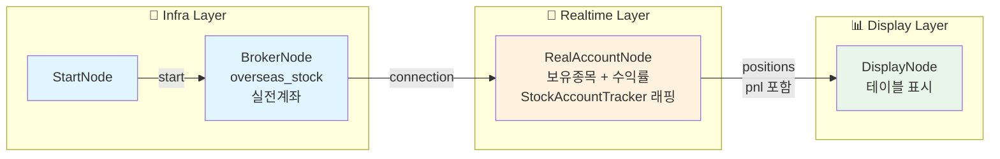

# 📊 예제 34: 보유 종목 실시간 수익률 모니터링

실시간으로 보유 종목의 수익률 변화를 모니터링하는 워크플로우입니다.

## 개요

| 항목 | 내용 |
|------|------|
| **목적** | 보유 종목의 실시간 수익률 추적 |
| **계좌** | 실전계좌 (LS증권) |
| **상품** | 해외주식 (overseas_stock) |
| **데이터** | WebSocket 실시간 시세 |

## 아키텍처: 틱 기반 vs REST 동기화

증권사 API를 자주 호출하면 사용자가 차단될 수 있습니다. 따라서 ProgramGarden은 **2가지 데이터 소스**를 조합합니다:

| 노드 | 데이터 소스 | 주기 | 용도 |
|------|------------|------|------|
| **RealAccountNode** | REST API + WebSocket | `sync_interval_sec` (기본 60초) + 틱마다 | 포지션 + 수익률 (pnl 포함) |
| **CustomPnLNode** | (선택적) | - | 커스텀 수익률 계산 (고급) |

### 데이터 흐름 (단순화)

```
[REST API] ──(60초)──▶ RealAccountNode ──▶ positions (pnl_rate, pnl_amount 포함)
                              │
[WebSocket] ──(틱마다)────────┘                    │
                                                   ▼
                                              DisplayNode
```

### 왜 이렇게 설계했나요?

1. **REST API 호출 최소화**: 포지션 정보는 자주 바뀌지 않음 → 60초마다만 동기화
2. **실시간 수익률**: 틱(WebSocket)이 올 때마다 즉시 계산 → 지연 없음
3. **정합성 보장**: 주기적 REST 동기화로 증권사 데이터와 차이 보정
4. **단순화**: `RealAccountNode`가 `StockAccountTracker`를 래핑하여 수익률까지 포함

### CustomPnLNode는 언제 사용하나요?

기본적으로 `RealAccountNode.positions`에 수익률이 포함되어 있어 `CustomPnLNode`는 필요 없습니다.

**CustomPnLNode가 필요한 경우:**
- 커스텀 수수료/세금 적용
- 멀티 계좌 포지션 합산
- 벤치마크(SPY 등) 대비 초과수익률 계산
- 가상 포지션 추적

### finance 패키지 연동

실제 구현에서는 `programgarden_finance` 패키지를 사용합니다:

```python
from programgarden_finance.ls.overseas_stock.real import Real

# WebSocket 연결
real = Real(token_manager=token_manager)
await real.connect()

# 틱 구독 (GSC = 해외주식체결)
real.GSC().add_gsc_symbols(["AAPL", "NVDA"])
real.GSC().on_gsc_message(lambda tick: calculate_pnl(tick))
```

## 워크플로우 구조



## 노드 구성 (3개로 단순화)

### 1. StartNode
- 워크플로우 시작점

### 2. BrokerNode
- **provider**: `ls-sec.co.kr` (LS증권)
- **product**: `overseas_stock` (해외주식)
- **paper_trading**: `False` (실전계좌)

### 3. RealAccountNode
- 실시간 계좌 정보 제공
- **출력**:
  - `held_symbols`: 현재 보유 종목 목록
  - `positions`: 포지션 상세 정보 (수량, 평균단가 등)
  - `balance`: 잔고 정보
- **sync_interval_sec**: 60초마다 REST API로 동기화

### 4. RealMarketDataNode
- 보유 종목의 실시간 시세 수신 (WebSocket)
- **입력**: `held_symbols`에서 자동으로 종목 목록 수신
- **출력**: `price`, `volume`, `bid`, `ask`

### 5. PnLCalculatorNode
- 실시간 수익률 계산
- **입력**:
  - `tick_data`: 실시간 시세
  - `positions`: 포지션 정보
- **출력**:
  - `position_pnl`: 종목별 수익률 (%)
  - `daily_pnl`: 일간 수익률
  - `summary`: 전체 요약

### 6. DisplayNode
- 테이블 형태로 시각화
- **표시 항목**: 종목, 수량, 평균단가, 현재가, 수익률(%), 평가손익

## 데이터 흐름

1. **시작**: `StartNode` → `BrokerNode`로 브로커 연결
2. **계좌 조회**: `RealAccountNode`가 보유 종목 목록(`held_symbols`) 및 포지션 정보(`positions`) 제공
3. **시세 구독**: `held_symbols`가 `RealMarketDataNode`로 전달되어 해당 종목들의 실시간 시세 구독
4. **수익률 계산**: `PnLCalculatorNode`가 현재가와 평균단가로 실시간 수익률 계산
5. **화면 표시**: `DisplayNode`가 테이블로 렌더링

## 실행 방법

### 1. 환경 변수 설정

프로젝트 루트의 `.env` 파일에 LS증권 API 키 설정:

```dotenv
APPKEY=your_appkey
APPSECRET=your_appsecret
```

### 2. 워크플로우 실행

```bash
cd src/programgarden
poetry run python examples/34_realtime_pnl_monitor/workflow.py
```

### 3. 예상 출력

```
=== DSL 검증 ===
Valid: True

=== 노드 구성 ===
  - start: StartNode (infra)
  - broker: BrokerNode (infra)
  - account: RealAccountNode (realtime)
  - realMarket: RealMarketDataNode (realtime)
  - pnlCalc: PnLCalculatorNode (calculation)
  - display: DisplayNode (display)

=== 실행 설정 ===
  계좌: 실전계좌
  상품: 해외주식
  
📊 실시간 수익률 현황
┌────────┬──────┬───────────┬───────────┬──────────┬───────────┐
│ Symbol │ Qty  │ Avg Price │ Cur Price │ PnL Rate │ PnL Amount│
├────────┼──────┼───────────┼───────────┼──────────┼───────────┤
│ NVDA   │ 10   │ 850.00    │ 875.30    │ +2.98%   │ +$253.00  │
│ AAPL   │ 20   │ 185.50    │ 192.30    │ +3.67%   │ +$136.00  │
│ TSLA   │ 5    │ 260.00    │ 248.90    │ -4.27%   │ -$55.50   │
└────────┴──────┴───────────┴───────────┴──────────┴───────────┘
```

## 커스터마이징

### 새로고침 주기 변경

```python
"options": {
    "refresh_ms": 1000,  # 1초마다 갱신 (기본 500ms)
}
```

### 정렬 기준 변경

```python
"options": {
    "sort_by": "pnl_amount",  # 평가손익 기준
    "sort_order": "desc",     # 내림차순
}
```

### 알림 추가

특정 수익률 도달 시 알림을 받으려면 `ConditionNode`와 `AlertNode`를 추가하세요:

```python
{
    "id": "profitAlert",
    "type": "ConditionNode",
    "category": "condition",
    "plugin": "Threshold",
    "fields": {
        "field": "pnl_rate",
        "operator": ">=",
        "value": 10.0,  # 10% 이상 수익 시
    },
},
{
    "id": "alert",
    "type": "AlertNode",
    "category": "event",
    "channel": "telegram",
    "template": "🎉 {{ symbol }} 수익률 {{ pnl_rate }}% 달성!",
}
```

## 관련 예제

- [05_watchlist_realmarket.py](../05_watchlist_realmarket.py): 관심종목 실시간 시세
- [33_supabase_postgres.py](../33_supabase_postgres.py): PostgreSQL에 상태 저장
- [27_24h_full_autonomous.py](../27_24h_full_autonomous.py): 24시간 자동매매

## 주의사항

1. **실전계좌 사용**: `paper_trading: False`로 설정되어 있어 실제 계좌 정보를 조회합니다.
2. **API 키 보안**: `.env` 파일을 `.gitignore`에 추가하여 커밋되지 않도록 하세요.
3. **시장 운영 시간**: 해외주식은 한국시간 기준 야간에 거래됩니다. 시장 마감 시에는 실시간 시세가 업데이트되지 않습니다.
