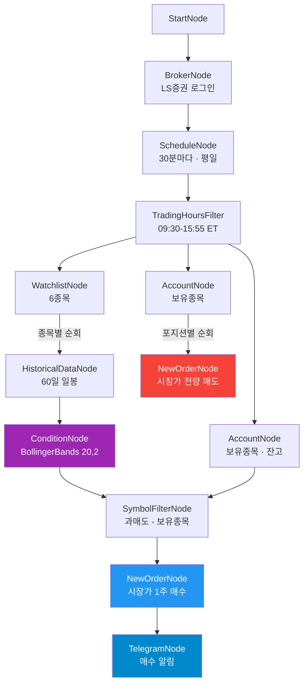

# 볼린저밴드 역추세 자동매매 봇

$10 이하 저가주 6종목을 볼린저밴드(20,2)로 분석하여 하단 밴드 터치 시 과매도 매수하고,
보유종목을 순환 매도합니다. 매수/매도 체결 시 텔레그램으로 알림을 보냅니다.

## 워크플로우



## 전략

### 매수 조건
- **지표**: Bollinger Bands (기간 20, 표준편차 2배)
- **신호**: 현재가 < 하단 밴드 → 과매도 (below_lower)
- **대상**: watchlist 중 미보유 종목
- **주문**: 시장가 1주

### 매도 조건
- **기준**: 보유 포지션 전량 시장가 매도
- **주기**: 매수와 동일 (30분마다 체크)

### 감시 종목 (6개)

| 종목 | 거래소 | 설명 |
|------|--------|------|
| SOFI | NASDAQ | SoFi Technologies |
| RIVN | NASDAQ | Rivian Automotive |
| LCID | NASDAQ | Lucid Group |
| GRAB | NASDAQ | Grab Holdings |
| OPEN | NASDAQ | Opendoor Technologies |
| DNA | NYSE | Ginkgo Bioworks |

> `workflow.json`의 `watchlist.symbols`를 수정하여 종목 변경 가능

### trend_trailing_bot과의 차이

| 항목 | trend_trailing_bot | bollinger_reversion_bot |
|------|-------------------|------------------------|
| 전략 | TSMOM 추세추종 (모멘텀) | 볼린저밴드 역추세 (평균회귀) |
| 종목 | 소형주 4종목 | 저가주 6종목 |
| 주기 | 5분 | 30분 |
| 매수 신호 | 60일 모멘텀 양수 | 볼린저 하단 터치 |

## 실행

### 환경변수

프로젝트 루트 `.env`에 설정:

```
# LS증권 (필수)
APPKEY=your_app_key
APPSECRET=your_app_secret

# 텔레그램 (선택 — 미설정 시 알림 비활성)
TELEGRAM-TOKEN=your_bot_token
TELEGRAM-CHAT-ID=your_chat_id
```

### 실행 명령

```bash
cd src/programgarden
poetry run python examples/bollinger_reversion_bot/run.py
```

- `Ctrl+C`로 안전 종료
- 미국장 시간(한국시간 23:30~06:00)에만 실제 매매 발생
- 장 외 시간에는 TradingHoursFilter에서 블록

### 콘솔 출력 예시

```
==================================================
  볼린저밴드 역추세 자동매매 봇
  (하단 터치 매수 / 평균회귀 매도 / 텔레그램)
==================================================

  감시 종목: SOFI, RIVN, LCID, GRAB, OPEN, DNA
  전략: 볼린저밴드(20,2) 하단 터치 = 과매도 매수

──────────────────────────────────────────────────
  📅 Cycle #1  (0:00:25)
     매수 0건 / 매도 0건 (누적)
──────────────────────────────────────────────────
  ✅ account (OverseasStockAccountNode) (1307ms)
     볼린저 분석: 0 과매도 / 5 정상
       OPEN: $5.14 (하단 $4.74 / 중간 $5.12) ✔️ 정상
  ✅ bollinger (ConditionNode) (6029ms)
  ✅ telegram_buy (TelegramNode) (1064ms)
```

## 파일 구조

```
bollinger_reversion_bot/
├── workflow.json      # 워크플로우 정의 (13노드, 13엣지)
├── run.py             # 실행 스크립트 (credential 주입 + 리스너)
└── README.md          # 이 문서
```

## 커스터마이즈

| 항목 | 파일 | 위치 |
|------|------|------|
| 감시 종목 변경 | workflow.json | `watchlist.symbols` |
| 스캔 주기 변경 | workflow.json | `schedule.cron` (예: `*/15` → 15분) |
| 볼린저 기간 | workflow.json | `bollinger.fields.period` (기본 20) |
| 표준편차 배수 | workflow.json | `bollinger.fields.std_dev` (기본 2.0) |
| 조건 방향 | workflow.json | `bollinger.fields.position` (`below_lower` / `above_upper`) |
| 매수 수량 | workflow.json | `buy_order.order.quantity` |
| 거래시간 | workflow.json | `trading_hours.start/end` |
| 최대 가동시간 | workflow.json | `schedule.max_duration_hours` (기본 720h) |
