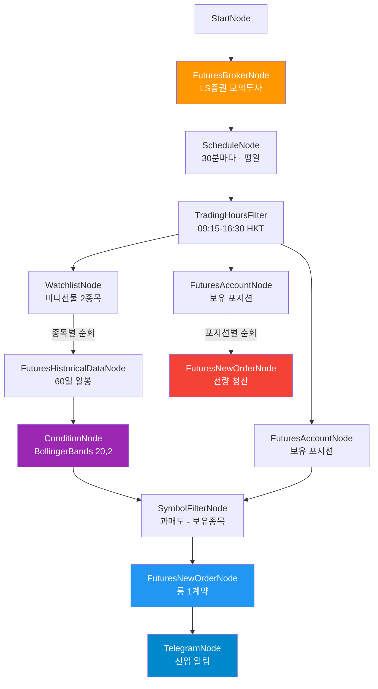

# HKEX 미니선물 역추세 자동매매 봇 (모의투자)

HKEX 미니항셍·미니H주 선물을 볼린저밴드(20,2)로 분석하여 하단 밴드 터치 시
롱 진입하고, 보유 포지션을 순환 청산합니다. 모의투자 모드로 실행됩니다.

## 워크플로우



## 전략

### 롱 진입
- **지표**: Bollinger Bands (기간 20, 표준편차 2배)
- **신호**: 현재가 < 하단 밴드 → 과매도 롱 진입
- **대상**: watchlist 중 미보유 종목
- **주문**: 시장가 1계약

### 포지션 청산
- **기준**: 보유 포지션 전량 반대매매
- **주기**: 롱 진입과 동일 (30분마다)

### 감시 종목 (2개)

| 종목코드 | 기초상품 | 설명 | 통화 | 틱가치 |
|----------|----------|------|------|--------|
| HMHJ26 | HMH | Mini Hang Seng (4월물) | HKD | 10 HKD |
| HMCEJ26 | HMCE | Mini H-Shares (4월물) | HKD | 10 HKD |

> 월물 만기 시 `workflow.json`의 `watchlist.symbols`에서 다음 월물로 교체

### 다른 예제 봇과의 차이

| 항목 | trend_trailing | bollinger_reversion | **hkex_futures** |
|------|---------------|--------------------|--------------------|
| 상품 | 해외주식 | 해외주식 | **해외선물** |
| 계좌 | 실전 | 실전 | **모의투자** |
| 거래소 | NASDAQ | NASDAQ/NYSE | **HKEX** |
| 전략 | TSMOM 추세 | 볼린저 역추세 | 볼린저 역추세 |
| 방향 | 매수만 | 매수만 | **롱/청산** |
| 종목 | 소형주 4개 | 저가주 6개 | 미니선물 2개 |

## 실행

### 환경변수

프로젝트 루트 `.env`에 설정:

```
# LS증권 해외선물 모의투자 (필수)
APPKEY_FUTURE_FAKE=your_app_key
APPSECRET_FUTURE_FAKE=your_app_secret

# 텔레그램 (선택 — 미설정 시 알림 비활성)
TELEGRAM-TOKEN=your_bot_token
TELEGRAM-CHAT-ID=your_chat_id
```

> 해외선물 모의투자 키는 LS증권 OpenAPI에서 별도 발급 필요

### 실행 명령

```bash
cd src/programgarden
poetry run python examples/hkex_futures_bot/run.py
```

- `Ctrl+C`로 안전 종료
- HKEX 장중 시간(한국시간 10:15~17:30)에만 실제 매매 발생
- 장 외 시간에는 TradingHoursFilter에서 블록
- **모의투자**이므로 실제 자금 소모 없음

### 콘솔 출력 예시

```
==================================================
  HKEX 미니선물 역추세 자동매매 봇
  (볼린저 롱 / 포지션 청산 / 모의투자)
==================================================

  감시 종목: HMHJ26, HMCEJ26
  전략: 볼린저밴드(20,2) 하단 터치 = 롱 진입
  모드: 모의투자 (paper_trading)

──────────────────────────────────────────────────
  📅 Cycle #1  (0:00:30)
     롱 0건 / 청산 0건 (누적)
──────────────────────────────────────────────────
  ✅ account (OverseasFuturesAccountNode) (850ms)
     볼린저 분석: 0 과매도 / 2 정상
       HMHJ26: 23150.0 (하단 22890.5 / 중간 23045.0) ✔️ 정상
       HMCEJ26: 7850.0 (하단 7720.3 / 중간 7800.5) ✔️ 정상
```

## HKEX 거래시간 (HKT)

| 세션 | 시간 (HKT) | 한국시간 (KST) |
|------|-----------|---------------|
| 오전 | 09:15 - 12:00 | 10:15 - 13:00 |
| 오후 | 13:00 - 16:30 | 14:00 - 17:30 |
| 야간 | 17:15 - 03:00 | 18:15 - 04:00 |

> 본 봇은 주간 세션(09:15-16:30 HKT)만 커버. 야간 세션 포함하려면 trading_hours 수정

## 파일 구조

```
hkex_futures_bot/
├── workflow.json      # 워크플로우 정의 (13노드, 13엣지)
├── run.py             # 실행 스크립트 (모의투자 credential 주입 + 리스너)
└── README.md          # 이 문서
```

## 커스터마이즈

| 항목 | 파일 | 위치 |
|------|------|------|
| 감시 종목 변경 | workflow.json | `watchlist.symbols` (월물 교체) |
| 스캔 주기 변경 | workflow.json | `schedule.cron` |
| 볼린저 기간 | workflow.json | `bollinger.fields.period` (기본 20) |
| 표준편차 배수 | workflow.json | `bollinger.fields.std_dev` (기본 2.0) |
| 매수 수량 | workflow.json | `buy_order.order.quantity` (기본 1계약) |
| 거래시간 | workflow.json | `trading_hours.start/end` |
| 야간 세션 추가 | workflow.json | `trading_hours.end`을 `"03:00"` 등으로 확장 |
| 모의→실전 전환 | workflow.json | `broker.paper_trading`을 `false`로 변경 |
