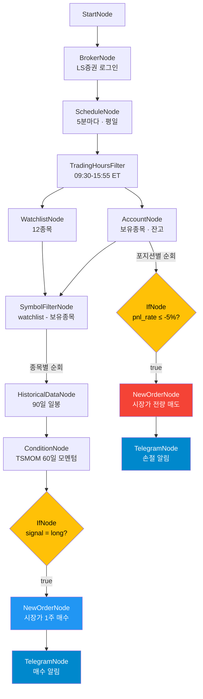

# 추세추종 + 스탑로스 자동매매 봇

해외주식 $30 이하 종목 중 TSMOM(시계열 모멘텀) 추세를 평가하여 자동 매수하고,
-5% 스탑로스로 자동 매도합니다. 매수/매도 체결 시 텔레그램으로 알림을 보냅니다.

## 워크플로우



## 전략

### 매수 조건
- **지표**: TSMOM (Time Series Momentum) 60일 룩백
- **신호**: 60일 수익률 > 0 → `signal = long`
- **대상**: watchlist 중 미보유 종목
- **주문**: 시장가 1주

### 매도 조건
- **기준**: 보유 포지션의 `pnl_rate` (평가손익률)
- **임계값**: -5% 이하 시 전량 시장가 매도
- **주기**: 매수와 동일 (5분마다 체크)

### 감시 종목 (12개)

| 종목 | 거래소 | 종목 | 거래소 |
|------|--------|------|--------|
| F (Ford) | NYSE | AAL (American Airlines) | NASDAQ |
| T (AT&T) | NYSE | CCL (Carnival) | NYSE |
| INTC (Intel) | NASDAQ | RIOT (Riot Platforms) | NASDAQ |
| SOFI (SoFi) | NASDAQ | WBD (Warner Bros) | NASDAQ |
| SNAP (Snap) | NYSE | RIVN (Rivian) | NASDAQ |
| NIO (NIO) | NYSE | LCID (Lucid) | NASDAQ |

> `workflow.json`의 `watchlist.symbols`를 수정하여 종목 변경 가능

## 실행

### 환경변수

프로젝트 루트 `.env`에 설정:

```
# LS증권 (필수)
APPKEY=your_app_key
APPSECRET=your_app_secret

# 텔레그램 (선택 — 미설정 시 알림 비활성)
TELEGRAM-TOKEN=your_bot_token
TELEGRAM-CHAT-ID=your_chat_id
```

### 실행 명령

```bash
cd src/programgarden
poetry run python examples/trend_trailing_bot/run.py
```

- `Ctrl+C`로 안전 종료
- 미국장 시간(한국시간 23:30~06:00)에만 실제 매매 발생
- 장 외 시간에는 TradingHoursFilter에서 블록

### 콘솔 출력 예시

```
==================================================
  추세추종 + 스탑로스 자동매매 봇
  (TSMOM 매수 / -5% 손절 / 텔레그램 알림)
==================================================

  감시 종목: F, T, INTC, SOFI, SNAP, NIO, AAL, CCL, RIOT, WBD, RIVN, LCID
  스케줄: 5분마다 (평일 09:30-15:55 ET)

──────────────────────────────────────────────────
  📅 Cycle #1  (0:05:00)
     매수 0건 / 매도 0건 (누적)
──────────────────────────────────────────────────
  ✅ account (OverseasStockAccountNode) (320ms)
  📊 TSMOM signal: F long, INTC long, SOFI neutral ...
  ✅ buy_order (OverseasStockNewOrderNode) (1520ms)
  ✅ telegram_buy (TelegramNode) (210ms)
```

### 텔레그램 알림 예시

매수:
```
🟢 매수 체결
종목: INTC (NASDAQ)
주문: 시장가 1주
모멘텀: 0.1234
```

손절:
```
🔴 손절 매도
종목: SOFI (NASDAQ)
수량: 1주
손익률: -5.23%
```

## 파일 구조

```
trend_trailing_bot/
├── workflow.json      # 워크플로우 정의 (15노드, 15엣지)
├── run.py             # 실행 스크립트 (credential 주입 + 리스너)
├── env_example.txt    # 환경변수 예시
└── README.md          # 이 문서
```

## 커스터마이즈

| 항목 | 파일 | 위치 |
|------|------|------|
| 감시 종목 변경 | workflow.json | `watchlist.symbols` |
| 스캔 주기 변경 | workflow.json | `schedule.cron` (예: `*/10` → 10분) |
| 스탑로스 비율 | workflow.json | `if_stop.right` (예: `-3.0` → -3%) |
| TSMOM 룩백 | workflow.json | `tsmom.fields.lookback_days` |
| 매수 수량 | workflow.json | `buy_order.order.quantity` |
| 거래시간 | workflow.json | `trading_hours.start/end` |
| 최대 가동시간 | workflow.json | `schedule.max_duration_hours` (기본 720h) |

## 업그레이드: 적응형 트레일링 스탑

현재는 -5% 고정 스탑로스입니다. 수익률이 높아질수록 허용 하락폭을 넓히는
**적응형 트레일링 스탑**으로 업그레이드하려면:

1. 매도 흐름을 `RealAccountNode` (실시간) 기반으로 변경
2. `ConditionNode` + `TrailingStop` 플러그인 사용 (`trail_ratio=0.5`)
3. `ThrottleNode` (30초) 추가

```
trail_ratio=0.5 일 때:
  수익 10% → 허용 하락 5% (HWM 대비)
  수익 20% → 허용 하락 10%
  수익 30% → 허용 하락 15%
```

TrailingStop 플러그인은 `risk_tracker` HWM(고점) 추적이 필요하므로
실시간 노드(`RealAccountNode`)와 함께 사용해야 합니다.
