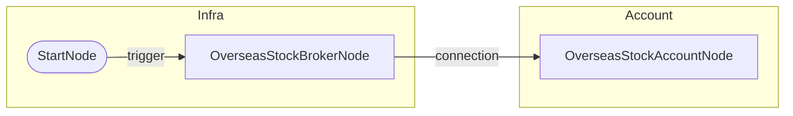

# 해외주식 계좌 조회 (01)

## 개요
- **목적**: 해외주식 실계좌 연결 및 예수금/보유종목 조회
- **사용 계좌**: 실계좌
- **Credential**: `7c5caa90-f013-44fd-855d-410437c86737`

## 워크플로우 도면

### Mermaid 다이어그램


### 노드 입출력 상세

```
┌─────────────────────────────────────────────────────────────────────────────┐
│ StartNode (start)                                                           │
├─────────────────────────────────────────────────────────────────────────────┤
│ IN:  (none)                                                                 │
│ OUT: trigger ─────────────────────────────────────────────────────────────> │
└─────────────────────────────────────────────────────────────────────────────┘
                                      │
                                      ▼ trigger
┌─────────────────────────────────────────────────────────────────────────────┐
│ OverseasStockBrokerNode (broker)                                            │
├─────────────────────────────────────────────────────────────────────────────┤
│ IN:  credential_id = "7c5caa90-f013-44fd-855d-410437c86737"                 │
│ OUT: connection ──────────────────────────────────────────────────────────> │
│        {provider: "ls-sec.co.kr", product: "overseas_stock"}                │
└─────────────────────────────────────────────────────────────────────────────┘
                                      │
                                      ▼ connection (자동 주입)
┌─────────────────────────────────────────────────────────────────────────────┐
│ OverseasStockAccountNode (account)                                          │
├─────────────────────────────────────────────────────────────────────────────┤
│ IN:  connection (브로커에서 자동 주입)                                       │
│ OUT: balance ───────────────────────────────────────────────────────────────│
│        {total_pnl_rate, cash_krw, stock_eval_krw, total_eval_krw}           │
│      positions ─────────────────────────────────────────────────────────────│
│        [{symbol, name, qty, avg_price, current_price, pnl_rate, ...}]       │
│      held_symbols ──────────────────────────────────────────────────────────│
│        ["GOSS"]                                                             │
└─────────────────────────────────────────────────────────────────────────────┘
```

### 노드 요약

| 노드 ID | 타입 | 입력 포트 | 출력 포트 |
|---------|------|----------|----------|
| start | StartNode | - | `trigger` |
| broker | OverseasStockBrokerNode | `credential_id` | `connection` |
| account | OverseasStockAccountNode | `connection` (자동) | `balance`, `positions`, `held_symbols` |

### 데이터 흐름

1. **start** → `trigger` 출력
2. **broker** ← trigger 수신 → `connection` 출력 (브로커 세션)
3. **account** ← connection 자동 주입 → `balance`, `positions`, `held_symbols` 출력

## 출력 데이터 구조

### balance
```json
{
  "total_pnl_rate": -6.02,
  "cash_krw": 6.0,
  "stock_eval_krw": 18000.0,
  "total_eval_krw": 19155.0,
  "total_pnl_krw": -1154.0
}
```

### positions (리스트 형태)
```json
[
  {
    "symbol": "GOSS",
    "name": "고사머 바이오",
    "qty": 5,
    "avg_price": 2.68,
    "current_price": 2.52,
    "pnl_rate": -6.03,
    "pnl_amount": -0.81,
    "currency": "USD",
    "market": "NASDAQ",
    "eval_amount": 12.6,
    "purchase_amount": 13.41
  }
]
```

### held_symbols
```json
["GOSS"]
```

## 바인딩 예시

positions가 리스트이므로 다음과 같이 바인딩 가능:
```
{{ nodes.account.positions }}                    → 전체 배열
{{ nodes.account.positions.first() }}           → 첫 번째 포지션
{{ nodes.account.positions.filter('pnl_rate > 0') }}  → 수익 종목만
{{ nodes.account.positions.map('symbol') }}     → 심볼 배열 추출
{{ nodes.account.positions.sum('eval_amount') }} → 총 평가금액
```

## 테스트 결과
- [x] 성공 (2026-01-29)
- 결과: GOSS 5주 보유, 총평가 19,155원, 손익률 -6.02%
- positions 리스트 형태 확인 완료
