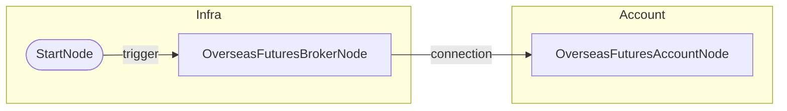

# 해외선물 계좌 조회 (02)

## 개요
- **목적**: 해외선물 모의투자 계좌 연결 및 예수금/포지션 조회
- **사용 계좌**: 모의투자
- **Credential**: `2126e9c2-3da4-4da7-9d98-e6fead52e4ac`

## 워크플로우 도면

### Mermaid 다이어그램


### 노드 입출력 상세

```
┌─────────────────────────────────────────────────────────────────────────────┐
│ StartNode (start)                                                           │
├─────────────────────────────────────────────────────────────────────────────┤
│ IN:  (none)                                                                 │
│ OUT: trigger ─────────────────────────────────────────────────────────────> │
└─────────────────────────────────────────────────────────────────────────────┘
                                      │
                                      ▼ trigger
┌─────────────────────────────────────────────────────────────────────────────┐
│ OverseasFuturesBrokerNode (broker)                                          │
├─────────────────────────────────────────────────────────────────────────────┤
│ IN:  credential_id, paper_trading=true                                      │
│ OUT: connection ──────────────────────────────────────────────────────────> │
│        {provider: "ls-sec.co.kr", product: "overseas_futures"}              │
└─────────────────────────────────────────────────────────────────────────────┘
                                      │
                                      ▼ connection (자동 주입)
┌─────────────────────────────────────────────────────────────────────────────┐
│ OverseasFuturesAccountNode (account)                                        │
├─────────────────────────────────────────────────────────────────────────────┤
│ IN:  connection (브로커에서 자동 주입)                                       │
│ OUT: balance ───────────────────────────────────────────────────────────────│
│        {by_currency, total_orderable, orderable_amount, deposit}            │
│      positions ─────────────────────────────────────────────────────────────│
│        [{symbol, exchange, name, is_long, quantity, price, ...}]            │
│      held_symbols ──────────────────────────────────────────────────────────│
│        ["HMCEG26", "HMHG26"]                                                │
└─────────────────────────────────────────────────────────────────────────────┘
```

### 노드 요약

| 노드 ID | 타입 | 입력 포트 | 출력 포트 |
|---------|------|----------|----------|
| start | StartNode | - | `trigger` |
| broker | OverseasFuturesBrokerNode | `credential_id`, `paper_trading` | `connection` |
| account | OverseasFuturesAccountNode | `connection` (자동) | `balance`, `positions`, `held_symbols` |

## 출력 데이터 구조

### balance
```json
{
  "by_currency": {
    "USD": {"deposit": 100000.0, "orderable_amount": 100000.0, ...},
    "HKD": {"deposit": 993640.0, "orderable_amount": 923253.0, "eval_pnl": 3120.0},
    ...
  },
  "total_orderable": 11223253.0,
  "orderable_amount": 100000.0,
  "deposit": 11293640.0
}
```

### positions (리스트 형태)
```json
[
  {
    "symbol": "HMCEG26",
    "exchange": "HKEX",
    "name": "Mini H-Shares(2026.02)",
    "is_long": true,
    "quantity": 1,
    "price": 9545.0,
    "entry_price": 9478.0,
    "current_price": 9545.0,
    "pnl_amount": 670.0,
    "currency": "HKD"
  },
  {
    "symbol": "HMHG26",
    "exchange": "HKEX",
    "name": "Mini Hang Seng(2026.02)",
    "is_long": true,
    "quantity": 1,
    "price": 27963.0,
    "entry_price": 27718.0,
    "current_price": 27963.0,
    "pnl_amount": 2450.0,
    "currency": "HKD"
  }
]
```

### held_symbols
```json
["HMCEG26", "HMHG26"]
```

## 바인딩 예시

```
{{ nodes.account.positions }}                        → 전체 포지션 배열
{{ nodes.account.positions.filter('is_long == true') }}  → 롱 포지션만
{{ nodes.account.positions.sum('pnl_amount') }}      → 총 손익금액
{{ nodes.account.balance.total_orderable }}          → 총 주문가능금액
{{ nodes.account.balance.by_currency.HKD.deposit }}  → HKD 예수금
```

## 테스트 결과
- [x] 성공 (2026-01-29)
- 결과: Mini H-Shares 1계약, Mini Hang Seng 1계약 보유
- 총 평가손익: +3,120 HKD
- positions 리스트 형태 확인 완료
