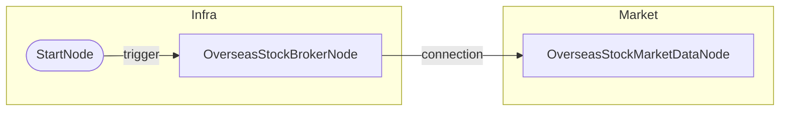

# 해외주식 시세 조회 (03)

## 개요
- **목적**: 해외주식 현재 시세 조회
- **사용 계좌**: 실계좌
- **조회 종목**: AAPL, TSLA, NVDA (NASDAQ)

## 워크플로우 도면

### Mermaid 다이어그램


### 노드 입출력 상세

```
┌─────────────────────────────────────────────────────────────────────────────┐
│ OverseasStockMarketDataNode (market)                                        │
├─────────────────────────────────────────────────────────────────────────────┤
│ IN:  symbols = [{symbol: "AAPL", exchange: "NASDAQ"}, ...]                  │
│ OUT: values ────────────────────────────────────────────────────────────────│
│        [{symbol, exchange, price, change, change_pct, volume, ...}]         │
└─────────────────────────────────────────────────────────────────────────────┘
```

### 노드 요약

| 노드 ID | 타입 | 입력 | 출력 |
|---------|------|------|------|
| start | StartNode | - | `trigger` |
| broker | OverseasStockBrokerNode | `credential_id` | `connection` |
| market | OverseasStockMarketDataNode | `symbols` | `values` |

## 출력 데이터 구조

### values (리스트 형태)
```json
[
  {
    "symbol": "AAPL",
    "exchange": "NASDAQ",
    "price": 257.85,
    "change": 1.41,
    "change_pct": 0.55,
    "volume": 65926,
    "open": 256.8,
    "high": 258.0,
    "low": 256.7,
    "close": 257.85
  },
  {
    "symbol": "TSLA",
    "exchange": "NASDAQ",
    "price": 442.3,
    "change": 10.84,
    "change_pct": 2.51,
    ...
  }
]
```

## 바인딩 예시

```
{{ nodes.market.values }}                          → 전체 시세 배열
{{ nodes.market.values.filter('change_pct > 0') }} → 상승 종목만
{{ nodes.market.values.map('symbol') }}            → 심볼 배열
{{ nodes.market.values.first().price }}            → 첫 번째 종목 가격
```

## 테스트 결과
- [x] 성공 (2026-01-29)
- AAPL: $257.85 (+0.55%)
- TSLA: $442.30 (+2.51%)
- NVDA: $191.27 (-0.13%)
