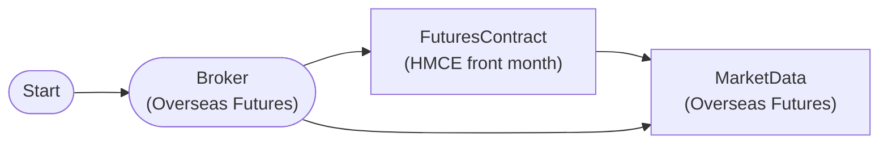

# Overseas Futures Market Data

Overseas futures current market data query (Mini H-Shares). The contract month is never hardcoded — `FuturesContractNode` resolves the currently listed front month at execution time, so the workflow keeps working after every expiry.

## Workflow Structure

## Node List

| ID | Type | Description |
|----|------|------|
| start | StartNode | Workflow start |
| broker | OverseasFuturesBrokerNode | Overseas futures broker connection (paper trading, HKEX) |
| contract | FuturesContractNode | Resolves the listed front-month contract of HMCE (Mini H-Shares) at execution time |
| market | OverseasFuturesMarketDataNode | Overseas futures market data query |

## Key Settings

- **broker**: Paper trading mode
- **contract**: `base_products: ["HMCE"]` (underlying product code — not a month-coded symbol), `contract_selection: "front"`, `futures_exchange: "HKEX"`
- **market**: `symbol: "{{ item }}"` — the engine auto-iterates the `symbols` output of **contract** ([{exchange, symbol}]), one contract at a time

> 만기가 지난 월물을 하드코딩하면 LS 는 빈 배열만 돌려주고 에러도 내지 않아 워크플로우가 조용히 죽습니다.
> **contract** 노드가 실행 시점에 상장 중인 근월물로 자동 해소하므로 만기와 무관하게 계속 동작합니다.

## Required Credentials

| ID | Type | Description |
|----|------|------|
| futures_cred | broker_ls_overseas_futures | LS Securities Overseas Futures API (paper trading, HKEX only) |

## Data Flow

1. **start** (StartNode) --> **broker** (OverseasFuturesBrokerNode)
1. **broker** (OverseasFuturesBrokerNode) --> **contract** (FuturesContractNode) — the o3101 master query needs an LS session
1. **contract** (FuturesContractNode) --> **market** (OverseasFuturesMarketDataNode)
1. **broker** (OverseasFuturesBrokerNode) --> **market** (OverseasFuturesMarketDataNode)
