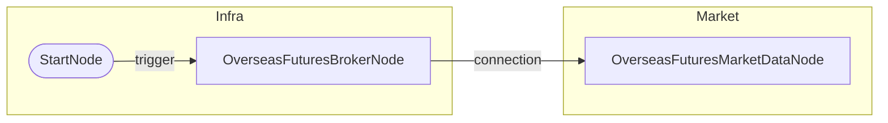

# 해외선물 시세 조회 (04)

## 개요
- **목적**: 해외선물 현재 시세 조회
- **사용 계좌**: 모의투자
- **조회 종목**: HMHG26 (Mini Hang Seng), HMCEG26 (Mini H-Shares)

## 워크플로우 도면

### Mermaid 다이어그램


### 노드 요약

| 노드 ID | 타입 | 입력 | 출력 |
|---------|------|------|------|
| start | StartNode | - | `trigger` |
| broker | OverseasFuturesBrokerNode | `credential_id`, `paper_trading` | `connection` |
| market | OverseasFuturesMarketDataNode | `symbols` | `values` |

## 출력 데이터 구조

### values (리스트 형태)
```json
[
  {
    "symbol": "HMHG26",
    "exchange": "HKEX",
    "symbol_name": "Mini Hang Seng(2026.02)",
    "price": 27966.0,
    "change": 62.0,
    "change_pct": 0.22,
    "volume": 90205,
    "open": 27880.0,
    "high": 28139.0,
    "low": 27578.0,
    "close": 27966.0
  },
  {
    "symbol": "HMCEG26",
    "exchange": "HKEX",
    "symbol_name": "Mini H-Shares(2026.02)",
    "price": 9541.0,
    "change": 2.0,
    "change_pct": 0.02,
    ...
  }
]
```

## 바인딩 예시

```
{{ nodes.market.values }}                          → 전체 시세 배열
{{ nodes.market.values.filter('change_pct > 0') }} → 상승 종목만
{{ nodes.market.values.first().price }}            → 첫 번째 종목 가격
```

## 테스트 결과
- [x] 성공 (2026-01-29)
- HMHG26 (Mini Hang Seng): 27,966 (+0.22%)
- HMCEG26 (Mini H-Shares): 9,541 (+0.02%)
