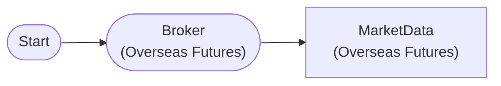

# Overseas Futures Market Data

Overseas futures current market data query (Mini Hang Seng, Mini H-Shares)

## Workflow Structure



## Node List

| ID | Type | Description |
|----|------|------|
| start | StartNode | Workflow start |
| broker | OverseasFuturesBrokerNode | Overseas futures broker connection (paper trading, HKEX) |
| market | OverseasFuturesMarketDataNode | Overseas futures market data query |

## Key Settings

- **broker**: Paper trading mode
- **market**: HMCEG26

## Required Credentials

| ID | Type | Description |
|----|------|------|
| futures_cred | broker_ls_overseas_futures | LS Securities Overseas Futures API (paper trading, HKEX only) |

## Data Flow

1. **start** (StartNode) --> **broker** (OverseasFuturesBrokerNode)
1. **broker** (OverseasFuturesBrokerNode) --> **market** (OverseasFuturesMarketDataNode)

## How to Run

```python
from programgarden import ProgramGarden

pg = ProgramGarden()
job = await pg.run_async(workflow)
```
