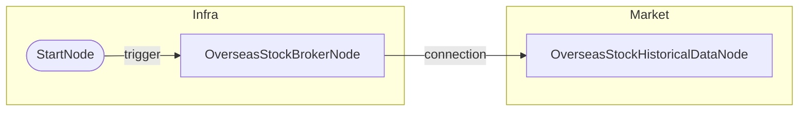

# 해외주식 과거 데이터 조회 (05)

## 개요
- **목적**: 해외주식 30일 과거 OHLCV 데이터 조회
- **사용 계좌**: 실계좌
- **조회 종목**: AAPL (NASDAQ)
- **바인딩 함수 테스트**: `date.ago()`, `date.today()`

## 워크플로우 도면

### Mermaid 다이어그램


### 노드 설정

```json
{
  "id": "historical",
  "type": "OverseasStockHistoricalDataNode",
  "symbols": [{"symbol": "AAPL", "exchange": "NASDAQ"}],
  "start_date": "{{ date.ago(30, format='yyyymmdd') }}",
  "end_date": "{{ date.today(format='yyyymmdd') }}",
  "timeframe": "1d"
}
```

### 바인딩 함수 평가 결과
- `{{ date.ago(30, format='yyyymmdd') }}` → `20260104`
- `{{ date.today(format='yyyymmdd') }}` → `20260203`

## 출력 데이터 구조

### values (리스트 형태)
```json
[
  {
    "symbol": "AAPL",
    "exchange": "NASDAQ",
    "time_series": [
      {
        "date": "20251230",
        "open": 272.81,
        "high": 274.08,
        "low": 272.28,
        "close": 273.08,
        "volume": 22139617
      },
      {
        "date": "20260129",
        "open": 256.8,
        "high": 258.0,
        "low": 256.7,
        "close": 257.85,
        "volume": 66295
      }
    ]
  }
]
```

## 바인딩 예시

```
{{ nodes.historical.values }}                              → 전체 배열
{{ nodes.historical.values.first().time_series }}          → 첫 번째 종목의 시계열
{{ flatten(nodes.historical.values, 'time_series') }}      → 평탄화 (심볼 포함)
{{ pluck(nodes.historical.values, 'time_series') }}        → 시계열만 추출
```

### flatten 결과 예시
```json
[
  {"symbol": "AAPL", "exchange": "NASDAQ", "date": "20251230", "open": 272.81, ...},
  {"symbol": "AAPL", "exchange": "NASDAQ", "date": "20260129", "open": 256.8, ...}
]
```

## 테스트 결과
- [x] 성공 (2026-02-03)
- 21일치 OHLCV 데이터 조회 완료
- `date.ago(30, format='yyyymmdd')`, `date.today(format='yyyymmdd')` 바인딩 함수 정상 동작
