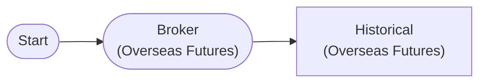

# Overseas Futures Historical Data

Overseas futures 30-day historical data query (Mini Hang Seng)

## Workflow Structure

## Node List

| ID | Type | Description |
|----|------|------|
| start | StartNode | Workflow start |
| broker | OverseasFuturesBrokerNode | Overseas futures broker connection (paper trading, HKEX) |
| historical | OverseasFuturesHistoricalDataNode | Overseas futures historical data query |

## Key Settings

- **broker**: Paper trading mode

## Required Credentials

| ID | Type | Description |
|----|------|------|
| futures_cred | broker_ls_overseas_futures | LS Securities Overseas Futures API (paper trading, HKEX only) |

## Data Flow

1. **start** (StartNode) --> **broker** (OverseasFuturesBrokerNode)
1. **broker** (OverseasFuturesBrokerNode) --> **historical** (OverseasFuturesHistoricalDataNode)
