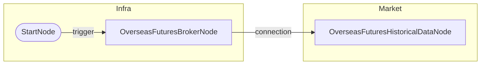

# 해외선물 과거 데이터 조회 (06)

## 개요
- **목적**: 해외선물 30일 과거 OHLCV 데이터 조회
- **사용 계좌**: 모의투자
- **조회 종목**: HMCEG26 (Mini H-Shares)
- **바인딩 함수**: `date.ago()`, `date.today()`

## 워크플로우 도면

### Mermaid 다이어그램


### 노드 설정

```json
{
  "id": "historical",
  "type": "OverseasFuturesHistoricalDataNode",
  "symbol": {"symbol": "HMCEG26", "exchange": "HKEX"},
  "start_date": "{{ date.ago(30, format='yyyymmdd') }}",
  "end_date": "{{ date.today(format='yyyymmdd') }}",
  "timeframe": "1d"
}
```

## 출력 데이터 구조

### values (리스트 형태)
```json
[
  {
    "symbol": "HMCEG26",
    "exchange": "HKEX",
    "time_series": [
      {
        "date": "20260107",
        "open": 26734.0,
        "high": 26881.0,
        "low": 26420.0,
        "close": 26532.0,
        "volume": 1270
      },
      ...
    ]
  }
]
```

## 테스트 결과
- [x] 성공 (2026-02-03)
- 20일치 OHLCV 데이터 조회 완료
- `date.ago(30, format='yyyymmdd')`, `date.today(format='yyyymmdd')` 바인딩 함수 정상 동작
