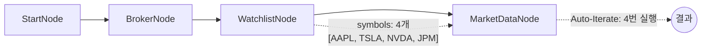

# 07-symbol-watchlist: 관심종목 시세 조회

## 목적
WatchlistNode로 관심종목을 정의하고, 자동 반복 실행으로 각 종목의 시세를 조회합니다.

## 워크플로우 구조



## 노드 설명

### WatchlistNode
- **역할**: 정적 관심종목 리스트 정의
- **출력**: `symbols` (symbol_list 타입)
- **특징**: Broker 연결 없이 독립 실행 가능

### OverseasStockMarketDataNode
- **symbol**: `{{ item }}` - 반복 아이템 전체 `{exchange, symbol}` 객체
- **Auto-Iterate**: WatchlistNode 출력이 배열이므로 각 아이템마다 실행

## 바인딩 테스트 포인트

| 표현식 | 예상 값 | 설명 |
|--------|---------|------|
| `{{ item }}` | `{exchange: "NASDAQ", symbol: "AAPL"}` | 현재 반복 아이템 (symbol 필드에 직접 바인딩) |
| `{{ item.symbol }}` | `"AAPL"` | 아이템의 symbol 필드 |
| `{{ item.exchange }}` | `"NASDAQ"` | 아이템의 exchange 필드 |
| `{{ index }}` | `0, 1, 2, 3` | 현재 인덱스 |
| `{{ total }}` | `4` | 전체 아이템 수 |

## 실행 결과 예시

```json
{
  "nodes": {
    "watchlist": {
      "symbols": [
        {"exchange": "NASDAQ", "symbol": "AAPL"},
        {"exchange": "NASDAQ", "symbol": "TSLA"},
        {"exchange": "NASDAQ", "symbol": "NVDA"},
        {"exchange": "NYSE", "symbol": "JPM"}
      ]
    },
    "market": {
      "symbol": "AAPL",
      "exchange": "NASDAQ",
      "price": 178.50,
      "change": 2.30,
      "change_rate": 1.30
    }
  }
}
```

## 관련 노드
- `WatchlistNode`: symbol.py
- `OverseasStockMarketDataNode`: market_stock.py
