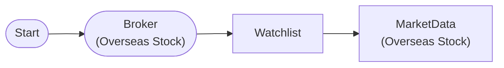

# Watchlist Market Data

Define watchlist symbols with WatchlistNode and query market data

## Workflow Structure



## Node List

| ID | Type | Description |
|----|------|------|
| start | StartNode | Workflow start |
| broker | OverseasStockBrokerNode | Overseas stock broker connection |
| watchlist | WatchlistNode | Define watchlist symbols |
| market | OverseasStockMarketDataNode | Overseas stock market data query |

## Key Settings

- **watchlist**: AAPL, TSLA, NVDA, JPM

## Required Credentials

| ID | Type | Description |
|----|------|------|
| broker_cred | broker_ls_overseas_stock | LS Securities Overseas Stock API |

## Data Flow

1. **start** (StartNode) --> **broker** (OverseasStockBrokerNode)
1. **broker** (OverseasStockBrokerNode) --> **watchlist** (WatchlistNode)
1. **watchlist** (WatchlistNode) --> **market** (OverseasStockMarketDataNode)

## How to Run

```python
from programgarden import ProgramGarden

pg = ProgramGarden()
job = await pg.run_async(workflow)
```
