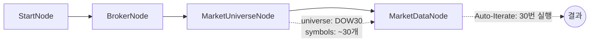

# 08-symbol-universe: 시장 대표지수 종목 조회

## 목적
MarketUniverseNode로 시장 대표지수(NASDAQ100, S&P500, DOW30 등)의 구성 종목을 자동으로 가져와 시세를 조회합니다.

## 워크플로우 구조



## 노드 설명

### MarketUniverseNode
- **역할**: 대표지수 구성 종목 자동 조회
- **universe**: `DOW30` - 다우존스 30 (테스트용으로 작은 지수 선택)
- **출력**: `symbols` (symbol_list), `count` (integer)
- **특징**:
  - Broker 연결 없이 독립 실행 가능
  - pytickersymbols 라이브러리 사용
  - 해외주식(overseas_stock) 전용

### 지원 인덱스
| universe | 설명 | 종목 수 |
|----------|------|---------|
| `DOW30` | 다우존스 30 | ~30개 |
| `SP100` | S&P 100 | ~100개 |
| `NASDAQ100` | 나스닥 100 | ~101개 |
| `SP500` | S&P 500 | ~503개 |

## 바인딩 테스트 포인트

| 표현식 | 예상 값 | 설명 |
|--------|---------|------|
| `{{ nodes.universe.symbols }}` | `[{symbol, exchange}, ...]` | 전체 종목 리스트 |
| `{{ nodes.universe.count }}` | `30` | 종목 수 |
| `{{ item }}` | `{exchange: "NASDAQ", symbol: "AAPL"}` | 현재 반복 종목 (객체) |
| `{{ total }}` | `30` | 전체 반복 수 |

## 실행 결과 예시

```json
{
  "nodes": {
    "universe": {
      "symbols": [
        {"exchange": "NASDAQ", "symbol": "AAPL"},
        {"exchange": "NASDAQ", "symbol": "MSFT"},
        {"exchange": "NYSE", "symbol": "JPM"},
        ...
      ],
      "count": 30
    },
    "market": {
      "symbol": "AAPL",
      "price": 178.50,
      "change": 2.30
    }
  }
}
```

## 주의사항
- **API 호출 수**: DOW30 = 30회, NASDAQ100 = ~100회, SP500 = ~500회
- 대량 호출 시 Rate Limit 주의
- 테스트 시 DOW30 권장

## 관련 노드
- `MarketUniverseNode`: symbol.py
- `OverseasStockMarketDataNode`: market_stock.py
