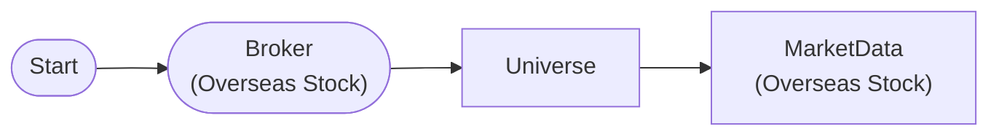

# Market Universe Index Query

Retrieve NASDAQ100 symbols with MarketUniverseNode

## Workflow Structure

## Node List

| ID | Type | Description |
|----|------|------|
| start | StartNode | Workflow start |
| broker | OverseasStockBrokerNode | Overseas stock broker connection |
| universe | MarketUniverseNode | Market universe definition |
| market | OverseasStockMarketDataNode | Overseas stock market data query |

## Required Credentials

| ID | Type | Description |
|----|------|------|
| broker_cred | broker_ls_overseas_stock | LS Securities Overseas Stock API |

## Data Flow

1. **start** (StartNode) --> **broker** (OverseasStockBrokerNode)
1. **broker** (OverseasStockBrokerNode) --> **universe** (MarketUniverseNode)
1. **universe** (MarketUniverseNode) --> **market** (OverseasStockMarketDataNode)
