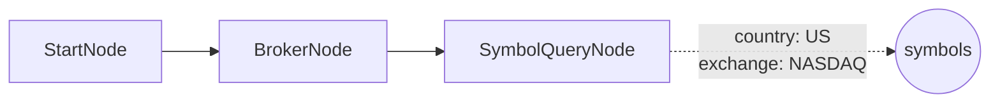

# 09-symbol-query-stock: 해외주식 종목 검색

## 목적
OverseasStockSymbolQueryNode로 LS증권에서 거래 가능한 해외주식 전체 종목을 조회합니다.

## 워크플로우 구조



## 노드 설명

### OverseasStockSymbolQueryNode
- **역할**: LS증권 API(g3190)로 거래 가능 종목 전체 조회
- **country**: `US` - 미국 주식
- **stock_exchange**: `82` - NASDAQ만 (81=NYSE/AMEX, 빈값=전체)
- **max_results**: `100` - 최대 조회 건수
- **출력**: `symbols` (symbol_list), `count` (integer)
- **특징**: Broker 연결 필요 (LS증권 API 호출)

### 거래소 코드
| stock_exchange | 설명 |
|----------------|------|
| `""` (빈값) | 전체 거래소 |
| `81` | NYSE/AMEX |
| `82` | NASDAQ |

### 국가 코드
| country | 설명 |
|---------|------|
| `US` | 미국 |
| `HK` | 홍콩 |
| `JP` | 일본 |
| `CN` | 중국 |
| `VN` | 베트남 |
| `ID` | 인도네시아 |

## 바인딩 테스트 포인트

| 표현식 | 예상 값 | 설명 |
|--------|---------|------|
| `{{ nodes.query.symbols }}` | `[{symbol, exchange}, ...]` | 종목 리스트 |
| `{{ nodes.query.count }}` | `100` | 조회된 종목 수 |
| `{{ nodes.query.symbols.first() }}` | `{symbol: "AAPL", exchange: "NASDAQ"}` | 첫 번째 종목 |

## 실행 결과 예시

```json
{
  "nodes": {
    "query": {
      "symbols": [
        {"exchange": "NASDAQ", "symbol": "AAPL"},
        {"exchange": "NASDAQ", "symbol": "MSFT"},
        {"exchange": "NASDAQ", "symbol": "AMZN"},
        ...
      ],
      "count": 100
    }
  }
}
```

## WatchlistNode vs SymbolQueryNode

| 구분 | WatchlistNode | SymbolQueryNode |
|------|---------------|-----------------|
| 종목 정의 | 수동 입력 | API 자동 조회 |
| Broker 필요 | X | O |
| 용도 | 관심종목 관리 | 전체 종목 탐색 |

## 관련 노드
- `OverseasStockSymbolQueryNode`: symbol_stock.py
- `OverseasStockBrokerNode`: infra.py
