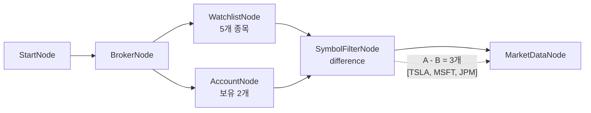

# 10-symbol-filter: 종목 필터링 (관심종목 - 보유종목)

## 목적
SymbolFilterNode로 두 종목 리스트를 비교하여 차집합을 계산합니다.
**중복 매수 방지**: 관심종목에서 이미 보유한 종목을 제외하여 신규 매수 대상만 추출합니다.

## 워크플로우 구조



## 노드 설명

### WatchlistNode
- **역할**: 매수 관심 종목 정의
- **symbols**: 5개 종목 (AAPL, TSLA, NVDA, MSFT, JPM)

### OverseasStockAccountNode
- **역할**: 현재 보유 종목 조회
- **출력**: `held_symbols` - 보유 종목 리스트

### SymbolFilterNode
- **역할**: 두 리스트 집합 연산
- **operation**: `difference` (차집합)
- **input_a**: `{{ nodes.watchlist.symbols }}` - 관심종목
- **input_b**: `{{ nodes.account.held_symbols }}` - 보유종목
- **출력**: `symbols` - 결과 (관심종목 - 보유종목)

### 집합 연산 종류
| operation | 설명 | 용도 |
|-----------|------|------|
| `difference` | A - B | 중복 매수 방지 |
| `intersection` | A ∩ B | 교집합 (두 조건 모두 만족) |
| `union` | A ∪ B | 합집합 |

## 바인딩 테스트 포인트

| 표현식 | 예상 값 | 설명 |
|--------|---------|------|
| `{{ nodes.watchlist.symbols }}` | `[{AAPL}, {TSLA}, {NVDA}, {MSFT}, {JPM}]` | 관심종목 5개 |
| `{{ nodes.account.held_symbols }}` | `[{AAPL}, {NVDA}]` | 보유종목 2개 (예시) |
| `{{ nodes.filter.symbols }}` | `[{TSLA}, {MSFT}, {JPM}]` | 신규 매수 대상 3개 |
| `{{ nodes.filter.count }}` | `3` | 결과 종목 수 |

## 실행 결과 예시

```json
{
  "nodes": {
    "watchlist": {
      "symbols": [
        {"exchange": "NASDAQ", "symbol": "AAPL"},
        {"exchange": "NASDAQ", "symbol": "TSLA"},
        {"exchange": "NASDAQ", "symbol": "NVDA"},
        {"exchange": "NASDAQ", "symbol": "MSFT"},
        {"exchange": "NYSE", "symbol": "JPM"}
      ]
    },
    "account": {
      "held_symbols": [
        {"exchange": "NASDAQ", "symbol": "AAPL"},
        {"exchange": "NASDAQ", "symbol": "NVDA"}
      ]
    },
    "filter": {
      "symbols": [
        {"exchange": "NASDAQ", "symbol": "TSLA"},
        {"exchange": "NASDAQ", "symbol": "MSFT"},
        {"exchange": "NYSE", "symbol": "JPM"}
      ],
      "count": 3
    }
  }
}
```

## 활용 예시

### 1. 중복 매수 방지
```
관심종목 - 보유종목 = 신규 매수 대상
```

### 2. 복합 조건 매수 신호
```
RSI과매도 ∩ MACD골든크로스 = 강력 매수 신호
```

### 3. 포트폴리오 리밸런싱
```
목표종목 - 현재종목 = 추가 매수 대상
현재종목 - 목표종목 = 매도 대상
```

## 관련 노드
- `SymbolFilterNode`: symbol.py
- `WatchlistNode`: symbol.py
- `OverseasStockAccountNode`: account_stock.py
