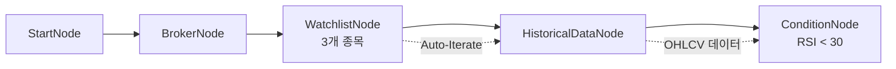

# 11-condition-rsi-filter: RSI 과매도 종목 필터링

## 목적
RSI(Relative Strength Index) 조건으로 과매도 종목을 찾고, filter/map 바인딩 함수를 테스트합니다.

## 워크플로우 구조



## 노드 설명

### WatchlistNode
- **symbols**: AAPL, TSLA, NVDA (3개 종목)

### OverseasStockHistoricalDataNode
- **symbol**: `{{ item }}` - 자동 반복 (전체 `{exchange, symbol}` 객체)
- **period**: `D` (일봉)
- **start_date**: `{{ date.ago(60, format='yyyymmdd') }}` - 60일 전
- **end_date**: `{{ date.today(format='yyyymmdd') }}` - 오늘

### ConditionNode (RSI)
- **plugin**: `RSI`
- **data**: `{{ nodes.historical.value }}` - OHLCV 데이터
- **fields**:
  - `period`: 14 (RSI 계산 기간)
  - `threshold`: 30 (과매도 기준)
  - `direction`: `below` (30 미만일 때 true)

## 바인딩 테스트 포인트

### 날짜 함수 (date 네임스페이스)
| 표현식 | 예상 값 | 설명 |
|--------|---------|------|
| `{{ date.today(format='yyyymmdd') }}` | `"20260129"` | 오늘 날짜 |
| `{{ date.ago(60, format='yyyymmdd') }}` | `"20251130"` | 60일 전 |

### 조건 결과
| 표현식 | 예상 값 | 설명 |
|--------|---------|------|
| `{{ nodes.rsi_condition.result.passed }}` | `true/false` | 조건 통과 여부 |
| `{{ nodes.rsi_condition.result.value }}` | `28.5` | RSI 값 |
| `{{ nodes.rsi_condition.result.symbol }}` | `"AAPL"` | 종목 코드 |

### 필터/맵 체이닝 (후속 노드에서 사용)
```json
// 과매도 종목만 필터링
"{{ nodes.rsi_condition.filter('result.passed == true') }}"

// 종목 코드만 추출
"{{ nodes.rsi_condition.map('result.symbol') }}"

// 체이닝: 과매도 종목의 심볼만
"{{ nodes.rsi_condition.filter('result.passed == true').map('result.symbol') }}"
```

## 실행 결과 예시

```json
{
  "nodes": {
    "watchlist": {
      "symbols": [
        {"exchange": "NASDAQ", "symbol": "AAPL"},
        {"exchange": "NASDAQ", "symbol": "TSLA"},
        {"exchange": "NASDAQ", "symbol": "NVDA"}
      ]
    },
    "historical": {
      "value": {
        "symbol": "AAPL",
        "exchange": "NASDAQ",
        "time_series": [
          {"date": "20260128", "close": 178.50, "open": 177.00, "high": 179.00, "low": 176.50, "volume": 50000000},
          ...
        ]
      }
    },
    "rsi_condition": {
      "result": {
        "passed": true,
        "value": 28.5,
        "symbol": "AAPL",
        "exchange": "NASDAQ",
        "indicator": "RSI",
        "threshold": 30,
        "direction": "below"
      }
    }
  }
}
```

## RSI 플러그인 설명

### 입력 파라미터
| 파라미터 | 기본값 | 설명 |
|----------|--------|------|
| `period` | 14 | RSI 계산 기간 |
| `threshold` | 30 | 기준값 |
| `direction` | `below` | `below`: 과매도, `above`: 과매수 |

### 출력
| 필드 | 타입 | 설명 |
|------|------|------|
| `passed` | boolean | 조건 충족 여부 |
| `value` | number | 현재 RSI 값 |
| `symbol` | string | 종목 코드 |

## 관련 노드
- `ConditionNode`: condition.py
- `OverseasStockHistoricalDataNode`: market_stock.py
- RSI 플러그인: community/plugins/rsi.py
