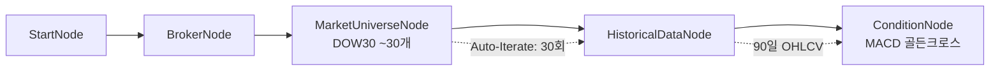

# 12-condition-macd-chain: MACD 골든크로스 + 체이닝

## 목적
MACD 플러그인으로 골든크로스(매수 신호)를 감지하고, 메서드 체이닝 표현식을 테스트합니다.

## 워크플로우 구조



## 노드 설명

### MarketUniverseNode
- **universe**: `DOW30` - 다우존스 30 종목
- 대량 종목 테스트 (30개 종목 반복 실행)

### OverseasStockHistoricalDataNode
- **symbol**: `{{ item }}` - 자동 반복 (전체 `{exchange, symbol}` 객체)
- **start_date**: `{{ date.ago(90, format='yyyymmdd') }}` - 90일 전
- MACD 계산에 충분한 데이터 확보

### ConditionNode (MACD)
- **plugin**: `MACD`
- **data**: `{{ nodes.historical.value }}`
- **fields**:
  - `fast_period`: 12 (단기 EMA)
  - `slow_period`: 26 (장기 EMA)
  - `signal_period`: 9 (시그널 라인)
  - `signal_type`: `golden_cross` (매수 신호)

## 바인딩 테스트 포인트

### 체이닝 메서드
| 표현식 | 예상 값 | 설명 |
|--------|---------|------|
| `{{ nodes.macd_condition.all() }}` | `[{result}, ...]` | 전체 결과 배열 |
| `{{ nodes.macd_condition.filter('result.passed == true') }}` | `[{...}, ...]` | 골든크로스 발생 종목 |
| `{{ nodes.macd_condition.filter('result.passed == true').count() }}` | `5` | 골든크로스 종목 수 |
| `{{ nodes.macd_condition.filter('result.passed == true').map('result.symbol') }}` | `["AAPL", ...]` | 종목 코드만 추출 |

### 통계 함수
```json
// 골든크로스 발생률
"buy_signal_rate": "{{ finance.pct(nodes.macd_condition.filter('result.passed == true').count(), 30) }}"

// MACD 히스토그램 평균
"avg_histogram": "{{ stats.avg(nodes.macd_condition.map('result.histogram')) }}"
```

## MACD 플러그인 설명

### 신호 유형
| signal_type | 설명 |
|-------------|------|
| `golden_cross` | MACD가 시그널 라인 상향 돌파 (매수) |
| `dead_cross` | MACD가 시그널 라인 하향 돌파 (매도) |
| `histogram_positive` | 히스토그램 양수 (상승 추세) |
| `histogram_negative` | 히스토그램 음수 (하락 추세) |

### 출력 필드
| 필드 | 타입 | 설명 |
|------|------|------|
| `passed` | boolean | 신호 발생 여부 |
| `macd` | number | MACD 값 |
| `signal` | number | 시그널 라인 값 |
| `histogram` | number | 히스토그램 값 (macd - signal) |
| `symbol` | string | 종목 코드 |

## 실행 결과 예시

```json
{
  "nodes": {
    "universe": {
      "symbols": [...],
      "count": 30
    },
    "macd_condition": {
      "result": {
        "passed": true,
        "macd": 2.35,
        "signal": 1.89,
        "histogram": 0.46,
        "signal_type": "golden_cross",
        "symbol": "AAPL",
        "exchange": "NASDAQ"
      }
    }
  }
}
```

## 체이닝 활용 예시

```json
// 후속 노드에서 골든크로스 종목만 주문
{
  "id": "order",
  "type": "OverseasStockNewOrderNode",
  "symbols": "{{ nodes.macd_condition.filter('result.passed == true').map('result') }}"
}
```

## 관련 노드
- `ConditionNode`: condition.py
- `MarketUniverseNode`: symbol.py
- MACD 플러그인: community/plugins/macd.py
