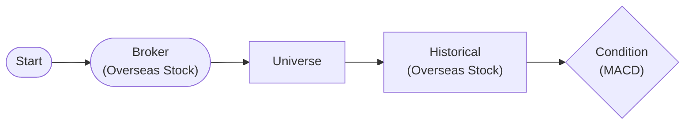

# MACD Golden Cross + Chaining

Detect MACD golden cross with plugin and test method chaining

## Workflow Structure

## Node List

| ID | Type | Description |
|----|------|------|
| start | StartNode | Workflow start |
| broker | OverseasStockBrokerNode | Overseas stock broker connection |
| universe | MarketUniverseNode | Market universe definition |
| historical | OverseasStockHistoricalDataNode | Overseas stock historical data query |
| macd_condition | ConditionNode | Condition check (plugin-based) |

## Key Settings

- **macd_condition**: Plugin `MACD`
- **macd_condition**: fast_period=12, slow_period=26, signal_period=9, signal_type=golden_cross

## Required Credentials

| ID | Type | Description |
|----|------|------|
| broker_cred | broker_ls_overseas_stock | LS Securities Overseas Stock API |

## Data Flow

1. **start** (StartNode) --> **broker** (OverseasStockBrokerNode)
1. **broker** (OverseasStockBrokerNode) --> **universe** (MarketUniverseNode)
1. **universe** (MarketUniverseNode) --> **historical** (OverseasStockHistoricalDataNode)
1. **historical** (OverseasStockHistoricalDataNode) --> **macd_condition** (ConditionNode)
