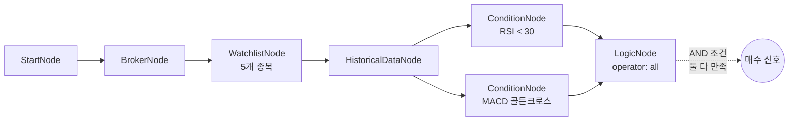

# 13-logic-complex: 복합 조건 (RSI + MACD)

## 목적
LogicNode로 여러 조건을 AND/OR 조합하여 강력한 매수 신호를 찾습니다.
- RSI 과매도 (RSI < 30) **AND**
- MACD 골든크로스

## 워크플로우 구조



## 노드 설명

### WatchlistNode
- **symbols**: 5개 종목 (AAPL, TSLA, NVDA, MSFT, JPM)

### ConditionNode (RSI)
- **plugin**: `RSI`
- **threshold**: 30, **direction**: `below`
- 과매도 구간 감지

### ConditionNode (MACD)
- **plugin**: `MACD`
- **signal_type**: `golden_cross`
- 상승 전환 신호

### LogicNode
- **operator**: `all` (AND)
- **conditions**: RSI + MACD 결과 조합
- 두 조건 모두 만족하는 종목만 통과

## 바인딩 테스트 포인트

### LogicNode 입력
```json
{
  "conditions": [
    {
      "is_condition_met": "{{ nodes.rsi_condition.result.passed }}",
      "passed_symbols": "{{ nodes.rsi_condition.result }}"
    },
    {
      "is_condition_met": "{{ nodes.macd_condition.result.passed }}",
      "passed_symbols": "{{ nodes.macd_condition.result }}"
    }
  ]
}
```

### LogicNode 출력
| 표현식 | 예상 값 | 설명 |
|--------|---------|------|
| `{{ nodes.logic.result.passed }}` | `true/false` | 복합 조건 충족 여부 |
| `{{ nodes.logic.passed_symbols }}` | `[{...}, ...]` | 조건 통과 종목 |
| `{{ nodes.logic.passed_symbols.count() }}` | `1` | 통과 종목 수 |

## LogicNode 연산자 종류

| operator | 설명 | 사용 예시 |
|----------|------|----------|
| `all` | AND (모두 충족) | RSI + MACD 동시 신호 |
| `any` | OR (하나라도 충족) | 여러 매수 조건 중 하나 |
| `not` | NOT (첫 조건 부정) | 과매수가 아닌 종목 |
| `xor` | XOR (배타적) | 둘 중 하나만 |
| `at_least` | N개 이상 충족 | 5개 중 3개 이상 |
| `weighted` | 가중치 합 threshold | 중요도 기반 |

## 실행 결과 예시

```json
{
  "nodes": {
    "rsi_condition": {
      "result": {
        "passed": true,
        "value": 28.5,
        "symbol": "TSLA"
      }
    },
    "macd_condition": {
      "result": {
        "passed": true,
        "macd": 1.23,
        "signal": 0.89,
        "histogram": 0.34,
        "symbol": "TSLA"
      }
    },
    "logic": {
      "result": {
        "passed": true,
        "operator": "all",
        "conditions_met": 2,
        "conditions_total": 2
      },
      "passed_symbols": [
        {
          "symbol": "TSLA",
          "exchange": "NASDAQ",
          "rsi": 28.5,
          "macd_histogram": 0.34
        }
      ]
    }
  }
}
```

## 활용 예시

### 강력 매수 신호 (AND)
```
RSI 과매도 + MACD 골든크로스 + 거래량 급증
→ 3개 조건 모두 만족 = 매수
```

### 리스크 분산 (at_least)
```
RSI, MACD, 볼린저밴드, 이평선 중 3개 이상 매수 신호
→ operator: "at_least", threshold: 3
```

### 가중치 기반 (weighted)
```
RSI(0.3) + MACD(0.4) + 거래량(0.3) >= 0.6
→ operator: "weighted", threshold: 0.6
```

## 관련 노드
- `LogicNode`: condition.py
- `ConditionNode`: condition.py
