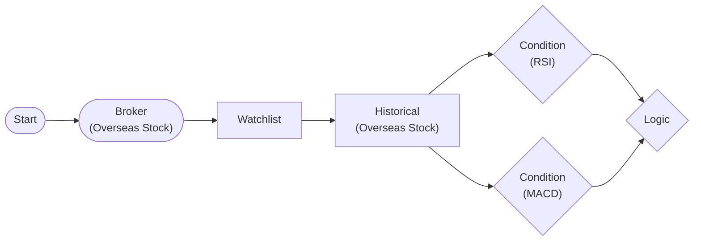

# Complex Condition (RSI + MACD)

Complex condition with LogicNode: RSI oversold AND MACD golden cross

## Workflow Structure



## Node List

| ID | Type | Description |
|----|------|------|
| start | StartNode | Workflow start |
| broker | OverseasStockBrokerNode | Overseas stock broker connection |
| watchlist | WatchlistNode | Define watchlist symbols |
| historical | OverseasStockHistoricalDataNode | Overseas stock historical data query |
| rsi_condition | ConditionNode | Condition check (plugin-based) |
| macd_condition | ConditionNode | Condition check (plugin-based) |
| logic | LogicNode | Logic combination (AND/OR/NOT) |

## Key Settings

- **watchlist**: AAPL, TSLA, NVDA, MSFT, JPM
- **rsi_condition**: Plugin `RSI`
- **rsi_condition**: period=14, threshold=30, direction=below
- **macd_condition**: Plugin `MACD`
- **macd_condition**: fast_period=12, slow_period=26, signal_period=9, signal_type=golden_cross
- **logic**: `` all ``

## Required Credentials

| ID | Type | Description |
|----|------|------|
| broker_cred | broker_ls_overseas_stock | LS Securities Overseas Stock API |

## Data Flow

1. **start** (StartNode) --> **broker** (OverseasStockBrokerNode)
1. **broker** (OverseasStockBrokerNode) --> **watchlist** (WatchlistNode)
1. **watchlist** (WatchlistNode) --> **historical** (OverseasStockHistoricalDataNode)
1. **historical** (OverseasStockHistoricalDataNode) --> **rsi_condition** (ConditionNode)
1. **historical** (OverseasStockHistoricalDataNode) --> **macd_condition** (ConditionNode)
1. **rsi_condition** (ConditionNode) --> **logic** (LogicNode)
1. **macd_condition** (ConditionNode) --> **logic** (LogicNode)

## How to Run

```python
from programgarden import ProgramGarden

pg = ProgramGarden()
job = await pg.run_async(workflow)
```
