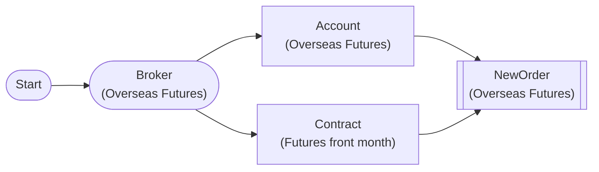

# Overseas Futures New Order

Test overseas futures new order with OverseasFuturesNewOrderNode

The contract symbol is never hardcoded: FuturesContractNode resolves the underlying product
(HMCE = Mini H-Shares) to the **currently listed front month** at execution time, so the workflow
keeps working after every expiry.
(월물 종목코드를 적어두지 않는다 — 실행 시점에 현재 상장된 근월물로 자동 해소되므로 만기가 지나도 계속 동작한다.)

## Workflow Structure

## Node List

| ID | Type | Description |
|----|------|------|
| start | StartNode | Workflow start |
| broker | OverseasFuturesBrokerNode | Overseas futures broker connection (paper trading, HKEX) |
| contract | FuturesContractNode | Resolves base product HMCE (Mini H-Shares) to the currently listed front-month contract (o3101) |
| account | OverseasFuturesAccountNode | Overseas futures account balance/position query |
| new_order | OverseasFuturesNewOrderNode | Overseas futures new order |

## Key Settings

- **broker**: Paper trading mode
- **contract**: `base_products=["HMCE"]`, `contract_selection="front"`, `futures_exchange="HKEX"` — requires the futures broker upstream (the o3101 master query needs an LS session)
- **new_order**: side=`buy`, order_type=`limit`, symbol/exchange bound to `{{ nodes.contract.symbols[0].symbol }}` / `{{ nodes.contract.symbols[0].exchange }}`

## Required Credentials

| ID | Type | Description |
|----|------|------|
| futures_cred | broker_ls_overseas_futures | LS Securities Overseas Futures API (paper trading, HKEX only) |

## Data Flow

1. **start** (StartNode) --> **broker** (OverseasFuturesBrokerNode)
1. **broker** (OverseasFuturesBrokerNode) --> **contract** (FuturesContractNode)
1. **broker** (OverseasFuturesBrokerNode) --> **account** (OverseasFuturesAccountNode)
1. **account** (OverseasFuturesAccountNode) --> **new_order** (OverseasFuturesNewOrderNode)
1. **contract** (FuturesContractNode) --> **new_order** (OverseasFuturesNewOrderNode)
