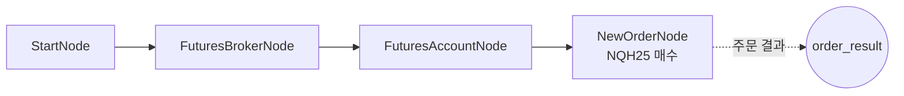

# 14-order-futures-new: 해외선물 신규 주문

## 목적
OverseasFuturesNewOrderNode로 해외선물 신규 주문을 테스트합니다.

> **주의**: 장외 시간(미국 동부시간 18:00~17:00 외)에는 주문 제출은 되지만 체결되지 않습니다.

## 워크플로우 구조



## 노드 설명

### OverseasFuturesBrokerNode
- **역할**: 해외선물 브로커 연결
- **credential_id**: LS증권 API 키

### OverseasFuturesAccountNode
- **역할**: 해외선물 계좌 정보 조회
- **출력**: `balance`, `positions`, `open_orders`

### OverseasFuturesNewOrderNode
- **역할**: 해외선물 신규 주문 실행
- **side**: `buy` (매수)
- **order_type**: `limit` (지정가)
- **order**: 주문 정보 객체
  - `symbol`: `HMCEG26` (Mini H-Shares 2026년 2월물)
  - `exchange`: `HKEX` (홍콩거래소)
  - `quantity`: `1` (1계약)
  - `price`: `9500.0` (지정가)

## 주문 파라미터

### side (주문 방향)
| 값 | 설명 |
|----|------|
| `buy` | 매수 (롱 포지션) |
| `sell` | 매도 (숏 포지션) |

### order_type (주문 유형)
| 값 | 설명 |
|----|------|
| `market` | 시장가 - 즉시 체결 |
| `limit` | 지정가 - 지정 가격에 체결 |

### 해외선물 거래소
| exchange | 설명 | 대표 상품 |
|----------|------|----------|
| `CME` | 시카고상업거래소 | NQ(나스닥), ES(S&P500), CL(원유) |
| `EUREX` | 유럽선물거래소 | DAX, EURO STOXX |
| `SGX` | 싱가포르거래소 | MSCI 아시아 |
| `HKEX` | 홍콩거래소 | 항셍지수 |

## 바인딩 테스트 포인트

| 표현식 | 예상 값 | 설명 |
|--------|---------|------|
| `{{ nodes.account.balance.available }}` | `10000.0` | 주문가능금액 |
| `{{ nodes.new_order.order_result.order_id }}` | `"531"` | 주문번호 |
| `{{ nodes.new_order.order_result.status }}` | `"submitted"` | 주문 상태 |

## 실행 결과 예시

### 장중 (체결 가능)
```json
{
  "nodes": {
    "new_order": {
      "order_result": {
        "order_id": "ORD20260129001",
        "symbol": "NQH25",
        "exchange": "CME",
        "side": "buy",
        "quantity": 1,
        "price": 20000.0,
        "status": "filled",
        "filled_quantity": 1,
        "filled_price": 20000.0
      }
    }
  }
}
```

### 장외 (체결 불가)
```json
{
  "nodes": {
    "new_order": {
      "order_result": {
        "order_id": "ORD20260129001",
        "status": "submitted",
        "message": "Order submitted but market is closed"
      }
    }
  }
}
```

## 거래 시간 참고

| 거래소 | 거래 시간 (한국시간) |
|--------|---------------------|
| CME | 07:00 ~ 06:00 (익일) |
| EUREX | 16:00 ~ 05:00 (익일) |
| SGX | 08:45 ~ 05:15 (익일) |

## 관련 노드
- `OverseasFuturesNewOrderNode`: order.py
- `OverseasFuturesBrokerNode`: infra.py
- `OverseasFuturesAccountNode`: account_futures.py
