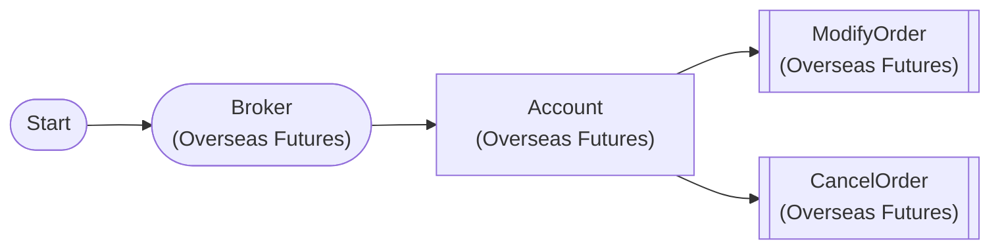

# Overseas Futures Order Modify/Cancel

Test OverseasFuturesModifyOrderNode and CancelOrderNode

## Workflow Structure



## Node List

| ID | Type | Description |
|----|------|------|
| start | StartNode | Workflow start |
| broker | OverseasFuturesBrokerNode | Overseas futures broker connection (paper trading, HKEX) |
| account | OverseasFuturesAccountNode | Overseas futures account balance/position query |
| modify_order | OverseasFuturesModifyOrderNode | Overseas futures order modify |
| cancel_order | OverseasFuturesCancelOrderNode | Overseas futures order cancel |

## Key Settings

- **broker**: Paper trading mode

## Required Credentials

| ID | Type | Description |
|----|------|------|
| futures_cred | broker_ls_overseas_futures | LS Securities Overseas Futures API (paper trading, HKEX only) |

## Data Flow

1. **start** (StartNode) --> **broker** (OverseasFuturesBrokerNode)
1. **broker** (OverseasFuturesBrokerNode) --> **account** (OverseasFuturesAccountNode)
1. **account** (OverseasFuturesAccountNode) --> **modify_order** (OverseasFuturesModifyOrderNode)
1. **account** (OverseasFuturesAccountNode) --> **cancel_order** (OverseasFuturesCancelOrderNode)

## How to Run

```python
from programgarden import ProgramGarden

pg = ProgramGarden()
job = await pg.run_async(workflow)
```
