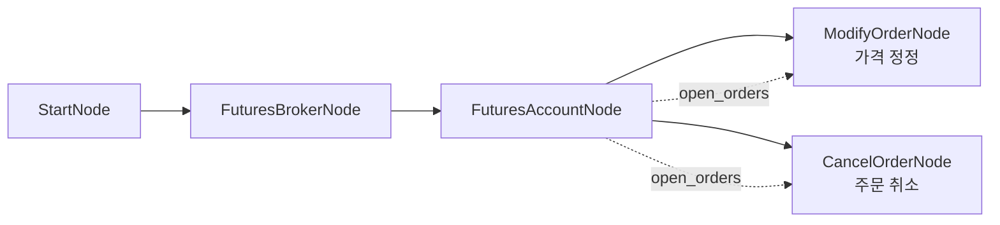
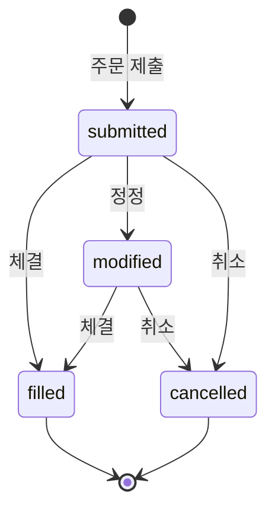

# 15-order-futures-modify-cancel: 해외선물 주문 정정/취소

## 목적
미체결 주문을 정정(ModifyOrderNode)하거나 취소(CancelOrderNode)합니다.

> **주의**: 미체결 주문이 없으면 정정/취소가 실패합니다. 먼저 14번 워크플로우로 주문을 제출하세요.

## 워크플로우 구조



## 노드 설명

### OverseasFuturesAccountNode
- **역할**: 미체결 주문 목록 조회
- **출력**: `open_orders` - 미체결 주문 리스트

### OverseasFuturesModifyOrderNode
- **역할**: 미체결 주문의 가격/수량 정정
- **original_order_id**: `{{ nodes.account.open_orders.first().order_id }}`
- **new_price**: `20500.0` (정정할 가격)

### OverseasFuturesCancelOrderNode
- **역할**: 미체결 주문 취소
- **original_order_id**: `{{ nodes.account.open_orders.last().order_id }}`

## 바인딩 테스트 포인트

### 미체결 주문 접근
| 표현식 | 예상 값 | 설명 |
|--------|---------|------|
| `{{ nodes.account.open_orders }}` | `[{order_id, symbol, ...}, ...]` | 미체결 주문 리스트 |
| `{{ nodes.account.open_orders.first() }}` | `{order_id: "ORD001", ...}` | 첫 번째 주문 |
| `{{ nodes.account.open_orders.last() }}` | `{order_id: "ORD002", ...}` | 마지막 주문 |
| `{{ nodes.account.open_orders.count() }}` | `2` | 미체결 주문 수 |

### 정정/취소 결과
| 표현식 | 예상 값 | 설명 |
|--------|---------|------|
| `{{ nodes.modify_order.modify_result.status }}` | `"modified"` | 정정 상태 |
| `{{ nodes.cancel_order.cancel_result.status }}` | `"cancelled"` | 취소 상태 |

## 실행 결과 예시

### 정정 성공
```json
{
  "nodes": {
    "modify_order": {
      "modify_result": {
        "original_order_id": "ORD20260129001",
        "modified_order_id": "ORD20260129002",
        "status": "modified",
        "new_price": 20500.0
      }
    }
  }
}
```

### 취소 성공
```json
{
  "nodes": {
    "cancel_order": {
      "cancel_result": {
        "original_order_id": "ORD20260129003",
        "status": "cancelled",
        "message": "Order cancelled successfully"
      }
    }
  }
}
```

### 실패 케이스 (미체결 주문 없음)
```json
{
  "nodes": {
    "modify_order": {
      "modify_result": {
        "status": "failed",
        "error": "No open orders found"
      }
    }
  }
}
```

## 정정 vs 취소

| 구분 | ModifyOrderNode | CancelOrderNode |
|------|-----------------|-----------------|
| 용도 | 가격/수량 변경 | 주문 철회 |
| 필수 입력 | original_order_id, new_price 또는 new_quantity | original_order_id |
| 결과 | 새 주문번호 발급 | 원주문 취소 |

## 주문 상태 흐름



## 관련 노드
- `OverseasFuturesModifyOrderNode`: order.py
- `OverseasFuturesCancelOrderNode`: order.py
- `OverseasFuturesAccountNode`: account_futures.py
