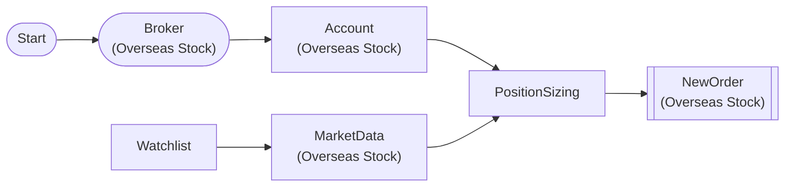

# Position Sizing

Calculate order quantity based on account balance with PositionSizingNode

## Workflow Structure

## Node List

| ID | Type | Description |
|----|------|------|
| start | StartNode | Workflow start |
| broker | OverseasStockBrokerNode | Overseas stock broker connection |
| account | OverseasStockAccountNode | Overseas stock account balance/position query |
| watchlist | WatchlistNode | Define watchlist symbols |
| market | OverseasStockMarketDataNode | Overseas stock market data query |
| sizing | PositionSizingNode | Position sizing calculation |
| new_order | OverseasStockNewOrderNode | Overseas stock new order |

## Key Settings

- **watchlist**: AAPL
- **new_order**: side=`buy`

## Required Credentials

| ID | Type | Description |
|----|------|------|
| broker_cred | broker_ls_overseas_stock | LS Securities Overseas Stock API |

## Data Flow

1. **start** (StartNode) --> **broker** (OverseasStockBrokerNode)
1. **broker** (OverseasStockBrokerNode) --> **account** (OverseasStockAccountNode)
1. **watchlist** (WatchlistNode) --> **market** (OverseasStockMarketDataNode)
1. **account** (OverseasStockAccountNode) --> **sizing** (PositionSizingNode)
1. **market** (OverseasStockMarketDataNode) --> **sizing** (PositionSizingNode)
1. **sizing** (PositionSizingNode) --> **new_order** (OverseasStockNewOrderNode)
