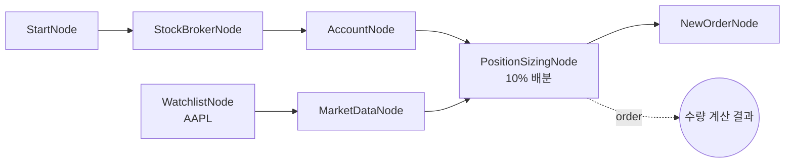

# 16-risk-position-sizing: 포지션 사이징

## 목적
PositionSizingNode로 계좌 잔고 기반의 자동 주문 수량 계산을 테스트합니다.

## 워크플로우 구조



## 노드 설명

### WatchlistNode
- **역할**: 매수 대상 종목 목록 제공
- **symbols**: `[{symbol: "AAPL", exchange: "NASDAQ"}]`

### OverseasStockMarketDataNode
- **역할**: 종목 현재가 조회
- **symbol**: `{{ item }}` (WatchlistNode에서 Auto-Iterate)
- **출력**: `value.price` (현재가)

### PositionSizingNode
- **역할**: 잔고 기반 주문 수량 계산
- **symbol**: `{{ item }}` (현재 종목)
- **balance**: `{{ nodes.account.balance.available }}` (주문가능금액)
- **market_data**: `{{ nodes.market.value }}` (시세 데이터)
- **method**: `fixed_percent` (고정 비율)
- **max_percent**: `10.0` (잔고의 10%)
- **출력**: `order` (symbol, exchange, quantity, price 포함)

### OverseasStockNewOrderNode
- **역할**: 계산된 수량으로 주문 실행
- **order**: `{{ nodes.sizing.order }}` (PositionSizingNode 결과)

## 포지션 사이징 방법

| method | 설명 | 사용 필드 |
|--------|------|-----------|
| `fixed_percent` | 잔고의 N% 투자 | `max_percent` |
| `fixed_amount` | 고정 금액 투자 | `fixed_amount` |
| `fixed_quantity` | 고정 수량 | `fixed_quantity` |
| `kelly` | 켈리 공식 기반 | `kelly_fraction` |
| `atr_based` | ATR 리스크 기반 | `atr_risk_percent` |

### 계산 예시 (fixed_percent)

```
잔고: $100,000
max_percent: 10%
주문가능금액: $10,000
현재가: $150.00
계산 수량: floor($10,000 / $150) = 66주
```

## 바인딩 테스트 포인트

| 표현식 | 예상 값 | 설명 |
|--------|---------|------|
| `{{ nodes.account.balance.available }}` | `100000.0` | 주문가능금액 |
| `{{ nodes.market.value.price }}` | `150.0` | 현재가 |
| `{{ nodes.sizing.order.quantity }}` | `66` | 계산된 수량 |
| `{{ nodes.sizing.order.price }}` | `150.0` | 주문 가격 |

## 실행 결과 예시

```json
{
  "nodes": {
    "account": {
      "balance": {
        "total": 150000.0,
        "available": 100000.0,
        "currency": "USD"
      }
    },
    "market": {
      "value": {
        "symbol": "AAPL",
        "exchange": "NASDAQ",
        "price": 150.0,
        "volume": 50000000
      }
    },
    "sizing": {
      "order": {
        "symbol": "AAPL",
        "exchange": "NASDAQ",
        "quantity": 66,
        "price": 150.0
      }
    },
    "new_order": {
      "order_result": {
        "order_id": "ORD20260129001",
        "status": "submitted"
      }
    }
  }
}
```

## 주요 특징

### Auto-Iterate 통합
WatchlistNode에 여러 종목이 있으면 각 종목별로:
1. MarketDataNode로 시세 조회
2. PositionSizingNode로 수량 계산
3. NewOrderNode로 주문 실행

### 리스크 관리
- 단일 종목에 전체 자산 투입 방지
- `max_percent`로 종목당 최대 배분 제한
- 시장가 변동에 따른 동적 수량 계산

## 관련 노드
- `PositionSizingNode`: risk.py
- `OverseasStockMarketDataNode`: market_stock.py
- `OverseasStockNewOrderNode`: order.py
