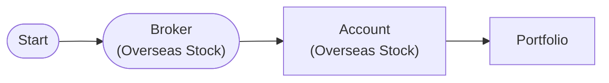

# Portfolio Management

Multi-strategy capital allocation and rebalancing with PortfolioNode

## Workflow Structure



## Node List

| ID | Type | Description |
|----|------|------|
| start | StartNode | Workflow start |
| broker | OverseasStockBrokerNode | Overseas stock broker connection |
| account | OverseasStockAccountNode | Overseas stock account balance/position query |
| portfolio | PortfolioNode | Portfolio risk management |

## Required Credentials

| ID | Type | Description |
|----|------|------|
| broker_cred | broker_ls_overseas_stock | LS Securities Overseas Stock API |

## Data Flow

1. **start** (StartNode) --> **broker** (OverseasStockBrokerNode)
1. **broker** (OverseasStockBrokerNode) --> **account** (OverseasStockAccountNode)
1. **account** (OverseasStockAccountNode) --> **portfolio** (PortfolioNode)

## How to Run

```python
from programgarden import ProgramGarden

pg = ProgramGarden()
job = await pg.run_async(workflow)
```
