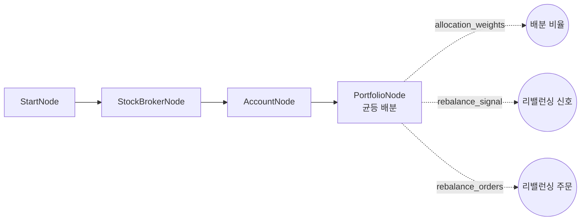
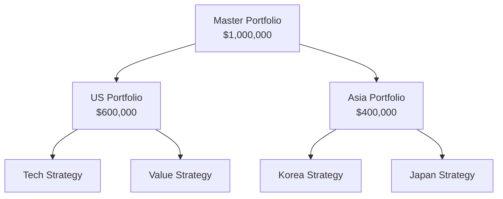

# 17-risk-portfolio: 포트폴리오 관리

## 목적
PortfolioNode로 멀티 전략 자본 배분 및 리밸런싱을 테스트합니다.

## 워크플로우 구조



## 노드 설명

### PortfolioNode
- **역할**: 멀티 전략 자본 배분 및 리밸런싱 관리
- **total_capital**: `{{ nodes.account.balance.total }}` (계좌 총자산)
- **allocation_method**: `equal` (균등 배분)
- **rebalance_rule**: `drift` (드리프트 기반 리밸런싱)
- **drift_threshold**: `5.0` (목표 대비 ±5% 이탈 시 리밸런싱)
- **capital_sharing**: `true` (전략 간 유휴 자본 공유)
- **reserve_percent**: `5.0` (5% 현금 예비금)

## 자본 배분 방법

| method | 설명 | 사용 시나리오 |
|--------|------|--------------|
| `equal` | 전략별 균등 배분 | 전략 간 차별 없이 배분 |
| `custom` | 사용자 지정 비율 | 특정 전략에 가중치 부여 |
| `risk_parity` | 변동성 역비례 배분 | 리스크 균형 추구 |
| `momentum` | 최근 수익 기반 배분 | 성과 좋은 전략에 집중 |

### custom 배분 예시

```json
{
  "allocation_method": "custom",
  "custom_allocations": {
    "momentum_strategy": 0.4,
    "mean_reversion": 0.3,
    "trend_following": 0.3
  }
}
```

## 리밸런싱 규칙

| rule | 설명 | 사용 필드 |
|------|------|-----------|
| `none` | 리밸런싱 안 함 | - |
| `periodic` | 주기적 리밸런싱 | `rebalance_frequency` |
| `drift` | 드리프트 기반 | `drift_threshold` |
| `both` | 주기 + 드리프트 | 둘 다 |

### 리밸런싱 빈도

```json
{
  "rebalance_rule": "periodic",
  "rebalance_frequency": "monthly"
}
```

| frequency | 설명 |
|-----------|------|
| `daily` | 매일 |
| `weekly` | 매주 |
| `monthly` | 매월 |
| `quarterly` | 분기별 |

## 바인딩 테스트 포인트

| 표현식 | 예상 값 | 설명 |
|--------|---------|------|
| `{{ nodes.account.balance.total }}` | `100000.0` | 총자산 |
| `{{ nodes.portfolio.allocation_weights }}` | `{...}` | 전략별 배분 비율 |
| `{{ nodes.portfolio.rebalance_signal }}` | `true/false` | 리밸런싱 필요 여부 |
| `{{ nodes.portfolio.rebalance_orders }}` | `[...]` | 리밸런싱 주문 목록 |

## 실행 결과 예시

```json
{
  "nodes": {
    "account": {
      "balance": {
        "total": 100000.0,
        "available": 95000.0,
        "currency": "USD"
      },
      "positions": [
        {"symbol": "AAPL", "exchange": "NASDAQ", "quantity": 50, "pnl": 500.0},
        {"symbol": "MSFT", "exchange": "NASDAQ", "quantity": 30, "pnl": -200.0}
      ]
    },
    "portfolio": {
      "allocation_weights": {
        "strategy_1": 0.5,
        "strategy_2": 0.5
      },
      "rebalance_signal": true,
      "rebalance_orders": [
        {"symbol": "AAPL", "exchange": "NASDAQ", "side": "sell", "quantity": 5},
        {"symbol": "MSFT", "exchange": "NASDAQ", "side": "buy", "quantity": 3}
      ],
      "combined_metrics": {
        "total_return": 0.03,
        "sharpe_ratio": 1.2,
        "max_drawdown": -0.05
      }
    }
  }
}
```

## 포트폴리오 계층 구조

PortfolioNode는 계층적으로 연결 가능합니다:



### 계층 배분 예시

```json
{
  "id": "master_portfolio",
  "type": "PortfolioNode",
  "total_capital": 1000000,
  "allocation_method": "custom",
  "custom_allocations": {
    "us_portfolio": 0.6,
    "asia_portfolio": 0.4
  }
}
```

## 주요 출력 포트

| 포트 | 타입 | 설명 |
|------|------|------|
| `combined_equity` | `portfolio_result` | 통합 자산 곡선 |
| `combined_metrics` | `performance_summary` | 통합 성과 지표 |
| `allocation_weights` | `dict` | 전략별 배분 비율 |
| `rebalance_orders` | `order_list` | 리밸런싱 주문 목록 |
| `rebalance_signal` | `bool` | 리밸런싱 신호 |
| `allocated_capital` | `dict` | 하위 전략에 배분된 자본 |

## 관련 노드
- `PortfolioNode`: portfolio.py
- `OverseasStockAccountNode`: account_stock.py
- `BacktestEngineNode`: analysis.py (백테스트 시 연결)
