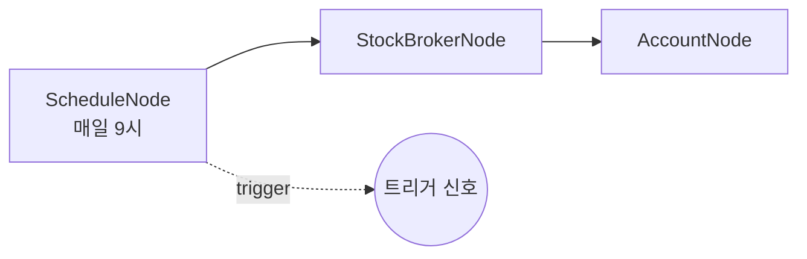

# 18-trigger-schedule: 스케줄 트리거

## 목적
ScheduleNode로 Cron 표현식 기반의 주기적 워크플로우 실행을 테스트합니다.

## 워크플로우 구조



## 노드 설명

### ScheduleNode
- **역할**: Cron 표현식 기반 주기적 트리거
- **cron**: `0 9 * * 1-5` (평일 오전 9시)
- **timezone**: `America/New_York` (뉴욕 시간대)
- **enabled**: `true` (스케줄 활성화)
- **출력**: `trigger` (트리거 신호)

## Cron 표현식

### 형식
```
분 시 일 월 요일
*  *  *  *  *
```

### 필드 설명
| 필드 | 범위 | 특수 문자 |
|------|------|----------|
| 분 | 0-59 | `*` `/` `,` `-` |
| 시 | 0-23 | `*` `/` `,` `-` |
| 일 | 1-31 | `*` `/` `,` `-` |
| 월 | 1-12 | `*` `/` `,` `-` |
| 요일 | 0-6 (일=0) | `*` `/` `,` `-` |

### 예시

| Cron | 설명 |
|------|------|
| `*/5 * * * *` | 매 5분마다 |
| `0 9 * * 1-5` | 평일 9시 |
| `0 9,16 * * *` | 매일 9시, 16시 |
| `0 */2 * * *` | 2시간마다 |
| `30 8 * * 1` | 매주 월요일 8시 30분 |
| `0 0 1 * *` | 매월 1일 자정 |

## 타임존

### 주요 타임존
| 코드 | 시차 (UTC) | 용도 |
|------|----------|------|
| `America/New_York` | -5/-4 | 미국 동부 (NYSE) |
| `America/Chicago` | -6/-5 | 미국 중부 (CME) |
| `Asia/Seoul` | +9 | 한국 |
| `Europe/London` | +0/+1 | 영국 |
| `Asia/Tokyo` | +9 | 일본 |

### 시장별 개장 시간 (현지 기준)

| 시장 | 개장 | 폐장 | Cron 예시 |
|------|------|------|----------|
| NYSE | 09:30 | 16:00 | `30 9 * * 1-5` |
| CME (선물) | 18:00 | 17:00(익일) | `0 18 * * 0-4` |
| KOSPI | 09:00 | 15:30 | `0 9 * * 1-5` |

## 바인딩 테스트 포인트

| 표현식 | 예상 값 | 설명 |
|--------|---------|------|
| `{{ nodes.schedule.trigger }}` | `true` | 트리거 발생 시 |
| `{{ nodes.account.balance }}` | `{...}` | 계좌 잔고 |

## 실행 결과 예시

### 트리거 발생 시
```json
{
  "nodes": {
    "schedule": {
      "trigger": true,
      "triggered_at": "2026-01-29T09:00:00-05:00"
    },
    "account": {
      "balance": {
        "total": 100000.0,
        "available": 95000.0
      }
    }
  }
}
```

## 활용 패턴

### 정시 계좌 조회
```json
{
  "cron": "0 9 * * 1-5",
  "description": "평일 9시 계좌 잔고 조회"
}
```

### 분 단위 시세 체크
```json
{
  "cron": "*/5 * * * 1-5",
  "description": "평일 5분마다 시세 체크"
}
```

### 월초 리밸런싱
```json
{
  "cron": "0 10 1 * *",
  "description": "매월 1일 10시 리밸런싱"
}
```

## 관련 노드
- `ScheduleNode`: trigger.py
- `TradingHoursFilterNode`: trigger.py (시간 필터링)
