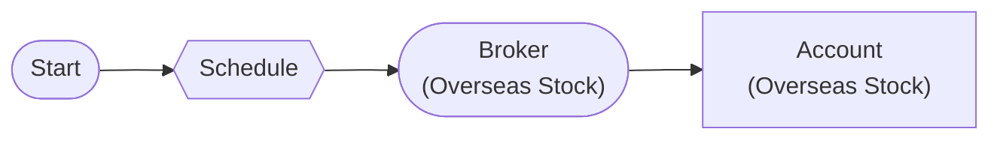

# Schedule Trigger

Periodic workflow execution with ScheduleNode

## Workflow Structure

## Node List

| ID | Type | Description |
|----|------|------|
| start | StartNode | Workflow start |
| schedule | ScheduleNode | Schedule trigger (cron) |
| broker | OverseasStockBrokerNode | Overseas stock broker connection |
| account | OverseasStockAccountNode | Overseas stock account balance/position query |

## Key Settings

- **schedule**: cron `0 9 * * 1-5` (timezone: America/New_York)

## Required Credentials

| ID | Type | Description |
|----|------|------|
| broker_cred | broker_ls_overseas_stock | LS Securities Overseas Stock API |

## Data Flow

1. **start** (StartNode) --> **schedule** (ScheduleNode)
1. **schedule** (ScheduleNode) --> **broker** (OverseasStockBrokerNode)
1. **broker** (OverseasStockBrokerNode) --> **account** (OverseasStockAccountNode)
