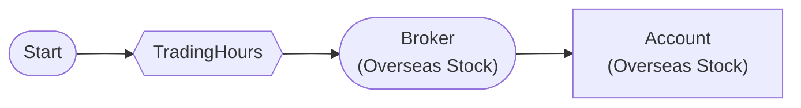

# Trading Hours Filter

Execute only during trading hours with TradingHoursFilterNode

## Workflow Structure

## Node List

| ID | Type | Description |
|----|------|------|
| start | StartNode | Workflow start |
| hours_filter | TradingHoursFilterNode | Trading hours filter |
| broker | OverseasStockBrokerNode | Overseas stock broker connection |
| account | OverseasStockAccountNode | Overseas stock account balance/position query |

## Key Settings

- **hours_filter**: 09:30~16:00 (America/New_York)

## Required Credentials

| ID | Type | Description |
|----|------|------|
| broker_cred | broker_ls_overseas_stock | LS Securities Overseas Stock API |

## Data Flow

1. **start** (StartNode) --> **hours_filter** (TradingHoursFilterNode)
1. **hours_filter** (TradingHoursFilterNode) --> **broker** (OverseasStockBrokerNode)
1. **broker** (OverseasStockBrokerNode) --> **account** (OverseasStockAccountNode)
