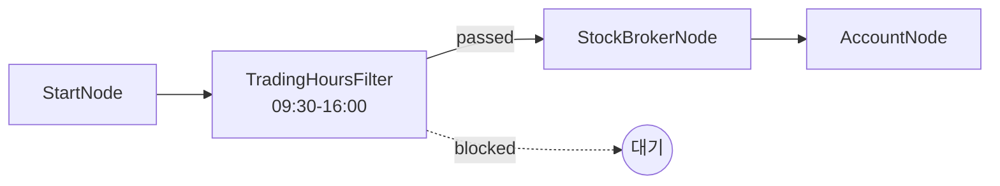
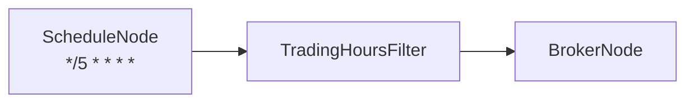

# 19-trigger-trading-hours: 거래시간 필터

## 목적
TradingHoursFilterNode로 거래시간 내에만 워크플로우가 진행되도록 필터링합니다.

## 워크플로우 구조



## 노드 설명

### TradingHoursFilterNode
- **역할**: 지정된 거래시간 내에만 신호 통과
- **start**: `09:30` (개장 시간)
- **end**: `16:00` (폐장 시간)
- **timezone**: `America/New_York`
- **days**: `["mon", "tue", "wed", "thu", "fri"]` (평일)
- **출력**:
  - `passed`: 거래시간 내 (통과)
  - `blocked`: 거래시간 외 (차단)

## 거래시간 설정

### 시간 형식
- 24시간 형식: `HH:MM`
- 예: `09:30`, `16:00`, `00:00`

### 요일 설정
| 값 | 요일 |
|----|------|
| `mon` | 월요일 |
| `tue` | 화요일 |
| `wed` | 수요일 |
| `thu` | 목요일 |
| `fri` | 금요일 |
| `sat` | 토요일 |
| `sun` | 일요일 |

## 시장별 거래시간 예시

### 미국 주식 (NYSE)
```json
{
  "start": "09:30",
  "end": "16:00",
  "timezone": "America/New_York",
  "days": ["mon", "tue", "wed", "thu", "fri"]
}
```

### 미국 선물 (CME) - 야간 포함
```json
{
  "start": "18:00",
  "end": "17:00",
  "timezone": "America/Chicago",
  "days": ["sun", "mon", "tue", "wed", "thu"]
}
```

### 한국 주식 (KOSPI)
```json
{
  "start": "09:00",
  "end": "15:30",
  "timezone": "Asia/Seoul",
  "days": ["mon", "tue", "wed", "thu", "fri"]
}
```

## 동작 방식

### 거래시간 내
1. StartNode 실행
2. TradingHoursFilterNode 통과 (`passed` = true)
3. BrokerNode 연결
4. AccountNode 실행

### 거래시간 외
1. StartNode 실행
2. TradingHoursFilterNode에서 대기
3. 거래시간이 될 때까지 1분마다 체크
4. 거래시간 시작 시 워크플로우 진행

## 바인딩 테스트 포인트

| 표현식 | 예상 값 | 설명 |
|--------|---------|------|
| `{{ nodes.hours_filter.passed }}` | `true/false` | 통과 여부 |
| `{{ nodes.account.balance }}` | `{...}` | 계좌 잔고 |

## 실행 결과 예시

### 거래시간 내
```json
{
  "nodes": {
    "hours_filter": {
      "passed": true
    },
    "account": {
      "balance": {
        "total": 100000.0,
        "available": 95000.0
      }
    }
  }
}
```

### 거래시간 외 (대기 후 진행)
```json
{
  "nodes": {
    "hours_filter": {
      "passed": true,
      "waited_until": "2026-01-29T09:30:00-05:00"
    }
  }
}
```

## 활용 패턴

### ScheduleNode + TradingHoursFilterNode


5분마다 트리거되지만, 거래시간 외에는 대기합니다.

### 복수 시장 지원
```json
{
  "nodes": [
    {
      "id": "us_filter",
      "type": "TradingHoursFilterNode",
      "start": "09:30",
      "end": "16:00",
      "timezone": "America/New_York"
    },
    {
      "id": "kr_filter",
      "type": "TradingHoursFilterNode",
      "start": "09:00",
      "end": "15:30",
      "timezone": "Asia/Seoul"
    }
  ]
}
```

## 관련 노드
- `TradingHoursFilterNode`: trigger.py
- `ScheduleNode`: trigger.py (주기적 트리거)
