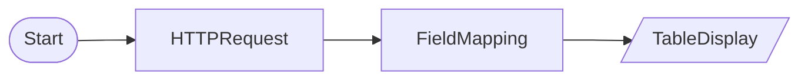

# HTTP Request

External API call with HTTPRequestNode and data transformation with FieldMappingNode. Test example using httpbin.org

## Workflow Structure

## Node List

| ID | Type | Description |
|----|------|------|
| start | StartNode | Workflow start |
| api_call | HTTPRequestNode | HTTP API request |
| mapper | FieldMappingNode | Field mapping/transformation |
| display | TableDisplayNode | Table display output |

## Key Settings

- **api_call**: `https://httpbin.org/json`

## Data Flow

1. **start** (StartNode) --> **api_call** (HTTPRequestNode)
1. **api_call** (HTTPRequestNode) --> **mapper** (FieldMappingNode)
1. **mapper** (FieldMappingNode) --> **display** (TableDisplayNode)
