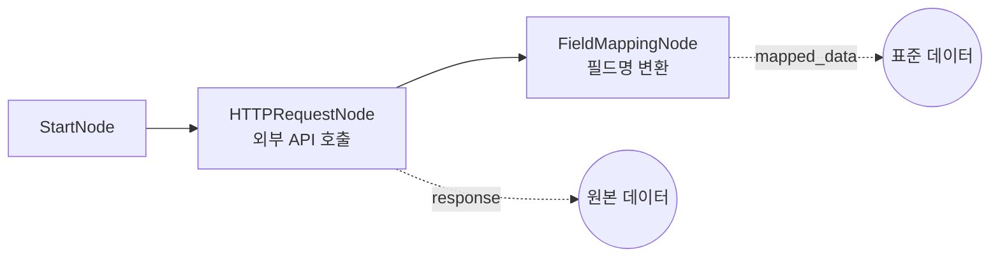

# 20-data-http: HTTP 요청

## 목적
HTTPRequestNode로 외부 REST API를 호출하고, FieldMappingNode로 응답 데이터를 표준 형식으로 변환합니다.

## 워크플로우 구조



## 노드 설명

### HTTPRequestNode
- **역할**: 외부 REST API 호출
- **method**: `GET`
- **url**: `https://api.example.com/v1/quotes`
- **query_params**: `{symbol: "AAPL", interval: "1d"}`
- **timeout_seconds**: `30` (30초 타임아웃)
- **retry_count**: `3` (실패 시 3회 재시도)
- **출력**:
  - `response`: API 응답 데이터
  - `status_code`: HTTP 상태 코드
  - `success`: 성공 여부 (2xx)
  - `error`: 에러 메시지

### FieldMappingNode
- **역할**: 필드명을 표준 형식으로 변환
- **data**: `{{ nodes.api_call.response.data }}` (API 응답)
- **mappings**: 필드명 매핑 규칙
- **preserve_unmapped**: `true` (매핑되지 않은 필드 유지)
- **출력**:
  - `mapped_data`: 변환된 데이터
  - `original_fields`: 원본 필드명 목록
  - `mapped_fields`: 매핑된 필드명 목록

## HTTP 메서드

| method | 용도 | body |
|--------|------|------|
| `GET` | 데이터 조회 | 없음 |
| `POST` | 데이터 생성 | 필요 |
| `PUT` | 데이터 전체 수정 | 필요 |
| `PATCH` | 데이터 부분 수정 | 필요 |
| `DELETE` | 데이터 삭제 | 선택 |

## 인증 설정

### Bearer Token
```json
{
  "credential_id": "api-token-cred"
}
```
credentials 섹션:
```json
{
  "credential_id": "api-token-cred",
  "type": "http_bearer",
  "data": {"token": "your-api-token"}
}
```

### API Key Header
```json
{
  "credential_id": "api-key-cred"
}
```
credentials 섹션:
```json
{
  "credential_id": "api-key-cred",
  "type": "http_header",
  "data": {"header_name": "X-API-Key", "header_value": "your-key"}
}
```

### Basic Auth
```json
{
  "credential_id": "basic-auth-cred"
}
```
credentials 섹션:
```json
{
  "credential_id": "basic-auth-cred",
  "type": "http_basic",
  "data": {"username": "user", "password": "pass"}
}
```

## 필드 매핑

### 매핑 규칙
```json
{
  "mappings": [
    {"from": "lastPrice", "to": "close"},
    {"from": "vol", "to": "volume"},
    {"from": "tradeDate", "to": "date"}
  ]
}
```

### 변환 예시

입력:
```json
[
  {"lastPrice": 150.0, "vol": 1000000, "tradeDate": "2026-01-29"}
]
```

출력:
```json
[
  {"close": 150.0, "volume": 1000000, "date": "2026-01-29"}
]
```

## 바인딩 테스트 포인트

| 표현식 | 예상 값 | 설명 |
|--------|---------|------|
| `{{ nodes.api_call.status_code }}` | `200` | HTTP 상태 코드 |
| `{{ nodes.api_call.success }}` | `true` | 성공 여부 |
| `{{ nodes.mapper.mapped_data }}` | `[...]` | 변환된 데이터 |
| `{{ nodes.mapper.original_fields }}` | `["lastPrice", "vol"]` | 원본 필드 |

## 실행 결과 예시

```json
{
  "nodes": {
    "api_call": {
      "response": {
        "data": [
          {"lastPrice": 150.0, "vol": 1000000, "tradeDate": "2026-01-29"}
        ]
      },
      "status_code": 200,
      "success": true,
      "error": null
    },
    "mapper": {
      "mapped_data": [
        {"close": 150.0, "volume": 1000000, "date": "2026-01-29"}
      ],
      "original_fields": ["lastPrice", "vol", "tradeDate"],
      "mapped_fields": ["close", "volume", "date"]
    }
  }
}
```

## 에러 처리

### 네트워크 오류
```json
{
  "response": null,
  "status_code": 0,
  "success": false,
  "error": "Network error: Connection timeout"
}
```

### HTTP 오류
```json
{
  "response": {"error": "Unauthorized"},
  "status_code": 401,
  "success": false,
  "error": null
}
```

## 관련 노드
- `HTTPRequestNode`: data.py
- `FieldMappingNode`: data.py
- `SQLiteNode`: data.py (로컬 데이터 저장)
