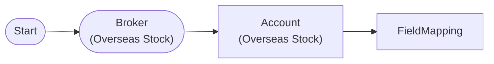

# Field Mapping + Auto-Iterate

Apply FieldMappingNode to AccountNode positions (item, index, total)

## Workflow Structure

## Node List

| ID | Type | Description |
|----|------|------|
| start | StartNode | Workflow start |
| broker | OverseasStockBrokerNode | Overseas stock broker connection |
| account | OverseasStockAccountNode | Overseas stock account balance/position query |
| mapper | FieldMappingNode | Field mapping/transformation |

## Required Credentials

| ID | Type | Description |
|----|------|------|
| broker_cred | broker_ls_overseas_stock | LS Securities Overseas Stock API |

## Data Flow

1. **start** (StartNode) --> **broker** (OverseasStockBrokerNode)
1. **broker** (OverseasStockBrokerNode) --> **account** (OverseasStockAccountNode)
1. **account** (OverseasStockAccountNode) --> **mapper** (FieldMappingNode)
