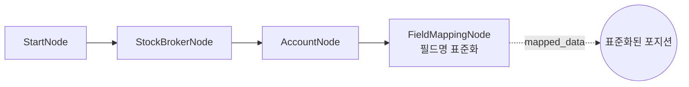
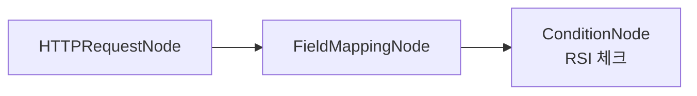

# 21-data-field-mapping: 필드 매핑 + Auto-Iterate

## 목적
AccountNode의 포지션 데이터에 FieldMappingNode를 적용하여 필드명을 표준화하고, Auto-Iterate 키워드(`item`, `index`, `total`)를 테스트합니다.

## 워크플로우 구조



## 노드 설명

### OverseasStockAccountNode
- **역할**: 해외주식 계좌 정보 조회
- **출력**: `positions` (포지션 목록)

### FieldMappingNode
- **역할**: API 응답 필드명을 표준 형식으로 변환
- **data**: `{{ nodes.account.positions }}` (포지션 배열)
- **mappings**: LS증권 API 필드 → 표준 필드
- **preserve_unmapped**: `true` (symbol, exchange 등 유지)

## 필드 매핑 규칙

### LS증권 API → 표준 형식
| from (API 원본) | to (표준) | 설명 |
|-----------------|-----------|------|
| `ovrs_stck_name` | `name` | 종목명 |
| `stck_bsop_unpr` | `entry_price` | 매입단가 |
| `ord_psbl_qty` | `quantity` | 보유수량 |

## Auto-Iterate 키워드

FieldMappingNode 이후 연결된 노드에서 사용 가능:

| 키워드 | 설명 | 예시 |
|--------|------|------|
| `{{ item }}` | 현재 반복 항목 | `{{ item.symbol }}` |
| `{{ index }}` | 현재 인덱스 (0부터) | `{{ index }}` → 0, 1, 2... |
| `{{ total }}` | 전체 항목 수 | `{{ total }}` → 3 |

### 사용 예시
```json
{
  "id": "order_node",
  "type": "OverseasStockNewOrderNode",
  "order": {
    "symbol": "{{ item.symbol }}",
    "exchange": "{{ item.exchange }}",
    "quantity": "{{ item.quantity }}"
  }
}
```

## 바인딩 테스트 포인트

| 표현식 | 예상 값 | 설명 |
|--------|---------|------|
| `{{ nodes.account.positions }}` | `[{...}, ...]` | 원본 포지션 |
| `{{ nodes.mapper.mapped_data }}` | `[{...}, ...]` | 표준화된 포지션 |
| `{{ nodes.mapper.original_fields }}` | `["ovrs_stck_name", ...]` | 원본 필드명 |
| `{{ nodes.mapper.mapped_fields }}` | `["name", "entry_price", ...]` | 매핑된 필드명 |

## 실행 결과 예시

### 입력 (원본 포지션)
```json
{
  "positions": [
    {
      "symbol": "AAPL",
      "exchange": "NASDAQ",
      "ovrs_stck_name": "APPLE INC",
      "stck_bsop_unpr": 150.0,
      "ord_psbl_qty": 50
    },
    {
      "symbol": "MSFT",
      "exchange": "NASDAQ",
      "ovrs_stck_name": "MICROSOFT CORP",
      "stck_bsop_unpr": 380.0,
      "ord_psbl_qty": 20
    }
  ]
}
```

### 출력 (표준화된 포지션)
```json
{
  "mapped_data": [
    {
      "symbol": "AAPL",
      "exchange": "NASDAQ",
      "name": "APPLE INC",
      "entry_price": 150.0,
      "quantity": 50
    },
    {
      "symbol": "MSFT",
      "exchange": "NASDAQ",
      "name": "MICROSOFT CORP",
      "entry_price": 380.0,
      "quantity": 20
    }
  ],
  "original_fields": ["ovrs_stck_name", "stck_bsop_unpr", "ord_psbl_qty"],
  "mapped_fields": ["name", "entry_price", "quantity"]
}
```

## 메서드 체이닝 예시

```json
{
  "first_position": "{{ nodes.mapper.mapped_data.first() }}",
  "total_count": "{{ nodes.mapper.mapped_data.count() }}",
  "symbols_only": "{{ nodes.mapper.mapped_data.map('symbol') }}",
  "profitable": "{{ nodes.mapper.mapped_data.filter('pnl > 0') }}"
}
```

## 활용 패턴

### 외부 API → 표준화 → 조건 노드


외부 데이터 소스의 필드명이 다를 때, FieldMappingNode로 표준화 후 조건 노드에서 일관된 필드명 사용.

## 관련 노드
- `FieldMappingNode`: data.py
- `OverseasStockAccountNode`: account_stock.py
- `ConditionNode`: condition.py (조건 평가)
